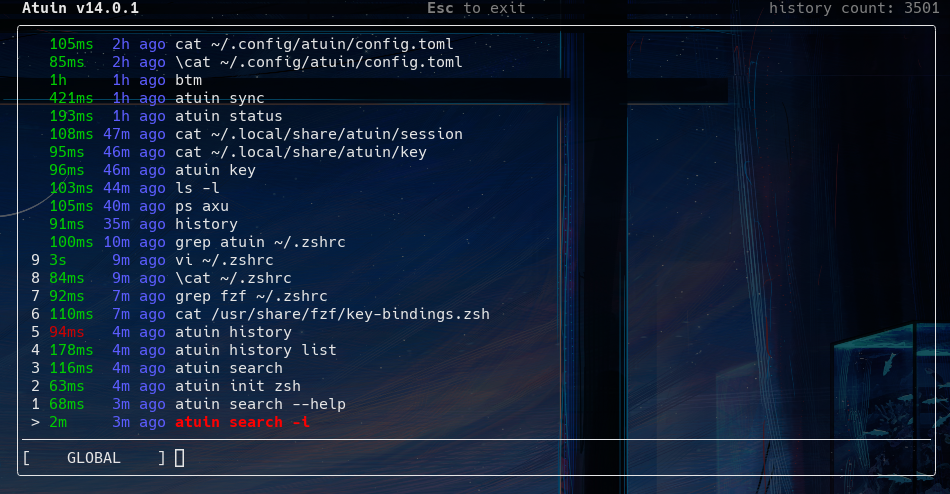

以前、 [chezmoi を試した時]()にドキュメントを読んでいたのですが、 [Can I store/share my shell history with chezmoi?](https://www.chezmoi.io/user-guide/frequently-asked-questions/usage/#can-i-storeshare-my-shell-history-with-chezmoi) という Q and A で [atuin](https://atuin.sh/) という OSS が有ることを知りました。

[ellie/atuin](https://github.com/ellie/atuin) は、シェルのヒストリを管理するソフトウェアで、単体のマシンで利用することもできますが、同期用のサーバを構成することでマシン間でヒストリを共有できます。
通信は E2EE で、無償で利用できるオフィシャルサーバも用意されているので、すぐに利用することができます。
今回は、 docker-compose を用いてサーバをセルフホストし、 zsh のヒストリを共有してみました。

<!--more-->

## atuin server
Docker でセルフホストするためのドキュメントが有ります。
https://atuin.sh/docs/self-hosting/docker

docker-compose の環境が既に存在する場合、特に詰まることは無いと思います。
私は、前段に Nginx HTTPS リバースプロキシを動作させているサーバに構築し、コンテナへプロキシする構成としました。

気にする必要が有るのは、 `ATUIN_OPEN_REGISTRATION` です。
atuin server を利用するにはユーザ登録が必要で、クライアント CLI からユーザ登録することができます。
例では true となっているので、自身のユーザ登録が終わったら、 false にしておくのが良いと思います。

また、 オフィシャルサーバには[GitHub のようなグラフ生成機能](https://github.com/ellie/atuin#opt-in-to-activity-graph)が有りますが、コードはオープンになっておらず、セルフホストでは利用することはできません。
[issue](https://github.com/ellie/atuin/issues/476) には、セフルホストサーバ向けにグラフを生成するツールを作成した方も居らっしゃるので、それを試してみるのも有りかもしれませんが、私は試したことありません。

## atuin setup
[ドキュメント](https://atuin.sh/docs/) に記載が有る通りですが、用意されているスクリプトもしくはパッケージマネージャを用いてインストールします。
Arch Linux ではパッケージ [atuin](https://www.archlinux.jp/packages/community/x86_64/atuin/) が用意されているので、 pacman などでインストールします。

```
sudo pacman -S atuin
```

ドキュメントでは続いて atuin register を実行していますが、オフィシャルサーバでは無くセルフホストサーバを利用したい場合は、先に設定ファイルを記載しておきます。

```
% cat ~/.config/atuin/config.toml
sync_address = "https://yourserver.example.com"
```

その他の設定項目については、 [設定ファイルに関するドキュメント](https://atuin.sh/docs/config/) に記載が有ります。
[issue](https://github.com/ellie/atuin/issues/504#issuecomment-1321167955) にもコメントが有りますが、 sync_address に `/` で終わる値を設定するとエラーになります。
私もこの問題に引っ掛かりました。

設定ファイルを用意したら、 register サブコマンドで同期サーバにユーザ登録した後、 import サブコマンドで既存ヒストリファイルの内容をインポートし、 sync サブコマンドで同期サーバと同期します。

```
atuin register -u <USERNAME> -e <EMAIL> -p <PASSWORD>
atuin import auto
atuin sync
```

register サブコマンドでアカウント登録が完了したので、前述したサーバの環境変数 `ATUIN_OPEN_REGISTRATION` は、 false に変更するのが良いと思います。

[同期頻度](https://atuin.sh/docs/config/#sync_frequency) や、 [自動同期するか否か](https://atuin.sh/docs/config/#auto_sync) についても、クライアントコンフィグで設定できます。
デフォルトでは 1h ごとに 同期が有効になっています。

status サブコマンドを用いて、同期されていることを確認できます。
```
% atuin status
[Local]
Sync frequency: 1h
Last sync: 2023-05-19 01:44:33.520537828 UTC
History count: 3480

[Remote]
Address: https://yourserver.example.com
Username: yoshihisa
History count: 3479
```

他のマシンから利用する時は、同様にクライアントコンフィグを作成しておき、 [login サブコマンド](https://atuin.sh/docs/commands/sync#login)を用います。
この時、暗号化キーが必要となりますので、既存マシンで `atuin key` を実行して暗号化キーを入手しておきます。
```
atuin login -u <USERNAME> -p <PASSWORD> -k <KEY>
```
あとは同様に、 import および sync しておきます。

## zsh で利用する
ドキュメントに[各シェルで利用する方法](https://atuin.sh/docs/#shell-plugin) が記載されているので、これに従い `~/.zshrc` に追記しておきます。
```
echo 'eval "$(atuin init zsh)"' >> ~/.zshrc
```

`atuin init zsh` を実行すると分かりますが、ヒストリ登録用の関数を定義し zsh のフックに登録したり、 Ctrl-r や 方向キー↑ へのキーバインドを定義しています。

私は下記のように定義し、特定のマシンだけで atuin を用いるようにし、 Ctrl-r のバインドを利用しないようにしています。
```
if [ $(hostname) = "desktop" ] || [ $(hostname) = "nb" ]; then
  eval "$(atuin init --disable-ctrl-r zsh)"
fi
```

私はヒストリを用いる際に Ctrl-r と Ctrl-p/n をよく利用しており、 Ctrl-r は fzf のヒストリ検索に設定しています。
また、プライベートで利用している一部のマシンだけで atuin を利用するので、頻繁に利用するキーを他マシンと異なる挙動にしたく無いという理由から、あまり利用していない 方向キー↑ を用いるようにしています。
必要なら、[全てのキーバインドを無効にして、好きなキーバインドを用いる](https://atuin.sh/docs/config/key-binding#zsh)ことも可能です。

最後に、シェルのコンフィグを再読み込みしておきます。

## atuin を利用する
前述した設定のキーバインドで atuin を起動すると、下記のような TUI が立ち上がり、ヒストリを検索することができます。



起動時は、 GLOBAL フィルターモードとなっており、全てのヒストリから検索しますが、 Ctrl-r で host(ローカルホストのみ), current-session(実行しているシェルで実行したヒストリのみ), directory(カレントディレクトリで実行したヒストリのみ) に変更することができます。
起動時のフィルターモードを変更するには、クライアントコンフィグで [filter_mode](https://atuin.sh/docs/config/#filter_mode) や [filter_mode_shell_up_key_binding](https://atuin.sh/docs/config/#filter_mode_shell_up_key_binding) を設定します。

検索モードも Ctrl-s で切り替えることができ、先頭一致やfuzzyなど、いくつか存在するので切り替えることができます。
クライアントコンフィグで [search_mode](https://atuin.sh/docs/config/#search_mode) を利用することで、デフォルトの検索モードを変更することができます。

検索結果から、 Alt-<1-9> で選択するなど、他にも [キーバインド](https://atuin.sh/docs/config/key-binding#atuin-ui-shortcuts) が有るので、必要に応じて確認しておくと便利です。

## atuin search CLI で検索する
Ctrl-r によって起動される atuin TUI は、 [search](https://atuin.sh/docs/commands/search) サブコマンドに \-\-interactive オプションを付けて起動したものです。
\-\-interactive オプションを用いないことで、コマンドラインとして検索でき、当然のことながら | や > に渡すことも可能です。
高度な検索が必要無い場合は [`atuin history list`](https://atuin.sh/docs/commands/list) も利用できます。

```
% atuin --version
atuin 14.0.1
% atuin search --help
Interactive history search

Usage: atuin search [OPTIONS] [QUERY]...

Arguments:
  [QUERY]...

Options:
  -c, --cwd <CWD>                    Filter search result by directory
      --exclude-cwd <EXCLUDE_CWD>    Exclude directory from results
  -e, --exit <EXIT>                  Filter search result by exit code
      --exclude-exit <EXCLUDE_EXIT>  Exclude results with this exit code
  -b, --before <BEFORE>              Only include results added before this date
      --after <AFTER>                Only include results after this date
      --limit <LIMIT>                How many entries to return at most
      --offset <OFFSET>              Offset from the start of the results
  -i, --interactive                  Open interactive search UI
      --filter-mode <FILTER_MODE>    Allow overriding filter mode over config [possible values: global, host, session, directory]
      --search-mode <SEARCH_MODE>    Allow overriding search mode over config [possible values: prefix, full-text, fuzzy, skim]
      --human                        Use human-readable formatting for time
      --cmd-only                     Show only the text of the command
      --delete                       Delete anything matching this query. Will not print out the match
      --delete-it-all                Delete EVERYTHING!
  -r, --reverse                      Reverse the order of results, oldest first
  -f, --format <FORMAT>              Available variables: {command}, {directory}, {duration}, {user}, {host}, {time}, {exit} and {relativetime}. Example: --format "{time} - [{duration}] - {directory}$\t{command}"
  -h, --help                         Print help
```

上記のオプションや、これまでの記述で分かるのですが、 atuin はコマンドを実行した、ホスト, ワーキングディレクトリ, 日時, 実行時間, 終了コード を持っています。

例えば、 \$CWD で 2023/01/01 以降に失敗した rm コマンドを検索し、実行したホスト名, \$CWD, 日時, コマンドライン を表示した例が次のものです。
なお、表示される日時は UTC のため、下記の例で rm コマンドを実行した時間は、 2023-05-07 19:20:15 JST です。

```
% echo $PWD
/home/yoshihisa
% atuin search -c . --exclude-exit 0 --after 01/01/2023 --format "{time},{host},{directory},{command}" ^rm
2023-05-17 10:20:15,nb,/home/yoshihisa,rm de
```

ちなみに、このコマンドは、 debug.log を rm しようとしファイル名指定を間違えたために exit != 0 となったものです。

```
% atuin search -c . --exclude-exit 0 --after 01/01/2023 --format "{time},{host},{directory},{command}" ^rm
2023-05-17 10:20:15,nb,/home/yoshihisa,rm de
% atuin search -c . --after $(!! | awk '{print $1}') !!:8*
atuin search -c . --after $(atuin search -c . --exclude-exit 0 --after 01/01/2023 --format "{time},{host},{directory},{command}" ^rm | awk '{print $1}') --format "{time},{host},{directory},{command}" ^rm
2023-05-17 10:20:15,nb,/home/yoshihisa,rm de
2023-05-17 10:20:17,nb,/home/yoshihisa,rm debug.log
```

マッチしたものを履歴から削除することもできます。

```
% atuin search ^rm
2023-02-05 08:55:15     rmdir Sync/screenlayout/desktop 0s
2023-02-05 08:55:18     rmdir Sync/screenlayout/nb      0s
2023-02-26 05:33:55     rmdir Nextcloud/exampledir      0s
2023-02-26 05:35:38     rmdir Nextcloud/test    0s
2023-04-15 11:25:52     rmdir Desktop   0s
2023-05-14 08:01:13     rm nvim.log     1s
2023-05-14 08:38:38     rm dump 619ms
2023-05-15 11:41:09     rm -rf ~/.local/state/nvim ~/.local/share/nvim ~/.cache/nvim    1s
2023-05-17 10:20:15     rm de   63ms
2023-05-17 10:20:17     rm debug.log    938ms
% atuin search --delete ^rm
```

## atuin におけるデータ保持
この項目は、あまり自信が無く、不正確な情報である可能性が高いです。
また、 v14.0.1 時点の情報です。

atuin はローカルに sqlite データベースとしてヒストリを持っています。

```
% cd ~/.local/share/atuin
% ls -lh history*
-rw-r--r-- 1 yoshihisa yoshihisa 1.5M  5月 20 16:45 history.db
-rw-r--r-- 1 yoshihisa yoshihisa  32K  5月 20 16:45 history.db-shm
-rw-r--r-- 1 yoshihisa yoshihisa 145K  5月 20 16:45 history.db-wal
% file history.db
history.db: SQLite 3.x database, last written using SQLite version 3038002, writer version 2, read version 2, file counter 36, database pages 369, cookie 0x9, schema 4, UTF-8, version-valid-for 36
```

このデータベースは、ヒストリに関する情報が平文でレコードされています。
下記の select 文で、 `sqlite3 history.db` コマンドの一部フィールドが `-1` なのは、完了していないコマンドだからだと思われます。
```
% sqlite3 history.db
SQLite version 3.42.0 2023-05-16 12:36:15
Enter ".help" for usage hints.
sqlite> .tables
_sqlx_migrations  history
sqlite> .schema history
CREATE TABLE history (
        id text primary key,
        timestamp integer not null,
        duration integer not null,
        exit integer not null,
        command text not null,
        cwd text not null,
        session text not null,
        hostname text not null, deleted_at integer,

        unique(timestamp, cwd, command)
);
CREATE INDEX idx_history_timestamp on history(timestamp);
CREATE INDEX idx_history_command on history(command);
CREATE INDEX idx_history_command_timestamp on history(
        command,
        timestamp
);
sqlite> select * from history order by timestamp desc limit 4;
018838226b54791792f34396dd02b0ee|1684568959828094906|-1|-1|sqlite3 history.db|/home/yoshihisa/.local/share/atuin|01883812780274d7be933bb385b8d956|desktop:yoshihisa|
018838225a1870329ebf81ecc790b884|1684568955416252635|69721921|0|file history.db|/home/yoshihisa/.local/share/atuin|01883812780274d7be933bb385b8d956|desktop:yoshihisa|
0188382251d67b138c1f9842f4e87d05|1684568953302243674|76845031|0|ls -lh history*|/home/yoshihisa/.local/share/atuin|01883812780274d7be933bb385b8d956|desktop:yoshihisa|
018838223418783b94d0a4496c28511c|1684568945688542228|81319344|0|cd ~/.local/share/atuin|/home/yoshihisa|01883812780274d7be933bb385b8d956|desktop:yoshihisa|
```

削除したヒストリがどのように変化するか確認するため、全てのヒストリを削除してみます。
```
% atuin search --delete-it-all
```

テーブルを確認すると deleted_at に日時を入れ、 command を空文字列としているように[見えます。](https://github.com/ellie/atuin/blob/v14.0.1/atuin-client/src/database.rs#L516)
実行した \$CWD, 実行時間 などは残っているのが、通常のヒストリファイルから行をまるごと削除することとの違いでしょうか。

```
% sqlite3 history.db
SQLite version 3.42.0 2023-05-16 12:36:15
Enter ".help" for usage hints.
sqlite> select * from history order by timestamp desc limit 4;
0188385290477ed58cc5ad2fefeb74ea|1684572115015807938|-1|-1|sqlite3 history.db|/home/yoshihisa/.local/share/atuin|01883812780274d7be933bb385b8d956|desktop:yoshihisa|
0188385282797f6aae8c4bf6d31fbb56|1684572111481415988|1675511015|130||/home/yoshihisa/.local/share/atuin|01883812780274d7be933bb385b8d956|desktop:yoshihisa|1684572113089529705
0188382cf94b7e2ebefd034ee95762a0|1684569651531828715|60192093299|1||/home/yoshihisa/.local/share/atuin|01883812780274d7be933bb385b8d956|desktop:yoshihisa|1684572111524849291
0188382cd1e17886a56b2ce02bbe1002|1684569641441387186|65061866|0||/home/yoshihisa/.local/share/atuin|01883812780274d7be933bb385b8d956|desktop:yoshihisa|1684572111534793376
```

この影響と思われるのですが、 `atuin stats` は、空文字も実行済みコマンドとして統計を返します。
[issue](https://github.com/ellie/atuin/issues/838) としても報告されており、既知の事象となります。
```
% atuin stats
[▮▮▮▮▮▮▮▮▮▮] 3756
[          ]    1 atuin
[          ]    1 sqlite3
Total commands:   3758
Unique commands:  3
```

atuin server 側の実装を見てみると、 delete を要求された場合は deleted_at のみ更新しているように[見えます。](https://github.com/ellie/atuin/blob/v14.0.1/atuin-server/src/database.rs#L150)
ただし、[ヒストリを追加する時に暗号化(data)してからサーバに送信しており、それには \$CWD も含まれます。](https://github.com/ellie/atuin/blob/v14.0.1/atuin-client/src/sync.rs#L148-L155)

```
$ docker-compose exec postgresql bash
root@662404d6ae47:/# psql -U atuin atuin
psql (14.8 (Debian 14.8-1.pgdg110+1))
Type "help" for help.

atuin=# \dn
List of schemas
  Name  | Owner
--------+-------
 public | atuin
(1 row)

atuin=# \dt
                 List of relations
 Schema |           Name           | Type  | Owner
--------+--------------------------+-------+-------
 public | _sqlx_migrations         | table | atuin
 public | history                  | table | atuin
 public | sessions                 | table | atuin
 public | total_history_count_user | table | atuin
 public | users                    | table | atuin
(5 rows)

atuin=# \d history
                                           Table "public.history"
   Column   |            Type             | Collation | Nullable |                 Default

------------+-----------------------------+-----------+----------+---------------------------------------
---
 id         | bigint                      |           | not null | nextval('history_id_seq'::regclass)
 client_id  | text                        |           | not null |
 user_id    | bigint                      |           | not null | nextval('history_user_id_seq'::regclas s)
 hostname   | text                        |           | not null |
 timestamp  | timestamp without time zone |           | not null |
 data       | text                        |           | not null |
 created_at | timestamp without time zone |           | not null | CURRENT_TIMESTAMP
 deleted_at | timestamp without time zone |           |          |
Indexes:
    "history_pkey" PRIMARY KEY, btree (id)
    "history_client_id_key" UNIQUE CONSTRAINT, btree (client_id)
    "history_deleted_index" btree (client_id, user_id, deleted_at)
Triggers:
    tg_user_history_count AFTER INSERT OR DELETE ON history FOR EACH ROW EXECUTE FUNCTION user_history_count()
```

当然ながら、暗号化キーの管理を正しくしておけば問題無いものの、気になる場合はレコードを DELETE するのも良いでしょうが、その場合にどのような挙動になるかは詳しく見ていません。
クライアントは sync し push する際に、リモートとローカルのレコード数を元に while し同期しており、PostgreSQL 側ではレコード数を把握するためにトリガプロシージャを利用しています。
このあたりも気にしないと挙動が壊れたり、 sync がとても遅くなったりするかもしれません。

## 記録されないようにフィルターする
[zsh 設定記事]() に記載した通り、筆者は一部のコマンドをヒストリに残さないように次のような設定をしています。

```
setopt hist_ignore_space
alias rm=" rm -iv"
alias mv=" mv -iv"
```

alias により rm の先頭にスペースを入れ、ヒストリに保存しないようにする手法です。
atuin によって zsh のヒストリに変更が生じることは無く、 zsh のヒストリ機能は正常に動作するのですが、 atuin には記録されてしまいます。

```
% touch test
% rm test
rm: 通常の空ファイル 'test' を削除しますか? y
'test' を削除しました
% history -1
 2398  touch test
% atuin history list | tail -4
2023-05-20 11:41:51     touch test      56ms
2023-05-20 11:41:54     rm test 5s
2023-05-20 11:42:03     history -1      45ms
2023-05-20 11:42:15     atuin history list | tail -4    0s
```

ただし、意図的に先頭スペースを入れたものは、 atuin に[記録されません。](https://github.com/ellie/atuin/blob/v14.0.1/atuin/src/command/client/history.rs#LL186C22-L186C89)

```
%  w > /dev/null
% !atuin
atuin history list | tail -4
2023-05-20 11:41:54     rm test 5s
2023-05-20 11:42:03     history -1      45ms
2023-05-20 11:42:15     atuin history list | tail -4    56ms
2023-05-20 11:42:45     atuin history list | tail -4    0s
```

代わりに、 [history_filter](https://atuin.sh/docs/config/#history_filter) を利用することができます。
正規表現で指定できるので、オプションに特定の文字列を含む場合に記録しないといった設定も可能です。

```
history_filter = [
   "^rm ",
   "^mv "
]
```

上記のように設定することで、 rm と mv コマンドを atuin に記録しないで済みます。

```
% touch test
% mv test test-mv
名前変更: 'test' -> 'test-mv'
% rm test-mv
rm: 通常の空ファイル 'test-mv' を削除しますか? y
'test-mv' を削除しました
% atuin history list | tail -2
2023-05-20 12:07:42     touch test      48ms
2023-05-20 12:08:09     atuin history list | tail -2    0s
```

## ヒストリの重要性
OS再インストールで /home を初期化した際など、私は気軽にシェルヒストリを捨ててました。
しかし、得に過去のワンライナーを参考にしたい時や、 qemu のようにオプションが長くなるものを再利用したい時など、重要な財産であったと再認識します。
また、自宅のデスクトップマシンで実施した作業を、コワーキングスペースや旅行先に持ち込んだラップトップで改めて実施したい時など、デスクトップマシンに SSH して確認することもありました。

そのため atuin を使い初めたのですが、今のところ便利に使えています。
最終的に、シェルのヒストリに残っていない場合は atuin のヒストリを漁って実行するという形としています。
実行すれば、シェルのヒストリにも残るので、次からはこれまで通りシェルのヒストリから確認できるという形です。

もちろん /home は定期的にリモートのサーバにバックアップを取得しているので、 atuin を利用せずとも、初期化後はヒストリファイルを復元すれば維持されます。
マシン間の同期は、 cron + ssh およびスクリプトなどを用いて、マージしても良いかもしれません。(当然 inc_append_history や share_history などに気をつける必要は有ると思います。)

そのあたりは、もう少し atuin を利用してから考えようと思います。
修了コードや、実行したディレクトリなどは、 zsh の拡張ヒストリでも保持されないので、それらが役立つかもしれません。
