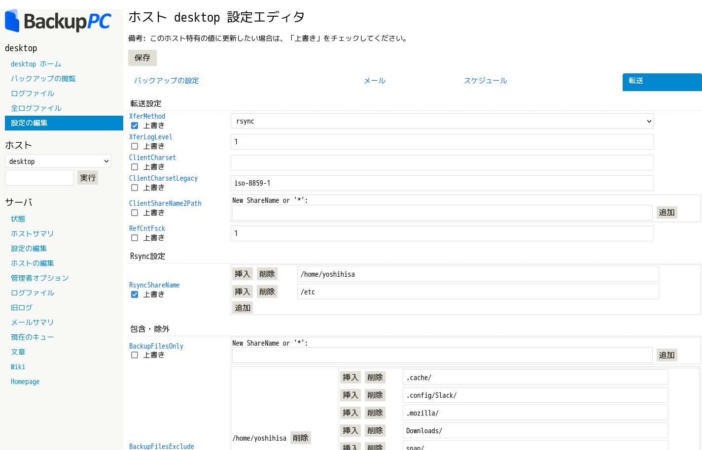
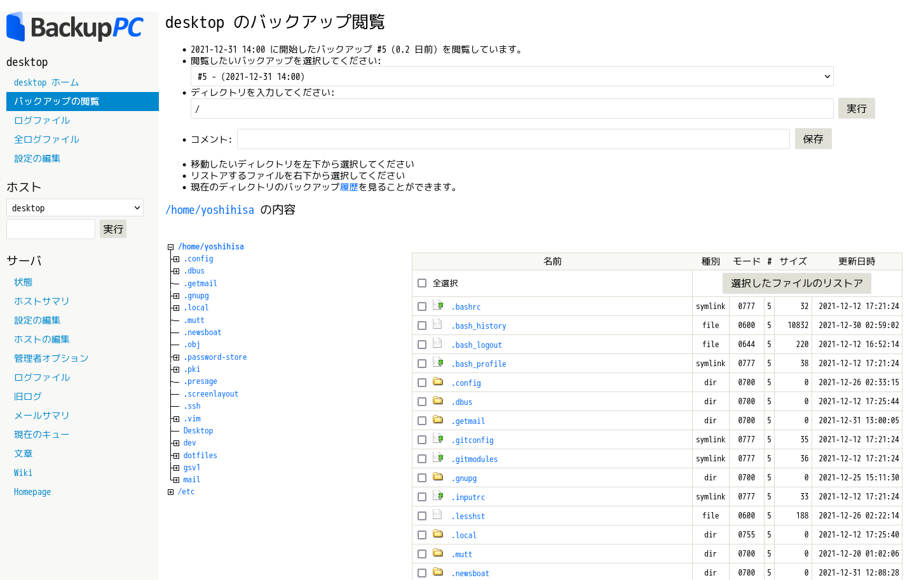

OSS の BackupPC を用いると、 Linux, macOS, Microsoft Windows のファイルレベルのバックアップをエージェントレスで取得できます。
WebUI から複数ユーザで利用する事ができ、重複排除及び圧縮、世代管理など、コンピュータのバックアップには十分な機能だと思います。
今回は、サーバ及びバックアップ対象のクライアント、どちらも Debian を用い、プロトコルとして rsync を用います。

https://backuppc.github.io/backuppc/

## BackupPC の主な特徴
- NFS, rsync, smb, ftp 等が利用でき、エージェントレスで実行できる。
- データ圧縮及び、単一もしくは複数コンピュータ間でのデータ重複排除。
- WebUI から複数ユーザで利用する事ができる。(今回は管理ユーザのみ利用する)
- 電子メールでの各種通知。
- Perl 製
<!--more-->

## 環境(前提)
- サーバは国内VPSを用い、 100Mbps の IPv4/IPv6 デュアルスタックである。
- クライアントは DS-Lite 配下にあり、グローバルからクライアントに対し IPv4 を用いた接続は不可能である。しかし IPv6 は ICMP 及び SSH(公開鍵認証 Ony) が公開されており、グローバルから接続可能である。
- サーバとクライアントは、 WireGuard にて IPv4 ローカル接続が可能である。 WebUI は HTTPS + BASIC 認証なのでグローバルに流しても良いが、グローバルで利用予定は無いのでローカル接続でのみ利用する。
- バックアップの為の rsync は、WireGuard / グローバルのどちらでも速度として変わらないが、グローバルで十分なのでグローバル経由とする。他の smb 等を利用する場合は ローカル接続 に流す。
- 共通のドメインを設定している。
```
$ grep search /etc/resolv.conf
search yoshihisa.link
```

サーバ <-> クライアント の通信に、用途別に ローカル接続(VPN)経由 / グローバル接続経由 の2経路を用いるので記載がややこしくなっていますが、通常はどちらか1経路のみで十分だと思います。

### サーバ
Debian bullseye

グローバルホスト名: gsv1.yoshihisa.link  
グローバルIPv4: gsv1\_ipv4  
グローバルIPv6: gsv1\_ipv6

ローカルネットワーク向けホスト名: gsv1.wg.yoshihisa.link  
ローカルIPv4: gsv1\_local\_ipv4

### クライアント
Debian sid

グローバルホスト名: desktop.yoshihisa.link  
グローバルIPv6: desktop\_ipv6

ローカルIPv4: desktop\_local\_ipv4

## どのプロトコルを選ぶか
クライアントが Linux なので rsync を用いますが、 Microsoft Windows でも Cygwin をベースに rsync を用いるのが望ましいです。
rsync を用いる場合、サーバとクライアントのチェックサムを確認し転送するので、クライアントマシンのCPUを多く利用しますが、ネットワーク帯域は少く済むメリットが有ります。

## サーバインストール
backuppc パッケージを導入し、設定された BASIC 認証の仮パスワードを異なるものに変更しておきます。
```
(gsv1)$ sudo apt install backuppc
# - ウェブサーバが問われるので apache2 とする。
# - システムユーザ backuppc が作成されプロセスが動作する。
# - BASIC 認証として backuppc ユーザと仮パスワードが設定されるので、変更する。
(gsv1)$ sudo htpasswd /etc/backuppc/htpasswd backuppc
```

メインの設定ファイルは `/etc/backuppc/config.pl` に存在し、 WebUI からも変更可能です。
次の2点を変更しておきます。
- `RsyncSshArgs`: デフォルトではサーバの backuppc ユーザが `ssh -l root client` して rsync を実行します。クライアントのrootユーザは利用したく無いので変更します。後に、クライアントにも backuppc ユーザを作成します。
- `Language`: WebUI の表示言語を日本語に変更します。
```
(gsv1)$ sudoedit /etc/backuppc/config.pl
(gsv1)$ diff -uprN config.pl /etc/backuppc/config.pl
--- config.pl   2021-04-13 03:02:10.000000000 +0900
+++ /etc/backuppc/config.pl     2021-12-26 00:20:16.483159785 +0900
@@ -1232,7 +1232,7 @@ $Conf{RsyncBackupPCPath} = "/usr/libexec
 #
 # This setting only matters if $Conf{XferMethod} = 'rsync'.
 #
-$Conf{RsyncSshArgs} = ['-e', '$sshPath -l root'];
+$Conf{RsyncSshArgs} = ['-e', '$sshPath -l backuppc'];

 #
 # Share name to backup.  For $Conf{XferMethod} = "rsync" this should
@@ -2121,7 +2121,7 @@ $Conf{RrdToolPath} = '/usr/bin/rrdtool';
 # Currently the Language setting applies to the CGI interface and email
 # messages sent to users.  Log files and other text are still in English.
 #
-$Conf{Language} = 'en';
+$Conf{Language} = 'ja';

 #
 # User names that are rendered by the CGI interface can be turned
```

他に重要なパラメータは下記の辺りだと思います。
今回はデフォルトで問題無いので変更しませんが、ディストリビューションや構成によっては事前に変更しておく必要が有ります。
- `CgiAdminUsers / CgiAdminUserGroup`: Webサーバの認証ユーザ(REMOTE\_USER)のうち、管理ユーザとするユーザ名/グループ名。該当しない一般ユーザは、自身に関連付けられたクライアントに関する操作のみ可能です。
- `PingMaxMsec`: バックアップを開始する前に行われる ICMP 疎通確認で許容するRTT。今回はグローバル経由でも十分に短いので変更していませんが、遠いリージョン間でバックアップを実施する場合や、モバイル回線を用いる場合は変更を検討する必要が有ります。
```
$Conf{CgiAdminUsers}     = 'backuppc';
$Conf{CgiAdminUserGroup} = 'backuppc';
$Conf{PingMaxMsec} = 20;
```

apache 向けの設定ファイルを編集しておきます。
デフォルトの状態では HTTP かつ localhost からのアクセスに限定されているので、 HTTPS に変更し、コメントの記載通りに `Require local` をコメントアウトしておきます。
HTTPS を有効化する為、 ssl mod と default-ssl site を有効化しておきます。
```
(gsv1)$ readlink /etc/apache2/conf-available/backuppc.conf
/etc/backuppc/apache.conf
(gsv1)$ diff -uprN apache.conf /etc/backuppc/apache.conf
--- apache.conf 2021-04-13 03:02:10.000000000 +0900
+++ /etc/backuppc/apache.conf   2021-12-26 00:14:30.017928809 +0900
@@ -7,7 +7,7 @@ Alias /backuppc /usr/share/backuppc/cgi-
         # info from network traffic during editing of the BackupPC config or
         # when browsing/restoring backups.
         # Requires that you have your webserver set up for SSL (https) access.
-        #SSLRequireSSL
+        SSLRequireSSL

        Options ExecCGI FollowSymlinks
        AddHandler cgi-script .cgi
@@ -19,7 +19,7 @@ Alias /backuppc /usr/share/backuppc/cgi-

         <RequireAll>
                # Comment out this line once you have setup HTTPS and uncommented SSLRequireSSL
-               Require local
+               #Require local

                # This line ensures that only authenticated users may access your backups
                Require valid-user
(gsv1)$ sudo a2enmod ssl
(gsv1)$ sudo a2ensite default-ssl.conf
(gsv1)$ sudo apache2ctl configtest
Syntax OK
```

前述の通り、 WebUI は WireGuard によるローカル接続のみ許可するよう、ファイアウォールを変更しておきます。
ローカル通信のインタフェースIPでのみ apache が LISTEN するようにしておくのも良いかと思います。
もちろん、グローバルインタフェース側のネットワークからローカルインタフェースのIPに疎通が取れない事が前提ですが...
```
(gsv1)$ sudoedit /etc/nftables.conf
tcp dport https ct state new ip saddr { client_network1/24, client_network2/24 } iif wg0 accept
(gsv1)$ sudo nft -f /etc/nftables.conf
(gsv1)$ sudo nft list ruleset
```

設定反映の為、 backuppc と apache を再起動しておきます。
```
(gsv1)$ sudo systemctl restart backuppc apache2
```

## ウェブブラウザからアクセス
WebUI にアクセスし、管理者(backuppc)で BASIC認証 を通過すると、下記のような画面になります。
(今回の例: `https://gsv1.wg.yoshihisa.link/backuppc/` )


今回の Debian パッケージではデフォルトで localhost クライアントをバックアップする設定が入っているので、これを削除しておきます。


これは、下記の設定ファイルをエディタで編集する事でも可能です。
```
(gsv1)$ tail -4 /etc/backuppc/hosts
host        dhcp    user    moreUsers     # <--- do not edit this line
#farside    0       craig   jill,jeff     # <--- example static IP host entry
#larson     1       bill                  # <--- example DHCP host entry
localhost   0       backuppc
```

クライアントと同名のディレクトリが `/var/lib/backuppc/pc` に存在し、クライアント固有のログファイルなどが格納されているので、必要なログを保全して削除しておきます。
削除しないでおくと、「削除して良いよ」という通知メールが届きます。
```
(gsv1)$ sudo rm -rf /var/lib/backuppc/pc/localhost
```

## ssh 設定
今回は rsync(ssh) を用いるので、サーバで backuppc ユーザの秘密鍵を生成し、クライアントでのバックアップ専用ユーザ作成と公開鍵の設定をしておきます。

サーバで backuppc ユーザにスイッチし、鍵を生成しておきます。
BackupPC に登録するクライアント名 desktop は、OSリゾルバによる名前解決で グローバルIPv6アドレスが返ってきます。
今回は必要無いと思いますが、必要に応じて、 `~backuppc/.ssh/config` も記載しておきます。
```
(gsv1)$ sudo su - backuppc
(gsv1)backuppc$ ssh-keygen -t ed25519
(gsv1)backuppc$ vi .ssh/config
(gsv1)backuppc$ cat .ssh/config
Host desktop
  Hostname desktop_ipv6
```

## クライアント設定
クライアントに backuppc ユーザを作成しておきます。
今回は、公開鍵認証のみを用いるので、パスワードロックも実施しておきました。
```
[yoshihisa@desktop ~]$ sudo useradd -d /var/lib/backuppc -m backuppc
[yoshihisa@desktop ~]$ sudo usermod -L backuppc
```

クライアントの backuppc ユーザに公開鍵を設定しておきます。
パスワード認証が許可されている場合は、backuppcユーザに一時的にパスワードを設定し、 ssh-copy-id で公開鍵を設定するのも良いかと思います。
```
(gsv1)backuppc$ ssh-copy-id desktop
```

必要に応じて、 no-agent-forwarding なども記載しておくのも良いかと思います。
```
[yoshihisa@desktop ~]$ sudoedit ~backuppc/.ssh/authorized_keys
from=”gsv1_ipv6”,no-agent-forwarding,no-port-forwarding,no-X11-forwarding,no-pty ssh-ed25519 AAAA.......
```

クライアントの backuppc ユーザが読み取り権限の無いファイルもバックアップできるよう、 sudoers を設定しておきます。
```
[yoshihisa@desktop ~]$ sudoedit /etc/sudoers.d/backuppc
[yoshihisa@desktop ~]$ sudo cat /etc/sudoers.d/backuppc
backuppc ALL=(ALL:ALL) NOPASSWD: /usr/bin/rsync
```

最後に、パスワードレスで ssh が可能か確認しておきます。
```
(gsv1)backuppc$ ssh desktop whoami
backuppc
```

## クライアント追加
WebUI から、バックアップ対象を追加します。
今回は、前述の通り、 `desktop` で名前解決できるので、 host としては `desktop` を指定します。

ここでの user とは、バックアップのコントロールや参照ができる BackupPC ユーザ(unixユーザ or 電子メールアドレス)であり、バックアップ対象のunixユーザとは関係有りません。
一般的にはマシンの所有者を指定するものであり、ホストのバックアップに関するメール通知も行われます。
moreUsers も同様ですが、 users と異なり、ホストに関するメールは送付されません。


続いて、ホスト固有の設定を実施します。
グローバル設定が引き継がれているので、必要な部分のみホスト固有設定として Overwrite します。


設定した項目は次の通りです。

- `XferMethod`: バックアップに使うプロトコル。rsyncを利用するのでrsyncに変更します。
- `RsyncShareName`: バックアップ対象のディレクトリを指定します。今回は、 `/home/yoshihisa` と `/etc` を指定しました。
- `RsyncClientPath`: クライアントの root ユーザでは無く backuppc ユーザを利用する事としたので、 `/usr/bin/rsync` から `sudo /usr/bin/rsync` に変更しておきます。
- `BackupFilesExclude`: バックアップから除外する領域を指定します。ユーザホームディレクトリに存在する ~/.cache や ~/Downloads 等のバックアップ不要なディレクトリを指定しておきます。

ホスト固有の設定は、 `/etc/backuppc/hostname.pl` として保存されます。
```
$ sudo cat /etc/backuppc/desktop.pl
$Conf{BackupPCNightlyPeriod} = 1;
$Conf{RsyncShareName} = [
  '/home/yoshihisa',
  '/etc'
];
$Conf{XferMethod} = 'rsync';
$Conf{RsyncClientPath} = 'sudo /usr/bin/rsync';
$Conf{BackupFilesExclude} = {
  '/home/yoshihisa' => [
    '.cache/',
    '.config/Slack/',
    '.mozilla/',
    'Downloads/',
    'snap/',
    'qemu/',
    'tmp/'
  ]
};
```

## バックアップの取得
WebUI からホストを選択すると、該当ホストのフルバックアップや増分バックアップ、指定時間のバックアップ停止が行えます。


デフォルトであれば、 `$Conf{WakeupSchedule}` に従い毎時(0時を除く)BackupPCが起動し、前回のバックアップから閾値を越えたホストに対しバックアップが実行されます。
閾値は、フルバックアップとして FullPeriod 、増分バックアップとして IncrPeriod を用い、デフォルトでは 1週間毎のフルバックアップと、1日毎の増分バックアップが実施されます。

## バックアップからのリストア
バックアップからリストアする際は、 WebUI からバックアップ世代を選択し、ファイルやディレクトリを選択してリストアできます。


選択しリストアに進むと、
- 指定したディレクトリへリストア
- zipファイルとしてダウンロード
- tarアーカイブとしてダウンロード

が選択できます。


## BlackoutPeriods
バックアップ取得前にpingによる疎通確認を実施していますが、安定してpingが成功している場合に、特定の時間を実行時間から除外する事ができます。
これをブラックアウトと呼び、業務時間などのマシン利用時に、バックアップが動作する事で高負荷となる事を避けるものであり、デフォルトでは次の通り設定されています。
```
$Conf{BlackoutBadPingLimit} = 3;
$Conf{BlackoutGoodCnt}      = 7;
$Conf{BlackoutPeriods} = [
    {
        hourBegin => 7.0,
        hourEnd   => 19.5,
        weekDays  => [1, 2, 3, 4, 5],
    },
];
```
BlackoutGoodCnt 回 ping が成功する場合にブラックアウト状態となり、BlackoutPeriods で指定した期間内はバックアップが実行されません。
BlackoutBadPingLimit 回 ping が失敗すると、ブラックアウト状態が解除されます。

ドキュメントにも記載が有りますが、 BlackoutGoodCnt と BlackoutBadPingLimit は期間を対等に見れない事に注意が必要です。
前述の通り、 ping はバックアップ実行前の疎通確認として実行されます。
デフォルトでは24時間毎に、フルバックアップもしくは増分バックアップのどちらかが実行されますので、 BlackoutGoodCnt = 7 を満たすには1週間必要という事になります。
逆にバックアップ対象がダウンしている場合、バックアップ実行前に ping が失敗した後 WakeupSchedule に従い(殆どのケースで)1時間後に再試行される為、 BlackoutBadPingLimit = 3 は3時間で条件を満たし、ブラックアウト状態が解除される事となります。

重要な時間設定は BlackoutPeriods であり、上記の例だと、 月曜 - 金曜 の 07:00 - 19:30 はバックアップが実行されません。
これは通常のワークケースを想定した値と思われます。

今回は個人のプライベート端末のバックアップとして構築するので、ルールを変更します。
```
$Conf{BlackoutPeriods} = [
  {
    'hourBegin' => 6,
    'hourEnd' => '23.5',
    'weekDays' => [
      0,
      6
    ]
  },
  {
    'hourBegin' => 6,
    'hourEnd' => '9.5',
    'weekDays' => [
      1,
      2,
      3,
      4,
      5
    ]
  },
  {
    'hourBegin' => 18,
    'hourEnd' => '23.5',
    'weekDays' => [
      1,
      2,
      3,
      4,
      5
    ]
  }
];
```
上記のルールでは、
- 土, 日 は 6:00 - 23:30 はブラックアウト期間
- 平日 は 6:00 - 09:30 及び 18:00 - 23:30 をブラックアウト期間

とし、プライベート時間ではバックアップが動作しないようにしています。

## 触れてみて
WebUI から世代を選択して容易にリストアできますし、 rsync でエージェントレスなので、複数のクライアントPCを持つ場合は使いやすいかなぁと思います。
しかし、そこまで頻繁にリストアする事も無いので、この規模のソフトウェアを導入する必要が有るのかも疑問では有ります。

しばらく利用してみます。

次回、異なるアプローチのバックアップOSSを記載しようと思います。
