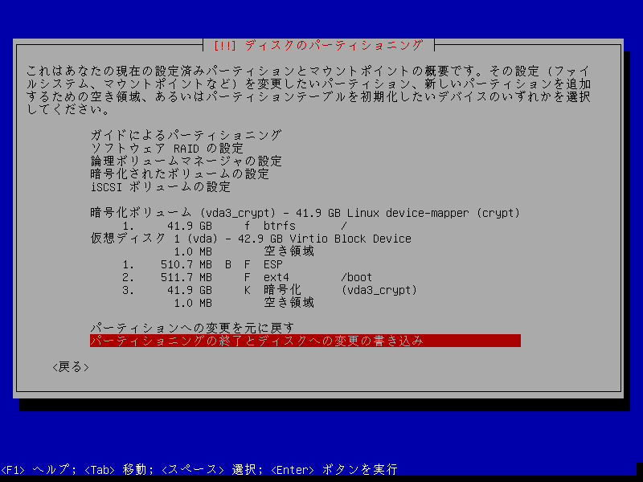
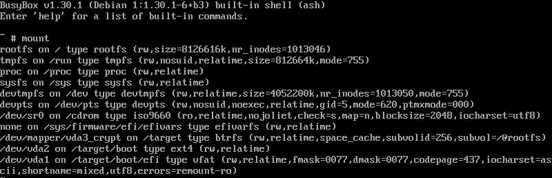

これまで LUKS + LVM + ext4 で組んでいたのですが、スナップショットを手軽に取得したかったので、 LUKS + Btrfs に移行する事にしました。

LVMを用いているのでスナップショットを取得する事は可能なのですが、ブロックデバイスのスナップショットであり、事前に容量をReserveする必要があり、ファイルシステム用途としては使いやすいものでは有りません。
システムアップデートや巨大なソフトウェアをインストールする前にスナップショットの取得をするのですが、徐々に面倒になり、取得しないままシステムを汚してしまう事も有ったので、 Snapper を用いてスナップショット管理も実施します。

また、Btrfsファイルシステムは1つとし、サブボリュームを作成し /home や /var/log にマウントする事で、スナップショット単位を分割する事にします。

<!--more-->

## 他の検討対象

今回、Btrfsの信頼性に関する話題を耳にしたり、ZFS(OpenZFS)を用いた ZFS on root も検討しました。
信頼性についてはよく話題になるので耳にしますが、今回はファイルサーバ用途では無いですし、リモートへのバックアップも構築しているので、あまり重視しませんでした。
そもそも、信頼性についての話題は、古い内容もよく見かけます。
~~よく壊れるのも遊びとして楽しそうだけど。~~
ZFSについては、既にファイルサーバで利用経験が有る(not root)事と、Btrfsを試してみたかった事から見送りました。

他に同様の要件を満たしたい場合、 [Stratis](https://stratis-storage.github.io/) も選択肢かと思います。
DeviceMapper シンプロビジョニングと XFS を用いているので、信頼性は十分なのでは無いかと思っていますし、もしもの時は dmsetup などで下位層に降りやすいのでは無いかとも思います。

## Debian bullseye setup

btrfs-convert なども利用できますが、ちょうど wine の導入に苦戦してシステムを汚してしまった直後だったので、クリーンインストールする事にしました。
インストーラ上では、サブボリュームを切る事ができないので、パーティション設定を完了した後、ベースシステムのインストールを開始する前に、ターミナルに落ちてファイルシステムを弄る事にします。
その為、 Expert install で進める事にします。



パーティション設定は、

1. ESP
2. /boot
3. LUKS

とし、LUKSの上にbtrfsを載せ / にマウントする事にします。
ここで変更を書き込むと、次にベースシステムのインストールに進む事ができますが、 Alt-F2 等でターミナルに落ちると、BusyBox シェルを利用する事ができます。



mount 状況を確認すると、Btrfs サブボリューム @rootfs が作成され /target にマウントされていて、 /dev/vda2 と /dev/vda1 がそれぞれ /target/boot, /target/boot/efi にマウントされている事が確認できます。
一度、/target 配下の全てのマウントを外して、Btrfs を /mnt にマウントしてから目的のサブボリュームを作成後、 /target にマウントし直しておきます。

まずマウントを外します。
```bash
umount /target/boot/efi
umount /target/boot
umount /target
```

/mnt に Btrfs をマウントすると、デフォルトで、サブボリューム @rootfs が作成されています。
```text
# mount /dev/mapper/vda3_crypt /mnt
# cd /mnt
/mnt # ls
@rootfs
```

新に作成するサブボリュームは

1. @home
2. @var\_log

で、それぞれ /home と /var/log にマウントする事にします。

/ と /home のスナップショット取得頻度を分ける為に /home 用のサブボリュームを作成しておきます。
加えて、 /var/log のスナップショットは不要なのと、ログの巻き戻りを防ぐ為に、 /var/log 用のサブボリュームも作成します。

```text
/mnt # btrfs subvolume create @home
/mnt # btrfs subvolume create @var_log
```

作成したら、 /target にマウントし直しておきます。
マウントオプションについては、CoW ファイルシステムなので、noatime オプションで余計な CoW が発生しないようにしています。
compress については、少し古いですが、[Phoronixによるベンチマーク(Linux 5.14)](https://www.phoronix.com/scan.php?page=article&item=btrfs-zstd-compress)の記事が有るので、参考になります。今回、レベルはデフォルトとして指定していません。
space\_cache については v2 も指定できますが、 man 5 btrfs を見て、デフォルトのままで良いかなぁと感じたので、デフォルトのままとしています。
この辺りは、凝り出したら考えていきたいです。

noatime については、mutt などの atime を用いるアプリケーションを利用する場合に注意が必要です。
私は neomutt を使っているので念の為にソースコードを確認しましたが、 mbox と mmdf だけが影響を受けるようでした。
Maildir のみを利用しているので、気にせず noatime としましたが、 mbox などを利用している場合は relatime などが良いかと思います。

```bash
mount -o rw,noatime,compress=zstd,space_cache,subvol=@rootfs /dev/mapper/vda3_crypt /target
mount /dev/vda2 /target/boot
mount /dev/vda1 /target/boot/efi
mkdir /target/home
mkdir -p /target/var/log
mount -o rw,noatime,compress=zstd,space_cache,subvol=@home /dev/mapper/vda3_crypt /target/home
mount -o rw,noatime,compress=zstd,space_cache,subvol=@var_log /dev/mapper/vda3_crypt /target/var/log
```

サブボリュームによる分割は、どのディレクトリ単位で分割するか、 openSUSE のドキュメントが参考になります。
利用するディストリビューションのパッケージマネージャや用途に合わせて分割するのが良いと思います。  
https://ja.opensuse.org/SDB:BTRFS

今回はインストール完了後に、

1. /swapfile/
2. /home/username/nobackup/
3. /var/lib/libvirt/images/

向けの サブボリューム も作成します。
それぞれ

1. swapfile を設置するサブボリュームはスナップショットが利用でき無い為、専用のサブボリュームを作成する。
2. ~ 以下にスナップショット対象外のディレクトリが欲しい。qemuイメージなど向け。
3. libvirtd が qcow2 イメージを保存する領域をスナップショット対象から外す。

という理由です。

/target 配下のマウントは戻しましたが、 既に生成されている /target/etc/fstab も変更しておきます。

```text
/dev/mapper/vda3_crypt /        btrfs  rw,noatime,compress=zstd,space_cache,subvol=@rootfs  0 0
/dev/mapper/vda3_crypt /home    btrfs  rw,noatime,compress=zstd,space_cache,subvol=@home    0 0
/dev/mapper/vda3_crypt /var_log btrfs  rw,noatime,compress=zstd,space_cache,subvol=@var_log 0 0
```

Alt-F1 でインストーラーに戻り、ベースシステムのインストールから続きを実施し、インストールを完了させます。

## swapfile の作成
swapfile はスナップショットサブボリュームや、CoWが実施できないなど、いくつかの制限が有るので、専用のサブボリュームを作成してマウントする事にします。
スワップファイルとして /swapfile/swapfile を利用する事にします。

まず、サブボリュームを作成して /swapfile にマウントします。
```bash
$ sudo mount /dev/mapper/vda3_crypt /mnt
$ cd /mnt/
/mnt $ sudo btrfs subvolume create @swapfile
/mnt $ sudo chattr +C @swapfile
/mnt $ sudo /swapfile
/mnt $ sudoedit /etc/fstab
/dev/mapper/vda3_crypt /swapfile btrfs rw,noatime,compress=zstd,space_cache,subvol=@swapfile 0 0
/mnt $ sudo mount -a
```

/swapfile/swapfile を作成します。
```bash
sudo truncate -s 0 /swapfile/swapfile
sudo btrfs property set /swapfile/swapfile compression none
sudo fallocate -l 8G /swapfile/swapfile
sudo chmod 600 /swapfile/swapfile
sudo mkswap /swapfile/swapfile
sudo swapon /swapfile/swapfile
```

/etc/fstab にエントリを追加しておきます。
```bash
$ sudoedit /etc/fstab
/swapfile/swapfile none swap defaults 0 0
```

## 追加 subvolume の作成
前述したように、スナップショット不要で、大きいファイルを設置するディレクトリを、更に別のサブボリュームを作成してマウントしておきます。
これも、CoW しないようにします。

ここでは、 libvirt が qemu のイメージを保管する為に利用する /var/lib/libvirt/images の作成のみ記載します。

```bash
$ sudo mount /dev/mapper/vda3_crypt /mnt
$ cd /mnt/
/mnt $ sudo btrfs subvolume create @var_lib_libvirt_images
/mnt $ sudo chattr +C @var_lib_libvirt_images
/mnt $ sudoedit /etc/fstab
/dev/mapper/vda3_crypt /var/lib/libvirt/images btrfs rw,noatime,compress=zstd,space_cache,subvol=@var_lib_libvirt_images 0 0
/mnt $ sudo mount -a
```

## Snapper
Btrfs のスナップショット取得を Snapper で自動化して、 /(@rootfs) と /home(@home) のスナップショットを取得します。

Snapper をインストールした後、 /(にマウントしている) サブボリューム用のコンフィグ `root` を create-config で作成します。
/ 用のコンフィグは root と想定されており、コンフィグ名を省略した操作は root コンフィグと想定されるので、 root としておくのが良いと思います。
```bash
sudo apt install snapper
sudo snapper -c root create-config /
```

Snapper は、いくつかの systemd timer が付属しており、それによりスナップショットを取得します。

- snapper-timeline.timer 1h毎にスナップショットを取得する。
- snapper-boot.timer システムブートの際にスナップショットを取得する。コンフィグ root がユニットファイルに指定されている。
- snapper-cleanup.service スナップショットの削除を行う。

さて、ここで少し困った事となるので、少しデフォルトから弄っておきます。

Snapper は上記の例では、 `/.snaphosts` というサブボリュームを作成し、その配下にスナップショット番号のディレクトリを作成し、 ReadOnly なスナップショット(=btrfsではsubvolume)を作成していきます。
下記のように参照する事が可能です。

```bash
$ sudo ls -l /.snapshots/150/
合計 4
-rw------- 1 root root 187  4月 17 00:00 info.xml
drwxr-xr-x 1 root root 290  4月 10 13:19 snapshot
$ sudo ls /.snapshots/150/snapshot
bin   data  etc   initrd.img      lib    lib64   media  opt   root  sbin  srv       sys  usr  vmlinuz
boot  dev   home  initrd.img.old  lib32  libx32  mnt    proc  run   snap  swapfile  tmp  var  vmlinuz.old
```

このレイアウトの問題は、 @rootfs サブボリューム(nest-level.1)の配下に、/.snapshots サブボリューム(nest-level.2)が作成され、更にその配下にスナップショット(subvolume(nest-level.3))が作成される事です。
これは、@rootfs を消去するには、全てのスナップショット(=配下の全てのサブボリューム)を削除する必要が有る事を意味します。
スナップショットから複製した新しい @rootfs を作成し / の復旧ができても、用済みとなったoldな @rootfs を消去する事ができません。

私を含め、多くのケースでは、既存のスナップショットは維持したまま、oldな @rootfs は消去したいと思います。
この問題を避ける為、 /.snapshots 用の subvolume を、 @rootfs と横並びの同一階層に用意する事にします。
つまり、 @rootfs subvolume(nest-level.1) のスナップショットを、 @snapshots subvolume(nest-level.1) 配下に作成(nest-level.2)する事とし、@rootfs を削除できるようにします。

これは [ArchWiki - Snapper - Suggested filesystem layout](https://wiki.archlinux.org/title/Snapper#Suggested_filesystem_layout) に記載されているテクニックで、そのまま流用する事にします。

まずは、 Snapper により自動的に作成された /.snapshots サボボリューム(nest-level.2)を消去します。

```bash
sudo btrfs subvolume delete /.snapshots
```

続いて、代わりに @snapshots サブボリュームを作成し、 /.snapshots にマウントしておきます。

```text
$ sudo mount /dev/mapper/sda3_crypt /mnt
$ cd !$
/mnt $ sudo btrfs subvolume create @snapshots
Create subvolume './@snapshots'
/mnt $ sudo mkdir /.snapshots
/mnt $ sudoedit /etc/fstab
/dev/mapper/vda3_crypt /.snapshots btrfs rw,noatime,compress=zstd,space_cache,subvol=@snapshots 0 0
/mnt $ sudo mount -a
/mnt $ sudo chmod 750 /.snapshots
```

このようにしておくと、USBメモリなどからレスキューブートした際に、
```text
# mount /dev/mapper/vda3_crypt /mnt
# cd /mnt
/mnt # # @rootfs を一時的にリネームしておく
/mnt # mv @rootfs @rootfs.2022XXXX
/mnt # # スナップショット(読み取り専用サブボリューム)から、新しい @rootfs を作成する。
/mnt # btrfs subvolume snapshot /mnt/@snapshots/number/snapshot /mnt/rootfs
/mnt # # 不要となった @rootfs.2022XXXX を削除する。(スナップショットは残したまま)
/mnt # rm @rootfs.2022XXXX
```
のような作業が実施できます。

これで基本的な下地ができたので、スナップショット取得数の設定を変更しておきます。
前述した snapper-timeline.timer で、タイムライン タイプのスナップショットが自動作成されるのですが、デフォルトだと数が多いので、この保持数を減らしておきます。
Snapperによるスナップショットのタイプや、タイプごとの保持数の設定など詳細については、SUSEのドキュメント[Snapperを使用したシステムの回復とスナップショット管理](https://documentation.suse.com/ja-jp/sles/15-SP1/html/SLES-all/cha-snapper.html)が参考になります。

```text
sudoedit /etc/snapper/configs/root
# limits for timeline cleanup
TIMELINE_MIN_AGE="1800"
TIMELINE_LIMIT_HOURLY="10"
TIMELINE_LIMIT_DAILY="7"
TIMELINE_LIMIT_WEEKLY="0"
TIMELINE_LIMIT_MONTHLY="0"
TIMELINE_LIMIT_YEARLY="0"
```

/home についても、同様に Snapper の設定を作成しておきます。
前述のサブボリュームの問題も同様で、 @home subvolume 配下にスナップショットを作成してしまいます。
ただし、私の場合は参照だけできれば良く、 / のように入れ替える事はしないので、そのままにしています。

```bash
sudo snapper -c home create-config /home
```

## Snapper におけるその他の情報
上記に記載した以外に、いくつかの留意点が有ります。

### パッケージマネージャフック
Debian bullseye では、 /etc/apt/apt.conf.d/80snapper により、自動的に前後のペアスナップショットが作成されます。
他のパッケージマネージャを用いるシステムでも、同様の機能を提供するものが有ります。

### updatedb
前述の通り、Snapper が作成したスナップショットが .snapshots 配下で閲覧できます。
updatedb(localteコマンドのDBアップデートコマンド)などの全ファイルを探索するプログラムが動作する環境では、スナップショットを除外しておく必要が有ります。

私の環境では、 /etc/cron.daily/locate により実行されており、カスタム設定を /etc/updatedb.findutils.cron.local から読み込むようになっていたので、ここに設定しておきます。

```bash
$ sudoedit /etc/updatedb.findutils.cron.local
PRUNENAMES=".snapshots"
export PRUNENAMES
```

### /boot
今回のパーティション構成では、/boot と /boot/efi は異なるパーティションであり、スナップショットの対象に含まれ無いので、定期的に /.boot.backup などにrsyncしておくのが良いと思います。

## 余談
cp は `cp --reflink=auto` としたり、ブラウザのプロファイルを psd でオーバーレイに載せたり、ブラウザのキャッシュをRAMに載せたりするのも良いと思います。
実施したのですが、十分に検証できて居ないのと、記事が非常に長くなってしまう為、今回は省きました。

## 参考情報
### 個人ブログ系
[ぜんぜんわからない俺達は雰囲気でbtrfs使っている - cat\_in\_136.blog()](https://cat-in-136.github.io/2021/09/zenzen-wakaranai-oretachi-funikide-btrfs-wo-tsukatteiru.html)  
Btrfsの全体像について参考となる。

[Btrfs メモ - 永遠に未完成](https://thinca.hatenablog.com/entry/2020/10/btrfs-memo)  
Vim で大変お世話になっている thinca さんによる Btrfs の CoW, 圧縮, subvolume + tips 記事。

[Btrfs on NVMe SSD のセットアップ - tiqwablog](https://blog.tiqwab.com/2019/05/06/setup-btrfs-on-nvme-ssd.html)  
Arch Linux での Btrfs 導入記事。

### ディストリビューション Wiki
[Btrfs - ArchWiki](https://wiki.archlinux.org/title/Btrfs)  
[Btrfs - Debian Wiki](https://wiki.debian.org/Btrfs)  
[Snapper - ArchWiki](https://wiki.archlinux.org/title/Snapper)  
[SDB:BTRFS - openSUSE Wiki](https://ja.opensuse.org/SDB:BTRFS)  
[Snapperを使用したシステムの回復とスナップショット管理 | SLES 15 SP1](https://documentation.suse.com/ja-jp/sles/15-SP1/html/SLES-all/cha-snapper.html)  

### 公式情報
[btrfs Wiki](https://btrfs.wiki.kernel.org/index.php/Main_Page)  

### ニュースメディア
[Btrfs Zstd Compression Benchmarks On Linux 4.14 - Phoronix](https://www.phoronix.com/scan.php?page=article&item=btrfs-zstd-compress)  

### 戦ってきた人達
[Btrfsが壊れかけて困った話 - Kenichiro MATOHARA](https://speakerdeck.com/matoken/btrfsgahuai-rekaketekun-tutahua)  

カーネル/VM探検隊@関西 4 naota344 Btrfsと戦ってきた


\#kernelvm @naota344 バージョン別BtrFSのころしかた

