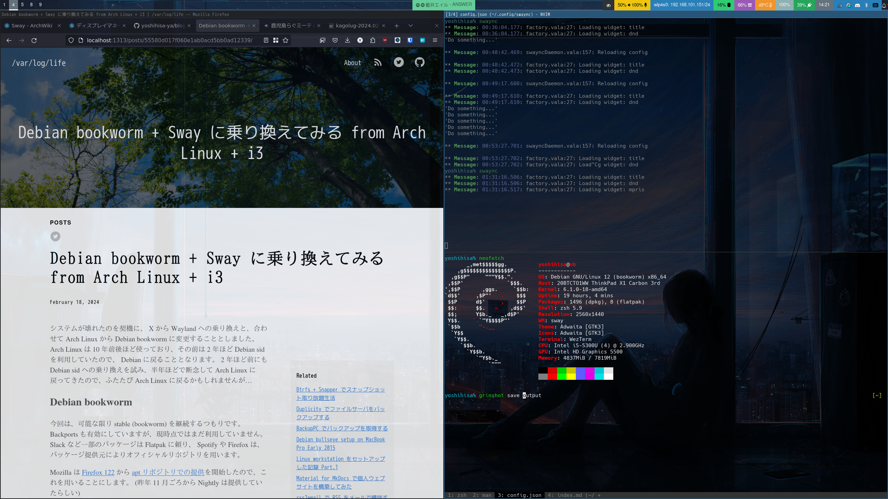
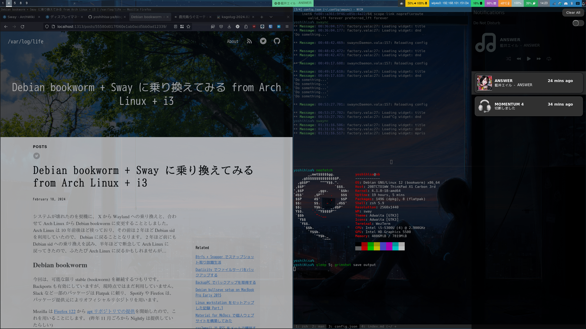

システムが壊れたのを契機に、 X から Wayland への乗り換えと、合わせて Arch Linux から Debian bookworm に変更することとしました。
Arch Linux は 10 年前後ほど使っており、その前は 2 年ほど Debian sid を利用していたので、 Debian に戻ることとなります。
2 年ほど前にも Debian sid への乗り換えを試み、半年ほどで断念して Arch Linux に戻ってきたので、ふたたび Arch Linux に戻るかもしれませんが...



<!--more-->

## Debian bookworm
今回は、可能な限り stable (bookworm) を継続するつもりです。
Backports も有効にしていますが、現時点ではまだ利用していません。
Slack など一部のパッケージは Flatpak に頼り、 Spotify や Firefox は、パッケージ提供元によりオフィシャルリポジトリを用います。

Mozilla は [Firefox 122](https://www.mozilla.org/en-US/firefox/122.0/releasenotes/) から [apt リポジトリでの提供](https://support.mozilla.org/en-US/kb/install-firefox-linux#w_install-firefox-deb-package-for-debian-based-distributions)を開始したので、これを用いることにします。
(昨年 11 月ごろから Nightly は提供していたらしい)

## Wayland + Sway
Sway については [Debian wiki](https://wiki.debian.org/sway) や [Arch Linux wiki](https://wiki.archlinux.jp/index.php/Sway) が参考になります。
また、 Wayland で利用できるツールも、 Debian でパッケージングされたものは [Debian wiki](https://wiki.debian.org/Wayland#Native_tools) が参考になります。

Sway を拡張した SwayFX や、 タイル型ウィンウマネージャーの他の選択肢として Hyprland も人気が有るようですが、いずれも現時点で Debian パッケージは存在しません。

```
$ sudo apt install sway swaybg swayidle swaylock xdg-desktop-portal-wlr xwayland
$ sudo apt install wdisplays kanshi waybar sway-notification-center grimshot rofi
```

- sway: Sway そのもの。 i3 の代替。
- swaybg: Sway で壁紙を設定するユーティリティ。
- swayidle: アイドル状態を検知しロックユーリティティなどを起動する。 xautolock の代替。
- swaylock: ロックユーティリティ。 i3lock の代替。
- xdg-desktop-portal-wlr: スクリーンショット、画面共有、リモートデスクトップなどに必要。
- xwayland: X アプリケーションを Wayland で動かすための X サーバ。

- wdisplays: ディスプレイの配置などを変更するユーティリティ。 ARandR の代替。
- kanshi: ディスプレイの接続/解除に伴う設定の自動変更ツール。 autorandr の代替。
- waybar: ステータスバーを作成する。 i3bar/Polybar の代替。
- sway-notification-center: Microsoft Windows や macOS のような通知センターを作成する通知デーモン。 dunst の代替。
- grimshot: スクリーンショットユーティリティ。
- rofi: アプリケーションランチャー。Debian では dmenu が通常で、 wofi が人気の有る代替だが、まだ乗り換えておらず rofi を継続。

Sway には標準で swaybar が同梱されていますが、よりカスタマイズできる waybar に置き換えています。
通知については、 mako (mako-notifier) が dunst の代替として広く使われるようですが、よりリッチな SwayNotificationCenter を試してみています。
下記の通り、右から出てくる通知センターです。
MPRIS による音楽コントロールも存在しますが、設定の問題なのか半透明なので修正する予定です。


アプリケーションランチャーについても、 Debian 環境では dmenu が起動するように設定されており、人気の有る代替は wofi です。
wofi を導入する予定ですが、まだ未設定なので rofi をしばらく継続利用します。

```
$ sudo apt install gammastep
```
GammaStep は Redshift の代替で、色温度の調整を行うツールです。
他に、音量や輝度調整の状態をスクリーンに出力するツールとして wob や SwayOSD( Debian パッケージ無し) が有りますが、今回は Waybar に任せることとし導入していません。

```
$ sudo apt install fonts-vlgothic fonts-ipafont fonts-font-awesome
$ sudo apt install brightnessctl clipman network-manager-gnome
```
フォントやクリップボードマネージャなども導入しておきます。
[Arch Linux wiki](https://wiki.archlinux.org/title/Sway#Clipboard) で紹介されているため導入していますが、まだよく分かっていないので、詳細については記載しません。

nm-applet は、 `nm-applet --indicator` のように `--indicator` オプションを付けなければ、バーに出力されません。

```
$ sudo apt install pipewire-audio wireplumber pipewire-media-session-
$ systemctl --user --now enable wireplumber.service
$ systemctl --user --now enable pipewire-pulse
$ sudo apt install pavucontrol playerctl
$ sudo apt install bluetooth blueman
```
オーディオ関連のパッケージを導入しておきます。

```
$ sudo apt install fcitx5 fcitx5-skk
```
日本語入力として fcitx5-skk を導入します。
[このパッチ](https://github.com/swaywm/sway/pull/7226) が適用されるまで、一部のアプリケーションで、日本語入力の変換候補が出ないことに注意が必要です。
私の環境だと、ターミナルの WezTerm が問題となりましたが、ターミナル上で日本語入力をするのは殆ど NeoVim を用いるときで、 NeoVim の SKK プラグインを用いるので殆ど影響は無視できるほど軽微でした。
Firefox, Spotify, Slack(Flatpak), Discord(Flatpak) などは問題が有りませんでした。

ディスプレイマネージャを用いないので、Sway の起動スクリプトを作成し、そこで export することとします。
```
#!/bin/bash

export GTK_IM_MODULE=fcitx
export QT_IM_MODULE=fcitx

sway
```

Sway に関するユーザがコントリビュートしたスクリプトは、 [OctopusET/sway-contrib](https://github.com/OctopusET/sway-contrib) に有り、 非アクティブウィンドウを半透明にする inactive-windows-transparency.py もこちらに有ります。
python3-i3ipc に依存するので導入することで実行することが可能となります。
```
$ sudo apt install python3-i3ipc
$ python3 ./inactive-windows-transparency.py --opacity 0.85
```

## Screen Share の問題
Wayland + Sway の環境では、ウェブでの画面共有などの際、モニタ単位での画面共有となり、ウィンドウ単位での画面共有ができない問題が有ります。
ワークアラウンドとして、[仮想モニタを使う例が issue で共有](https://github.com/emersion/xdg-desktop-portal-wlr/issues/107#issuecomment-1596107337) されているので、ありがたくこれを使うこととします。
issue の通りコンフィグを書き換えた後、 `swaymsg create_output` コマンドを実行すると HEADLESS-1 が作成されます。

この状態で WebRTC のテストページ https://mozilla.github.io/webrtc-landing/gum_test.html にアクセスし画面共有を開始すると、 wofi で画面選択が表われるので、 HEADLESS-1 を選択し画面共有を開始することができます。
目的のアプリケーションのみを HEADLESS-1 に移動し、 `Mod + f` でフルスクリーンにして利用します。

画面共有したアプリケーションでプレビューを表示したり、 OBS を使うことで HEADLESS-1 を見ながら操作することが可能ですが、 wl-mirror を使うと簡単です。
wl-mirror は Debian bookworm にパッケージは無く、 sid に存在するので sid を使うか、 [GitHub Releases から deb パッケージを取得](https://github.com/Ferdi265/wl-mirror/releases) して使うことが可能です。

## Arch Linux との思い出
Arch Linux は、とても良いディストリビューションですが、高頻度でのアップグレード作業が厳しくなってきました。
メインマシンやラップトップのみならず、環境が大幅に異なるもの (例えば職場の WSL2 上に構築されたもの) の維持も有り、疲れてきた部分が有ります。

壊れやすいと言われますが、確かにアップストリームで生じたバグを踏むことが有るものの、すぐに解消されることやダウングレードも手段として存在し、それ自体はあまり問題では有りませんでした。
しかし、 AUR などで導入したパッケージが依存関係の問題を引き起こしたり、誤ってあまり推奨されない構築をしていた場合に踏む問題は、ケタ違いに厄介でした。
今回も、推奨されない構築を行っていた為、アップグレード作業が厳しくなり、複数台を修正する必要が生じた(ただし再インストールのほうが早い)ことが契機でした。
インストールの自由度が高いぶん、知識不足で動かしてしまうことは多々有り、例えばディレクトリ構成や ESP マウントポイントから Secure Boot の設定まで、一般的に推奨されないが動いてしまうことは多々有ります。
推奨から外れた部分は、アップグレードで壊れる可能性が高くなり、そのケツ持ちは自分で行わなければなりません。
もちろん、それにより成長し、どのディストリビューションでも使える偏らない知識を得ることが出来ますが、ちょっと数を減らして他の事に集中したい為、乗り換えます。

今後も一部では使っていくと思いますし、私のホームグラウンドであり、片よらない普遍的な知識を得る場として活用していくことは変わらないつもりです。
