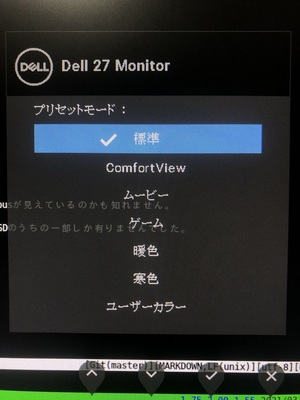

昨年、ディスプレイ故障によりDell製の27インチWQHDディスプレイP2720DC x2に買い替えたのですが、ComfortViewというバックライトや発色を優しくするプリセットモードが有り利用していました。いわゆるムービーモードやゲームモードと同様にOSDにて設定できる表示モードの1つなのですが、最近はコンソール以外に動画等も見る機会が増えたので、標準とComfortViewを容易に切り替えられる事が望ましくなったためスクリプトを組みました。
<!--more-->

環境:  
  PC: ThinkPad Arch Linux  
  Monitor: Dell P2720DC x2  
  USB Type-C(DisplayPort Alt Mode) + MST DaisyChain

Windowsを利用している場合は、Dell Display Managerを利用してコンピュータから変更ができますが、Linuxのため、液晶ディスプレイとの通信規格であるDDC/CIをサポートしたddcutilコマンドを用いることにしました。

カーネルモジュールを読んだ後にdetectすると検出されます。
```
]$ sudo modprobe i2c-dev
]$ sudo ddcutil detect
Invalid display
   I2C bus:  /dev/i2c-7
   EDID synopsis:
      Mfg id:               AUO
      Model:
      Product code:         XXXX
      Serial number:
      Binary serial number: 0 (0x00000000)
      Manufacture year:     2017
      EDID version:         1.4
   DDC communication failed
   This is an eDP laptop display. Laptop displays do not support DDC/CI.

Display 1
   I2C bus:  /dev/i2c-8
   EDID synopsis:
      Mfg id:               DEL
      Model:                DELL P2720DC
      Product code:         XXXXX
      Serial number:        XXXXXXX
      Binary serial number: XXXXXXXXX (0xXXXXXXXX)
      Manufacture year:     2020
      EDID version:         1.4
   VCP version:         2.1

Display 2
   I2C bus:  /dev/i2c-10
   EDID synopsis:
      Mfg id:               DEL
      Model:                DELL P2720DC
      Product code:         XXXXX
      Serial number:        XXXXXXX
      Binary serial number: XXXXXXXXX (0xXXXXXXXX)
      Manufacture year:     2020
      EDID version:         1.4
   VCP version:         2.1

Display 3
   I2C bus:  /dev/i2c-11
   EDID synopsis:
      Mfg id:               DEL
      Model:                DELL P2720DC
      Product code:         XXXXX
      Serial number:        XXXXXXX
      Binary serial number: XXXXXXXXX (0xXXXXXXXX)
      Manufacture year:     2020
      EDID version:         1.4
   VCP version:         2.1
```
3つのP2720DCが検出されましたが、MSTを有効に設定した側のP2720DCのシリアルが2回登場していたので、2つのI2C busが見えているのかも知れません。

`capabilities` を用いると各項目と設定できる値を検出することが出来るのですが、残念ながらDisplay ModeにはOSDのうちの一部しか有りませんでした。

```
]$ sudo ddcutil capabilities | grep -A7 'Feature: DC'
   Feature: DC (Display Mode)
      Values:
         00: Standard/Default mode
         03: Movie
         05: Games
   Feature: DF (VCP Version)
   Feature: E0 (Manufacturer specific feature)
   Feature: E1 (Manufacturer specific feature)
```

そこで、複数のモードに切り変えながら全てのVCPコードと値を書き出しdiffを取ると、差分が生じた複数のうち、Code 0xf0が怪しいことが判明しました。

```
// プリセットモード: 標準のとき
]$ sudo ddcutil getvcp 0xf0
VCP code 0xf0 (Manufacturer Specific         ): mh=0x00, ml=0xff, sh=0x00, sl=0x00

// プリセットモード: ComfortViewのとき
]$ sudo ddcutil getvcp 0xf0
VCP code 0xf0 (Manufacturer Specific         ): mh=0x00, ml=0xff, sh=0x00, sl=0x0c
```

またComfortViewのとき、Code 0xdc(Display Mode)は変わらず0x00(Standard/Default mode)のままですが、改めて0x00を書き込むと標準に戻る事を確認しました。
接続されているP2720DCが標準であればComfortViewに、ComfortViewであれば標準に変更するよう、雑なシェルスクリプトにしておきます。
getvcpやsetvcpは遅いのでディスプレイ毎に&し最後にwaitするようにしたり、他のモードを引数に取るようにしたりすると便利かもしれません。
```
#!/bin/bash

lsmod | grep -q '^i2c_dev' || sudo modprobe i2c_dev
for i in $(sudo ddcutil detect | grep -A2 'Model: *DELL P2720DC' | awk '/Serial number:/ {print $NF}' | sort | uniq); do
  sudo ddcutil --sn $i getvcp 0xf0 | grep -q sl=0x0c && sudo ddcutil --sn $i setvcp 0xdc 0x00 || sudo ddcutil --sn $i setvcp 0xf0 0x0c
done
```
