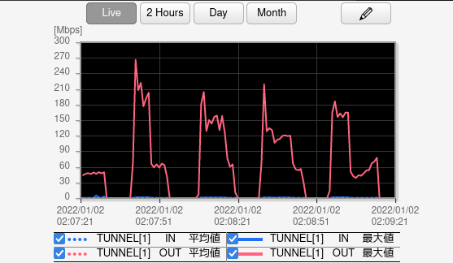

前回 [BackupPC でバックアップを取得する]() で BackupPC を使ってみました。

複数クライアントのバックアップを取得でき、バックアップ対象にエージェントが不要など便利なのですが、 VPS 等のVMインスタンスが必要となるのが不便な点です。
NAS等の大容量プールをバックアップする際、それだけ大容量なブロックストレージをアタッチしなければなりません。
安価に構築する手法としてオブジェクトストレージをVMでマウントする方法も有りますが、それでは LUKS 等を利用できないので、バックアップソフトウェアで暗号化を担保する必要も有ります。
(前回の BackupPC では LUKS 上に構築しています)

今回は、ファイルサーバに Duplicity をインストールし、オブジェクトストレージ Backblaze B2 Cloud Storage にバックアップしようと思います。

Duplicity: https://duplicity.gitlab.io/duplicity-web/

Backblaze B2 Cloud Storage: https://www.backblaze.com/b2/cloud-storage.html


## Duplicity の主な特徴
- OSS の CLI バックアップソフトウェア(Ubuntu の 標準 GUI バックアップツールである Deja Dup のバックエンド)
- GnuPG を用いた暗号化及び、署名による改竄検知が可能
- 各種オブジェクトストレージ、クラウドストレージサービス、scp、WebDAV 等をサポート
<!--more-->

## 環境(前提)
Debian bullseye

ZFS環境のファイルサーバであり、バックアップ対象は下記、合計 約 521 GB。
```
root@sv4:~# zfs list /data/{document,music,picture}
NAME                 USED  AVAIL     REFER  MOUNTPOINT
tank/data/document   327G  7.36T      327G  /data/document
tank/data/music      148G  7.36T      148G  /data/music
tank/data/picture   45.9G  7.36T     45.9G  /data/picture
root@sv4:~#
```
ZFS snapshot による世代管理、NAS製品(MD-RAID 1)への rsync を定期的に実施している為、遠隔地へのバックアップが主目的であり、火災などによる消失への備えである。

## Duplicity を利用してみる
下記は、初回のフルバックアップでリモートサーバに作成されたファイルの例です。
```
yoshihisa@gsv1:~$ file backup/sv4/*
backup/sv4/duplicity-full-signatures.20220101T143459Z.sigtar.gpg: GPG symmetrically encrypted data (AES256 cipher)
backup/sv4/duplicity-full.20220101T143459Z.manifest.gpg:          GPG symmetrically encrypted data (AES256 cipher)
backup/sv4/duplicity-full.20220101T143459Z.vol1.difftar.gpg:      GPG symmetrically encrypted data (AES256 cipher)
yoshihisa@gsv1:~$
```
Duplicity は指定容量を上限(デフォルトでは200MB)にアーカイブした tar(difftar) をリモートサーバに保管します。
200MBに収まらない場合は、vol1 ... vol? の形式で増えていきます。
インクリメンタル(増分)バックアップでは、変更されたファイルについて、 rdiff が生成する diff が tar ファイルに保存される為、小容量で済みます。

これとは別に、 manifest と sigtar を保管しており、これらは duplicity を実行したマシンの ~/cache/duplicity/ にも保管されます。

sigtar は、 rdiff が生成したシグネチャが保管されています。
rdiff はバイナリ間の差分を扱いますが、diff コマンドで想定するように新旧のファイルを必要としません。
代わりに、ファイルからシグネチャと呼ばれる短かいファイルを生成しておき、これを利用します。
シグネチャは、ブロック単位でのチェックサムが含まれているので、変更後の新しいファイルと比較する事で差分が生じたブロックを検出できます。
インクリメンタルバックアップでは、これによって検出された差分ブロックと、新しいシグネチャを保管する事で成立します。
つまり、増分バックアップを行うにあたり、リモートサーバからオリジナルファイルをダウンロードして比較する必要は有りません。
なお、フルバックアップは、シグネチャがそこそこの容量となるので sigtar もそれなりの容量になります。

manifest は、バックアップ対象のファイルがどの difftar に存在するか記載されています。

### scp にバックアップする
まずは scp でリモートサーバ `yoshihisa@gsv1.yoshihisa.link:/home/yoshihisa/backup/sv4` にバックアップしようと思います。
リモートサーバはscpで接続できればツールは不要なので、レンタルサーバ等でも良いかと思います。

duplicity と、 SSH秘密鍵のパスフレーズ入力回避用に keychain を導入しておきます。
SSH接続用にキーペアの作成と、バックアップファイルの暗号化及び署名用に、GnuPG キーペアを作成しておきます。
オブジェクトストレージに保管するだけであれば、keychain や SSHキーペアは不要です。
```
root@sv4:~# apt install duplicity keychain
root@sv4:~# ssh-keygen -t ed25519
root@sv4:~# ssh-copy-id yoshihisa@gsv1.yoshihisa.link
root@sv4:~# gpg --gen-key
```

duplicity の構文は、 cp などに似ています。
```
$ duplicity [full|incremental] [options] directory remote
```
上記では directory を remote にバックアップする動作であり、full/incremental は省略可能です。
```
$ duplicity remote directory
```
remote を手前に持ってくると、リストアモードとして動作します。

keychain を利用する為に .bashrc に追記しておき、改めてログインする事で利用できるようにしておきます。
```
root@sv4:~# echo 'keychain --nogui --clear id_ed25519' >> ~/.bashrc
root@sv4:~# echo '. ~/.keychain/$HOSTNAME-sh' >> ~/.bashrc
root@sv4:~# exit
yoshihisa@sv4:~$ su -
パスワード:

 * keychain 2.8.5 ~ http://www.funtoo.org
 * Found existing ssh-agent: 2010351
 * ssh-agent: All identities removed.
 * Adding 1 ssh key(s): /root/.ssh/id_ed25519
Enter passphrase for /root/.ssh/id_ed25519:              # SSHキーパスフレーズを入力
 * ssh-add: Identities added: /root/.ssh/id_ed25519

root@sv4:~#
```

この状態でバックアップを取得してみます。
GnuPG に関連する環境変数として、

PASSPHRASE  
encrypt-key の パスフレーズを指定。

SIGN\_PASSPHRASE  
sign-key の パスフレーズを指定。もし指定が無い場合、encrypt-keyと同一の鍵であれば、 PASSPHRASE が参照され用いられる。

が存在するので、指定しておくとスクリプト実行時に便利です。

```
root@sv4:~# export PASSPHRASE='xxxxxxxx'
root@sv4:~# duplicity --encrypt-key XXXXXXXX --sign-key XXXXXXXX /data/document/path/to/backup scp://yoshihisa@gsv1.yoshihisa.link//home/yoshihisa/backup/sv4
Local and Remote metadata are synchronized, no sync needed.
Last full backup date: none
Reuse configured PASSPHRASE as SIGN_PASSPHRASE
No signatures found, switching to full backup.
--------------[ Backup Statistics ]--------------
StartTime 1641053588.15 (Sun Jan  2 01:13:08 2022)
EndTime 1641053591.82 (Sun Jan  2 01:13:11 2022)
ElapsedTime 3.68 (3.68 seconds)
SourceFiles 4077
SourceFileSize 162020957 (155 MB)
NewFiles 4077
NewFileSize 162020957 (155 MB)
DeletedFiles 0
ChangedFiles 0
ChangedFileSize 0 (0 bytes)
ChangedDeltaSize 0 (0 bytes)
DeltaEntries 4077
RawDeltaSize 162016091 (155 MB)
TotalDestinationSizeChange 35679650 (34.0 MB)
Errors 0
-------------------------------------------------
```

バックアップが取得できたら、マシンが消失した事を想定し、手元のキャッシュデータを削除して、適当なディレクトリにリストアしてみます。
```
root@sv4:~# rm -rf .cache/duplicity
root@sv4:~# duplicity --encrypt-key XXXXXXXX --sign-key XXXXXXXX scp://yoshihisa@gsv1.yoshihisa.link//home/yoshihisa/backup/sv4 /path/to/restore
```

最後に、 ~root に存在する GnuPG のキーストア、SSHキーペア、これらのパスフレーズは、USBメモリのLUKS領域などに複製し安全な場所に保管しておく必要が有ります。


### Backblaze B2 Cloud Storage にバックアップする
Backblaze B2 Cloud Storage は、 $0.005/GB/Month 単価のオブジェクトストレージです。
今回の用途では、バックアップ対象は現時点で 約 521 GBですが、フルバックアップが重複して保管される期間が存在する事や各種オーバーヘッドを想定して 平均 800GB 程度と仮定すると、 $4/月(執筆時点で約465円/月)となります。

トラフィックは egress のみ $0.01/GB がかかります。
リストアの為に、最後のフルバックアップと、それ以降の増分バックアップを全てダウンロードするとし、仮に 600GB と想定すると、ダウンロードに $6/回(執筆時点で約697円/回)が必要となります。
これであれば十分に安い金額ですし、そもそも人生で1回も発生し無いことが望ましいでしょう。
また、定期的に verify しリモートファイルの整合性を担保するべきなのですが、ダウンロードが発生し egress 課金が発生してしまいます。
代わりにフルバックアップを実行し、古いバックアップセットを削除してしまうのが良いかと思いますので、最後のスクリプト化では、この方針を取ります。

Amazon S3 Glacier や Wasabi も検討しましたが、今回は Backblaze B2 Cloud Storage を利用します。
(Wasabi は egress 含めトラフィック課金が有りませんが、代わりにストレージ単価が $0.0059/GB/Month であり、1TBの最低料金が設定されています。)

https://www.backblaze.com/b2/cloud-storage.html

何れも執筆時点の価格であり、APIリクエスト課金も有るので、正しい価格はオフィシャルページから確認してください。

必要なパッケージを導入します。
```
root@sv4:~# apt install python3-b2sdk
```

今回は、バケット `file-backup-music`, `file-backup-picture`, `file-backup-document` を作成しており、合わせて Application Key も取得しています。
作成したバケット `file-backup-music` に `/data/music` をバックアップしてみます。

```
root@sv4:~# duplicity --encrypt-key XXXXXXXX --sign-key XXXXXXXX /data/music b2://aaaaa:bbbbbbb@file-backup-music/
Local and Remote metadata are synchronized, no sync needed.
Last full backup date: none
Reuse configured PASSPHRASE as SIGN_PASSPHRASE
No signatures found, switching to full backup.
--------------[ Backup Statistics ]--------------
StartTime 1641090287.67 (Sun Jan  2 11:24:47 2022)
EndTime 1641110527.62 (Sun Jan  2 17:02:07 2022)
ElapsedTime 20239.95 (5 hours 37 minutes 19.95 seconds)
SourceFiles 5598
SourceFileSize 158797226340 (148 GB)
NewFiles 5598
NewFileSize 158797226340 (148 GB)
DeletedFiles 0
ChangedFiles 0
ChangedFileSize 0 (0 bytes)
ChangedDeltaSize 0 (0 bytes)
DeltaEntries 5598
RawDeltaSize 158797219737 (148 GB)
TotalDestinationSizeChange 159495006687 (149 GB)
Errors 0
-------------------------------------------------
```

約5時間37分で終了しており、転送量から、約7.51MB/S(60.12Mbps)の転送速度で有った事が分かります。
実際には、「転送するファイルの作成 -> 転送」を繰り返しているので、ルータでトラフィックを見ると波になっています。



リストアの確認も実施したのち、バックアップをスクリプトにし、cronに登録しておきます。

```
root@sv4:~# crontab -l | grep backup.sh
0 0 * * 0 /root/backup.sh > /dev/null
root@sv4:~# cat /root/backup.sh
#!/bin/bash

export PASSPHRASE='xxxxxxxx'
export SIGN_PASSPHRASE='xxxxxxxx'

SIGNKEY="XXXXXXXX"
ENCRKEY="XXXXXXXX"

B2_KEYID="aaaaa"
B2_APPKEY="bbbbb"

export GNUPGHOME="/root/.gnupg"

DUPLICITY="duplicity --encrypt-key $ENCRKEY --sign-key $SIGNKEY"
DUPLICITY_BACKUP="$DUPLICITY --full-if-older-than 3M --num-retries 3"
DUPLICITY_CLEANUP="$DUPLICITY remove-all-but-n-full 1 --force"

B2_BACKDIRS="/data/music /data/document /data/picture"

for i in $B2_BACKDIRS; do
    REMOTE="b2://$B2_KEYID:$B2_APPKEY@file-backup-$(basename $i)/"
    $DUPLICITY_BACKUP $i $REMOTE && $DUPLICITY_CLEANUP $REMOTE
done
```

スクリプトで利用しているオプションは次の通りです。

- --full-if-older-than 3M フルバックアップの期間を設定します。前回のフルバックアップから3ヶ月経過したら、再びフルバックを実施します。
- --num-retries 3 リトライ回数を3回に設定します。

また、バックアップが正常に完了した後、 `duplicity remove-all-but-n-full 1 --force` を実行し、過去1回のフルバックアップを残し削除を実施します。
これはつまり、直近のフルバックアップ1回と、その後のインクリメントバックアップのみを保持します。
duplicity での削除関連コマンドは `--force` を付けないとリストアップのみとなるので、 `--force` オプションも付与します。
