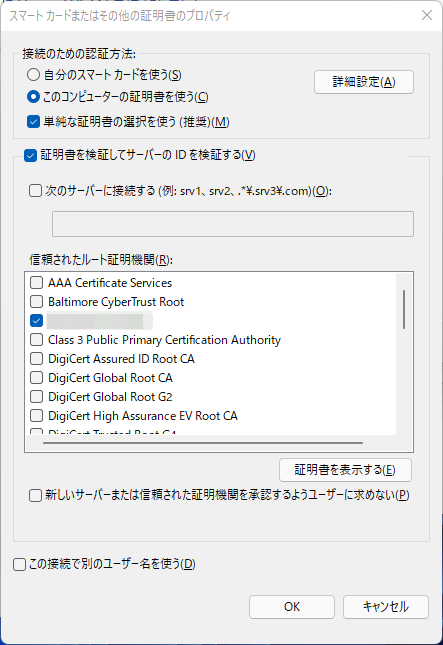
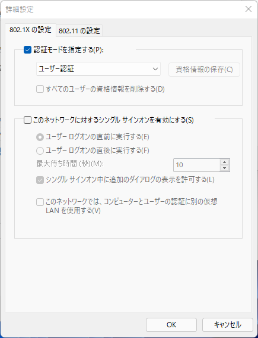

自宅の無線LANにおけるセキュリティ向上の為、WPA2 Enterprise EAP-TLSを導入したので、構築記録として残しておきます。

個人宅における無線LANのニーズは高まっており、スマートフォンはもちろんの事、電子書籍リーダーやスマートスピーカーなど、私の自宅でも数多くの無線LANクライアントが存在します。これまではWPA2-PSK(AES)を使っており、つまりPre-Shared Keyを設定していたわけですが、ネットワーク構成の見直しと同時にEAP-TLSとする事にしました。

なお、EAP-TLSに対応していないデバイスも有るため、これらはセキュリティが低いとして、別ネットワークに収容してWPA2-PSKを利用できるSSIDを吹く事にしました。
合わせてメインネットワークに接続できる端末のセキュリティ要件を定義し、これを満たさないデバイスも別ネットワークに収容し、メインネットワークとはファイアウォールで遮断しました。例えば、私個人以外にも管理権限の有る職場のテレワーク端末や、SecureBoot及びストレージ暗号化を実施していないクライアント端末などです。

今回は、Raspberry Pi 3を利用し、Debian GNU/Linux bullseye及び、FreeRAIUSを用いました。

<!--more-->

## Setup FreeRADIUS
Debian の Raspberry Pi イメージは下記に有るので、記載通りにセットアップしておきます。

https://wiki.debian.org/RaspberryPiImages

```
# apt install freeradius
# cd /etc/freeradius/3.0/certs
# less README
```

まずFreeRADIUSをインストールした後、鍵を作成しますが、必要な事はREADMEに丁寧に記載されています。今回は、専用のCAを構築するので、

1. CA構築
1. サーバ証明書の発行
1. クライアント証明書の発行

を行います。

なお今回は、FreeRADIUSをホストするマシンでCA構築及びクライアント証明書の発行を行っており、それに必要な秘密鍵も同一ホストで生成および保管してしまっています。

### CA構築
CAを構築し、サーバ証明書およびクライアント証明書の署名に利用します。

```
# cd /etc/freeradius/3.0/certs
# diff -uprN ca.cnf.org ca.cnf
--- ca.cnf.org  2021-07-28 19:28:32.000000000 +0900
+++ ca.cnf      2021-09-25 20:08:03.572385807 +0900
@@ -14,7 +14,7 @@ private_key           = $dir/ca.key
 RANDFILE               = $dir/.rand
 name_opt               = ca_default
 cert_opt               = ca_default
-default_days           = 60
+default_days           = 2000
 default_crl_days       = 30
 default_md             = sha256
 preserve               = no
@@ -47,12 +47,12 @@ output_password             = whatever
 x509_extensions                = v3_ca

 [certificate_authority]
-countryName            = FR
-stateOrProvinceName    = Radius
-localityName           = Somewhere
-organizationName       = Example Inc.
-emailAddress           = admin@example.org
-commonName             = "Example Certificate Authority"
+countryName            = JP
+stateOrProvinceName    = Tokyo
+localityName           = -----
+organizationName       = -----
+emailAddress           = -----
+commonName             = "-----"

 [v3_ca]
 subjectKeyIdentifier   = hash

# make ca.pem
# make ca.der
```
デフォルトで指定してある60日は短かいので変更し、countryName等の要素も変更(一部を-でマスクしています)しておきます。Makefileが用意されているので、これを用いて作成できます。

### サーバ証明書
構築したCAでサーバ証明書を発行します。クライアントの初回設定の際に、このサーバ証明書を信頼する事とします。

```
# cd /etc/freeradius/3.0/certs
# diff -uprN server.cnf.org server.cnf
--- server.cnf.org      2021-09-25 20:15:22.637845747 +0900
+++ server.cnf  2021-09-25 20:13:50.203044878 +0900
@@ -14,7 +14,7 @@ private_key           = $dir/server.key
 RANDFILE               = $dir/.rand
 name_opt               = ca_default
 cert_opt               = ca_default
-default_days           = 60
+default_days           = 398
 default_crl_days       = 30
 default_md             = sha256
 preserve               = no
@@ -46,12 +46,12 @@ output_password             = whatever
 req_extensions         = v3_req

 [server]
-countryName             = FR
-stateOrProvinceName     = Radius
-localityName            = Somewhere
-organizationName        = Example Inc.
-emailAddress            = admin@example.org
-commonName              = "Example Certificate Authority"
+countryName            = JP
+stateOrProvinceName    = Tokyo
+localityName           = -----
+organizationName       = -----
+emailAddress           = -----
+commonName             = "-----"

 [ v3_req ]
 basicConstraints = CA:FALSE

# make server.pem
```

デフォルトで指定してある60日は短かいので変更しますが、ルート証明書と異なり、398 日間を超えないものとしておきます。Apple製デバイスが、398日間を超えるサーバ証明書を信頼しない為で、Google Chrome, Mozilla Firefoxも追従している為です。

https://support.apple.com/ja-jp/HT211025  
https://chromium.googlesource.com/chromium/src/+/ae4d6809912f8171b23f6aa43c6a4e8e627de784  
https://github.com/mozilla/pkipolicy/issues/204

Appleはこの変更について「ユーザが追加したルート CA や管理者が追加したルート CA が発行する証明書には影響しません。」と記載しているので、今回のケースでは、より長期の有効期限としても問題無いと思われます。しかし、他社製デバイスの挙動を把握していないのと、サーバ証明書のrenewによるクライアントへの再配布は無く手間が少ないので、短めで発行しておきました。

なお、より長い有効期限を設定する場合でも、下記に示す825日以下という条件は満たす必要が有りそうなので、注意する必要が有ります。詳細は各ベンダーのドキュメントや、実機における検証を実施いただければと思います。

https://support.apple.com/ja-jp/HT210176

最後に、プロセスが読めるようにしておきます。
```
# chown freerad server.pem
# chown freerad server.key
```

### クライアント証明書
構築したCAでクライアント証明書を発行します。クライアント毎に作成し、クライアントに配布します。

```
# cd /etc/freeradius/3.0/certs
# diff -uprN client.cnf.org client.cnf
--- client.cnf.org      2021-07-28 19:28:32.000000000 +0900
+++ client.cnf  2021-09-25 20:33:29.582667010 +0900
@@ -14,7 +14,7 @@ private_key           = $dir/ca.key
 RANDFILE               = $dir/.rand
 name_opt               = ca_default
 cert_opt               = ca_default
-default_days           = 60
+default_days           = 2000
 default_crl_days       = 30
 default_md             = sha256
 preserve               = no
@@ -45,9 +45,9 @@ input_password                = whatever
 output_password                = whatever

 [client]
-countryName            = FR
-stateOrProvinceName    = Radius
-localityName           = Somewhere
-organizationName       = Example Inc.
-emailAddress           = user@example.org
-commonName             = user@example.org
+countryName            = JP
+stateOrProvinceName    = Tokyo
+localityName           = -----
+organizationName       = -----
+emailAddress           = iphone8@-----
+commonName             = iphone8@-----

# make client.pem
```

他のクライアント端末向けも同様に作成しておきます。

### EAP-TLS設定
IEEE802.1X EAP-TLS の認証サーバとして動作するよう、FreeRADIUSを設定しておきます。

設定する項目は、次の通りです。

1. ネットワーク(Authenticatorが属する)とシークレットの指定
1. CA証明書, サーバ秘密鍵, サーバ証明書の設定

```
# cd /etc/freeradius/3.0
# diff -uprN clients.conf.org clients.conf
--- clients.conf.org    2021-07-28 19:28:32.000000000 +0900
+++ clients.conf        2021-09-25 20:51:10.779566336 +0900
@@ -266,3 +266,8 @@ client localhost_ipv6 {
 #              secret = testing123
 #      }
 #}
+
+client private-network-1 {
+       ipaddr          = 192.168.100.0/24
+       secret          = ----------
+}
```
ネットワーク(Authenticatorが属する)とシークレットを設定しておきます。シークレットはAuthenticatorに設定します。

```
# cd /etc/freeradius/3.0
# diff -uprN eap.org mods-enabled/eap
--- eap.org     2021-07-28 19:28:32.000000000 +0900
+++ mods-enabled/eap    2021-09-25 21:37:56.156748769 +0900
@@ -182,7 +182,7 @@ eap {
        #
        tls-config tls-common {
                private_key_password = whatever
-               private_key_file = /etc/ssl/private/ssl-cert-snakeoil.key
+               private_key_file = /etc/freeradius/3.0/certs/server.key

                #  If Private key & Certificate are located in
                #  the same file, then private_key_file &
@@ -218,7 +218,7 @@ eap {
                #  give advice which will work everywhere.  Instead,
                #  we give general guidelines.
                #
-               certificate_file = /etc/ssl/certs/ssl-cert-snakeoil.pem
+               certificate_file = /etc/freeradius/3.0/certs/server.pem

                #  Trusted Root CA list
                #
@@ -231,7 +231,7 @@ eap {
                #  In that case, this CA file should contain
                #  *one* CA certificate.
                #
-               ca_file = /etc/ssl/certs/ca-certificates.crt
+               ca_file = /etc/freeradius/3.0/certs/ca.pem

                #  OpenSSL will automatically create certificate chains,
                #  unless we tell it to not do that.  The problem is that
```
CA証明書, サーバ秘密鍵, サーバ証明書を設定します。

```
# systemctl restart freeradius
```

## Setup authenticator
今回は、Authenticatorとなる無線APとして、Allied TelesisのAT-MWS600APを用います。


SSIDの設定として、WPA2エンタープライズを選択し、RADIUSサーバのIPと、シークレットを設定しておきます。

## Setup クライアント
### iOS 15.x
生成されたclient.p12をiPhoneに転送すると、構成プロファイルとして導入できます。
```
# openssl pkcs12 -in client.p12 -noout -info
Enter Import Password:
MAC: sha1, Iteration 2048
MAC length: 20, salt length: 8
PKCS7 Encrypted data: pbeWithSHA1And40BitRC2-CBC, Iteration 2048
Certificate bag
PKCS7 Data
Shrouded Keybag: pbeWithSHA1And3-KeyTripleDES-CBC, Iteration 2048
```
確認するとこのファイルは、クライアント証明書と、その生成のために作成した(クライアント)秘密鍵が、パスワードベースの暗号化が行われ入っているようです。`-noout` オプションを削除すると、より詳細な内容が出力されます。


p12ファイルを構成プロファイルとして導入した後、対象のSSIDを選び、モードをEAP-TLSに変更した後、IDから導入したクライアント証明書を選択し接続します。この時点でユーザ名は、今回は無いので不要です。


サーバ証明書を信頼するか問われるので、詳細を確認して問題無ければ承認すると、接続が完了します。

今回試した限りでは、事前にCAのルート証明書を導入し信頼しても、上記のサーバ証明書を信頼するか確認するステップは変わりませんでした。
詳細を確認できていませんが、Appleの導入リファレンスに下記の記載が有るので、サーバ証明書はオレオレ認証局での発行を辞めるか、Macを用いて構成プロファイルを作成する必要が有りそうです。

> RADIUSサーバの証明書がオペレーティングシステムがデフォルトで信頼する認証局（CA）から発行されない場合は、構成プロファイルで信頼を確立する必要もあります。

https://support.apple.com/ja-jp/guide/deployment-reference-ios/apd7b6d34790/web

### Windows 11
[Linux workstation をセットアップした記録 Part.1]()で利用した ThinkPad X1 Carbon 3rd にWindows 11を検証の為に導入していたので、導入手順を記載します。Linuxを消去して導入していた為、今回はLinuxの手順は記載しません、そもそも記載しなくても大丈夫なユーザだらけだと思いますし...

1. ルート証明書(ca.der)導入
1. クライアント証明書及び秘密鍵導入(client.p12)
1. Wi-Fi設定

の手順で行ないます。上記に記載したiOS 15.xと異なり、ルート証明書を導入した後に信頼する事で、サーバ証明書に関する警告は表示されない事を確認しています。


まずはルート証明書をインストールします。

ウィザード中、「信頼されたルート証明機関」ストアに配置するように指定します。

内容を確認してインストールします。

次にクライアント証明書と秘密鍵をまとめた client.p12を用いて登録します。こちらも同様にインストールしますが、証明書ストアは自動選択としておきます。

続いて、Wi-Fiの設定を実施します。今回、SSIDのブロードキャストは行っていましたが、ネットワークが表示されなかった為、ウィザードを用いて登録しています。

SSIDを入力し、WPA2-エンタープライズを選択し登録を行います。

ネットワークのプロパティを開き、セキュリティタブから、「ネットワークの認証方法の選択」にて「スマートカードまたはその他の証明書」を選択し、「設定」ボタンからルート証明書の選択を行います。

先ほど登録したルート証明書が選択できるので、選択しOKをクリックします。

引き続き、「詳細設定」を選択し、認証モードを「ユーザー認証」を指定しておきます。


最後に、Wi-Fi一覧からSSIDを選択し接続した後、EAP-TLSを用いて接続できている事を確認しておきます。

## 導入してみて
FreeRADIUSのREADMEが非常に充実しているので、基本的なネットワーク知識が有れば、導入は難しくない印象でした。実際構築そのものは、下調べとDebian GNU/Linuxのセットアップを含めても、半日有れば完了した記憶が有ります。(構築したのが1ヶ月前なのでだいぶ忘れてますが...)
今回、CRL(証明書失効リスト)等についてはかなり省略していますが、Makefileで作成されているので、ちゃんとRevokeの検証などもしておく必要が有りそうです。
今後、有線LANについても、ダイナミックVLANと組み合わせて、認証済みと非認証のコンピュータを別々のVLANに収容するなどしていきたいと思います。
