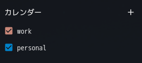
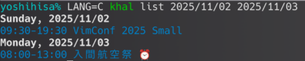
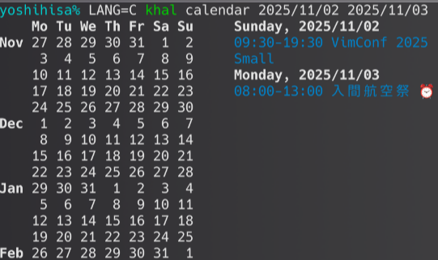
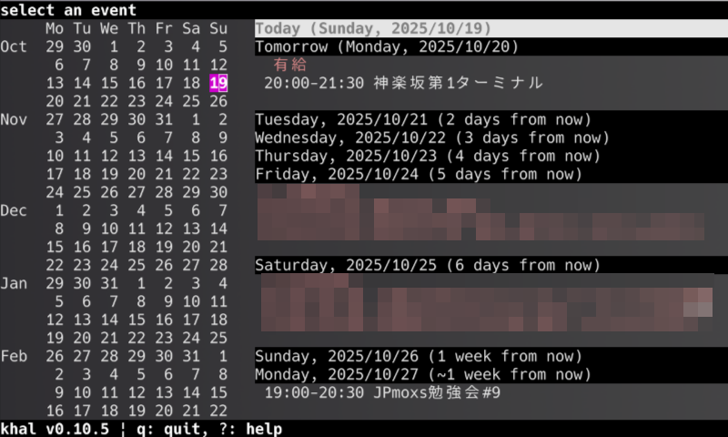
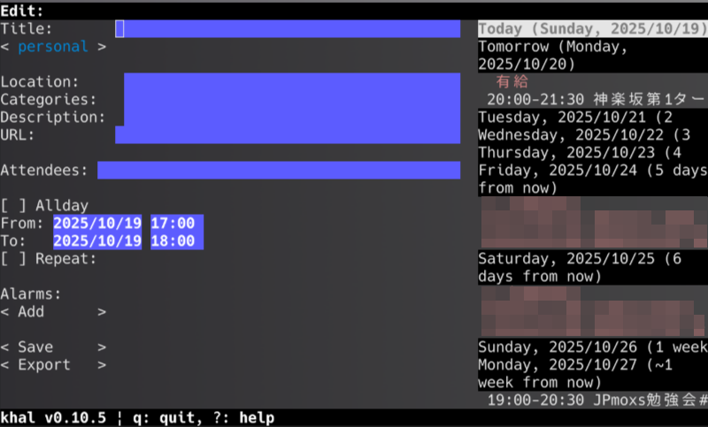

ターミナルでカレンダーを閲覧するために、今更ですが [khal](https://github.com/pimutils/khal) を試してみます。
Nextcloud の CalDAV サーバと連携するために、 [vdirsyncer](https://github.com/pimutils/vdirsyncer) も合わせて利用します。

いずれも Debian であればリポジトリに存在します。

- [khal](https://packages.debian.org/trixie/khal)
- [vdirsyncer](https://packages.debian.org/trixie/vdirsyncer)

<!--more-->

## vdirsyncer でローカルと同期する

[config.example](https://github.com/pimutils/vdirsyncer/blob/main/config.example) や [チュートリアル](https://vdirsyncer.pimutils.org/en/stable/tutorial.html) が存在するので、コンフィグ作成の助けになります。

### Nextcloud と同期する
Nextcloud に 2 つのカレンダーを作成しており、これを同期するために作成した `.config/vdirsyncer/config` が下記です。
```
[general]
status_path = "~/.vdirsyncer/status/"

[pair personal]
a = "personal_local"
b = "personal_remote"
collections = ["from a", "from b"]
metadata = ["displayname", "color"]

[storage personal_local]
type = "filesystem"
path = "~/.calendars/nextcloud/"
fileext = ".ics"

[storage personal_remote]
type = "caldav"
url = "https://nextcloud.example.com/remote.php/dav"
username = "username"
password = "password"
```

今回は personal というペア定義を作成し、次の 2 つを同期します。
- personal_local: khal が見るローカル `~/.calendars/nextcloud/`
- personal_remote: nextcloud.example.com の Nextcloud

pair セクションの collections は、どのカレンダーを同期するかを指定します。
例に記載した `collections = ["from a", "from b"]` は、 a(personal_local) および b(personal_remote) から、全てのカレンダーを同期します。
今回はローカル(personal_local)は空で、リモート(personal_remote)には以下の2つのカレンダーが有りますので、2つとも同期することになります。
- personal: 個人的な予定用のカレンダー(vdirsyncerの設定ファイルの personal と同一名称なのは偶然です)
- work: 有給取得日の管理用カレンダー

この 2 つのカレンダーだけで問題無ければ、以下のように設定することもできます。
```
collections = ["personal", "work"]
```

ローカルでは、次のように、 path に指定した '~/.calendars/nextcloud/' の下にそれぞれ同期されることとなります。
```
$ tree ~/.calendars
/home/yoshihisa/.calendars
└── nextcloud
    ├── personal
    └── work
```

pair セクションの `metadata` は、カレンダーに関する追加の情報を同期するか指定します。
例に記載した displayname と color は、カレンダーの表示名と、色を同期します。

Nextcloud では、下記のスクリーンショットで示した Web UI での表示名と、カレンダーの色となります。



今回は khal を用いますが、 khal での文字色にも影響します。

設定ファイルを作成したら、 discover, metasync, sync を実行します。
```
$ vdirsyncer discover
$ vdirsyncer metasync
$ vdirsyncer sync
```

discover を実行すると、ローカルとリモートから同期するコレクションを探し、今回の場合は Nextcloud に存在する personal と work を検出します。
リモートに存在し、ローカルに存在しないので、ローカルに作成するか問われます。
```
$ vdirsyncer discover
Discovering collections for pair personal
personal_local:
personal_remote:
  - "work"
  - "personal"
warning: No collection "work" found for storage personal_local.
Should vdirsyncer attempt to create it? [y/N]: y
warning: No collection "personal" found for storage personal_local.
Should vdirsyncer attempt to create it? [y/N]: y
Saved for personal: collections = ["work", "personal"]
```

次に metasync を実行し、前述したカレンダー表示名と色を同期します。
カレンダー表示名と色はファイルとして保存されます。
```
$ vdirsyncer metasync
$ grep . ~/.calendars/nextcloud/**/*(.)
/home/yoshihisa/.calendars/nextcloud/personal/color:#0082c9
/home/yoshihisa/.calendars/nextcloud/personal/displayname:personal
/home/yoshihisa/.calendars/nextcloud/work/color:#C98879
/home/yoshihisa/.calendars/nextcloud/work/displayname:work
```

最後に sync サブコマンドで同期します。
```
$ vdirsyncer sync
```

sync は定期的に実行することとなりますが、 Debian パッケージでは systemd 用にユニットファイルが同梱しているので、タイマーを有効化します。
```
$ systemctl --user enable vdirsyncer.timer
```

ちなみに当方の Debian bullseye 環境では、次の通り定義されています。
```
$ systemctl --user cat vdirsyncer.timer
# /usr/lib/systemd/user/vdirsyncer.timer
[Unit]
Description=Synchronize vdirs

[Timer]
OnBootSec=5m
OnUnitActiveSec=15m
AccuracySec=5m

[Install]
WantedBy=timers.target

$ systemctl --user cat vdirsyncer.service
# /usr/lib/systemd/user/vdirsyncer.service
[Unit]
Description=Synchronize calendars and contacts
Documentation=https://vdirsyncer.readthedocs.org/

[Service]
ExecStart=/usr/bin/vdirsyncer sync
RuntimeMaxSec=3m
Restart=on-failure
```

### iCalendar を購読する
次に、 connpass が提供する iCalendar を購読してみます。
閲覧専用で、ローカルからリモートへ同期することは有りません。

```
[pair connpass]
a = "connpass_local"
b = "connpass_remote"
collections = null

[storage connpass_local]
type = "filesystem"
path = "~/.calendars/connpass/"
fileext = ".ics"

[storage connpass_remote]
type = "http"
url = "https://connpass.com/joinmanage/XXXXXXXXXXXXXXXXXXXX.ics"
```

カレンダーの定義を追加したので、改めて discover を実行してから sync しておきます。

```
$ vdirsyncer discover
$ vdirsyncer sync
```

## khal でカレンダーを閲覧する
`configure` サブコマンドを利用すると、質問に回答することで設定ファイルを作成できますが、今回は手動で作成しました。

vdirsyncer で 3 つのカレンダーをローカルに同期したので、カレンダーを 3 つ定義しておきます。
合わせて、デフォルトカレンダーと、日付や日時のフォーマットを指定しておきます。

`~/.config/khal/config`
```
[calendars]

[[personal]]
path = ~/.calendars/nextcloud/personal
type = discover

[[work]]
path = ~/.calendars/nextcloud/work
type = discover

[[connpass]]
path = ~/.calendars/connpass
type = discover

[locale]
timeformat = %H:%M
dateformat = %Y/%m/%d
longdateformat = %Y/%m/%d
datetimeformat = %Y/%m/%d %H:%M
longdatetimeformat = %Y/%m/%d %H:%M

[default]
default_calendar = personal
```

`list` サブコマンドを用いると、カレンダーの予定が表示されます。
今回は connpass の予定のみを表示させるためにカレンダーを \-a オプションで指定しています。
```
$ khal list -a connpass | head
Today, 2025/10/19
14:00-18:00 鹿児島Linux勉強会 2025.10(オンライン開催) :: ## 鹿児島Linux勉強会

※鹿児島と付いていますが，オンラインなので住んでいる地域は問いません(前月の鹿児島の参加者は1人)．Linux/UNIXやOSSに興味があれば誰でも参加OK．

月イチペースを目標に集まってLinuxをはじめUNIX，UNIX-Like system, OSS等の関連する様々な事を語り合うことを目的としています．

BoFやアンカンファレンスのような形式で発表したいネタを持った人が発表します．
発表ネタはLinux やUNIX-Like system, OSSなどにかすってればOK
ちょっとした事や相談事とかもOK
```

予定の description も全て表示されますが、上記の connpass のカレンダーではイベントページの情報がほぼ全て記載されるので、それだけでターミナルが流れてしまいます。
また、私は予定の description に、航空会社や旅行代理店から来たメール内容などをそのまま転記するので、これも長くなってしまいます。

この問題を解決するために、設定ファイルにフォーマットを指定し、 description を表示しないようにします。
```
[view]
agenda_event_format = {calendar-color}{cancelled}{start-end-time-style} {title}{repeat-symbol}{alarm-symbol}{reset}
```

加えて、 `list` コマンドなどを実行した場合に表示する期間を timedelta で指定しておきます。

```
[default]
timedelta = 14d
```

また、 list サブコマンドを含め、多くのサブコマンドでは日付で範囲指定ができます。
下記の例では、 Nextcloud で指定しているカレンダーの色(青色)で出力され、リマインダーが設定されている予定にはアラームマークが付いています。


その他、私がよく利用するサブコマンドは `calendar` です。
`new` や `edit` というサブコマンドも有るのですが、当方はインタラクティブインタフェースを利用するので、あまり使いません。


### ikhal
`interactive` サブコマンドを用いるか、 `ikhal` コマンドを用いると、インタラクティブとなります。



`n` で新しい予定を作成できる。

