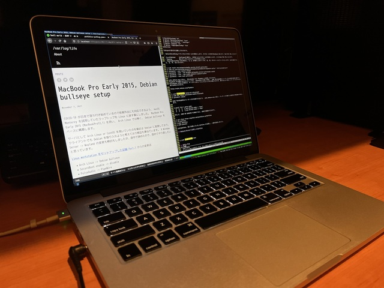

COVID-19 が日本で落ち付き始めているので長期外出にも対応できるよう、 macOS Monterey を試用していたラップトップを Linux に戻す事にしました。
MacBook Pro Early 2015 (MacBookPro12,1) を用い、 Arch Linux では無く、 Debian bullseye をベースに構築します。

サーバとして Arch Linux or CentOS を用いていたのを最近は Debian に変更しており、クライアントでも Debian を取り入れようと考えており検証も兼ねています。
X Window Server -> Wayland の変更も検討もしましたが、途中で諦めたので、改めてやり直したいと思っています。

<!--more-->
[Linux workstation をセットアップした記録 Part.1]() からの変更点
- Arch Linux -> Debian bullseye
- SecureBoot enable -> disable
- PulseAudio -> PipeWire
- synaptics -> libinput
- iptables(netfilter) -> nft(nftables)

Wayland(and Sway) への変更は見送りましたが、オーディオを PipeWire に、タッチパッド制御を libinput に、ファイアウォールを nftables に変更します。

Arch Linux 環境で意識している、最新や最小限をあまり重視しない事にし、パッケージグループ等も一部で利用します。
パッケージマネージャは、手動で指定しインストールしたパッケージと、依存関係で導入されたパッケージを区別しているので、手動で指定したパッケージだけを後で参照したり、他のシステムに適用する時に楽な為です。

今回はひとまず最新の stable である Bullseye で構築してみますが、飽きたら unstable の sid に変更してみようと思います。

## MacBook Pro Early 2015
https://wiki.debian.org/InstallingDebianOn/Apple/MacBookPro/Early-2015-13-inch

debian.org にいくつか情報が有るので、Power Management の項目は参考にしてスクリプトを導入します。

```
# dmidecode -t system | grep 'Product Name'
        Product Name: MacBookPro12,1
```

MacBook Pro は 2016 モデルから Apple T1 チップを搭載しており、更に 2018 モデルから Apple T2 セキュリティチップを搭載しています。
特に Apple T2 セキュリティチップはセキュアブート同等の機能を提供しているので、注意が必要かと思われます。

https://support.apple.com/ja-jp/HT208862

## Debian bullseye
今回はUSBメモリを用いてインストールを実施しました。
イメージのチェックサムが正しいか、チェックサムファイルが改竄されていないかを検証しておきます。
```
$ LANG=C gpg --verify SHA512SUMS.sign
$ LANG=C sha512sum -c SHA512SUMS 2>/dev/null | grep debian-11.1.0-amd64-netinst.iso
$ sudo cp debian-11.1.0-amd64-netinst.iso /dev/sda
```

option を押しながら起動し、USBメモリからブートさせます。

https://support.apple.com/ja-jp/HT201255

wikiに記載の通り、インストール中にトラックパッドは動作しないので、必要に応じてUSB接続マウスを用意しておきます。
また、無線LANチップも動作しないので、Apple純正のEthernetアダプタを用いてインストールを実施しました。

パーティションオプションとして、暗号化LVMを選択します。
個人的見解ですが、LUKSのパスフレーズを、rootユーザのパスフレーズと同一とする事は問題有りません。
他人がLUKSのパスフレーズを知ってしまった場合、root権限を利用される事と殆ど変わらないからです。

今回、インストーラでは次のパッケージ選択としました。

- [ ] Debian デスクトップ環境
- [ ] ... GNOME
- [ ] ... Xfce
- [ ] ... GNOME Flashback
- [ ] ... KDE Plasma
- [ ] ... Cinnamon
- [ ] ... MATE
- [ ] ... LXDE
- [ ] ... LXQt
- [ ] Web サーバ
- [x] SSH サーバ
- [x] 標準システムユーティリティ

標準システムユーティリティを導入すると、telnet, lsof, dig, traceroute などの基本的なユーティリティが入ります。
先述の通り、あまり最小構成は目指さないので、標準システムユーティリティにはチェックを入れておきます。

この段階までに Release Notes と Installation Guide を軽く摘み読んでおくのが良いと思います。

Release Notes: https://www.debian.org/releases/bullseye/releasenotes  
Installation Guide: https://www.debian.org/releases/bullseye/installmanual

## 基本パッケージ
```
# vi /etc/default/ssh
SSHD_OPTS="-o PasswordAuthentication=no"
# systemctl restart ssh
```
自宅ではメイン端末からリモートで操作する事が多いので、sshdを導入しました。
ネットカフェや公共無線LANにも接続するので、パスワード認証は無効とし、公開鍵認証のみとします。

```
# sed -i 's/main$/main contrib non-free/' /etc/apt/sources.list
# apt update
```
フリーで無いソフトウェアも許容します。

```
# lspci -nn | grep Network
03:00.0 Network controller [0280]: Broadcom Inc. and subsidiaries BCM43602 802.11ac Wireless LAN SoC [14e4:43ba] (rev 01)
# apt install firmware-brcm80211
```
無線LANチップを確認し、ファームウェアを導入します。

https://wiki.debian.org/brcmfmac

```
# echo options hid_apple fnmode=2 | tee -a /etc/modprobe.d/hid_apple.conf
# update-initramfs -u
```
合わせて、Apple Keyboard のファンクションキー取り扱いを、F1-F12をデフォルトとします。

https://wiki.debian.org/InstallingDebianOn/Apple/PageFragmentKeyboard

```
# apt install sudo sysstat locate git build-essential curl global vim intel-microcode strace nfs-common golang debian-goodies
```
基本的なユーティリティを導入します。
あくまで私が導入しているパッケージなので、多くの人が利用しないかもしれないパッケージも記載しています。

- sudo  sudoコマンド
- sysstat sarユーティリティ。筆者は、sysstatによるアクティビティ収集を殆どのマシンで有効にしています。
- locate  updatedb,locateユーティリティ。筆者は、流動的で無い設定ファイル等の探索にlocateを利用する事が多いです。
- git gitコマンド
- build-essential Debianパッケージ構築に必要な複数パッケージが導入されます。Debianパッケージを構築する予定は現時点で有りませんが、makeやgcc、依存でgnupgなどが入るので、インストールしておきます。
- curl curlコマンド
- global ソースコードタグシステム。ctagsが有名だと思いますが、筆者はctagsを知らずにgtags(GNU global)に入門した身なので、コードリーディング用に導入しておきます。
- vim 愛用エディタ
- intel-microcode Intelマシンなのでintel-microcodeを導入します。
- strace straceコマンド
- nfs-common NFSクライアントとして動作させる為。
- golang go製ツールを導入する為。
- debian-goodies checkrestart コマンド等を利用する為。

```
# usermod -aG sudo yoshihisa
# visudo
%sudo   ALL=(ALL:ALL) NOPASSWD: ALL
```
Debianインストーラで作成された一般ユーザでsudoを利用できるようにしておきます。

```
$ sudoedit /etc/sysstat/sysstat
HISTORY=365
SADC_OPTIONS="-S XALL"
$ sudo systemctl enable sysstat --now
```
sysstatによるアクティビティ収集の期間と対象をデフォルトから増やしておきます。
systemdでenableすることで、systemd-timerによって定期的に動作します。

```
$ sudoedit /etc/nftables.conf
#!/usr/sbin/nft -f

flush ruleset

table inet filter {
  chain input {
    type filter hook input priority 0; policy drop;
    iif lo accept
    ct state established,related accept
    tcp dport ssh ct state new accept
    ip6 nexthdr icmpv6 icmpv6 type { nd-neighbor-solicit,  nd-router-advert, nd-neighbor-advert } accept
  }
  chain forward {
    type filter hook forward priority 0; policy drop;
  }
  chain output {
    type filter hook output priority 0; policy accept;
  }
}
$ sudo systemctl enable nftables --now
$ sudo nft list ruleset # 確認
```
簡易的なステートフルファイアウォールとして、sshとIPv6動作に必要なパケットのINPUTを許容します。
`table inet filter` を用いており、IPv4/IPv6双方に影響します。

ArchWikiにサンプルが幾つか有るので、これをベースに組み立てました。
英語ページは更新されており、サンプルも複雑な物が掲載されています。

https://wiki.archlinux.jp/index.php/Nftables

## i3-wm desktop
```
$ sudo apt install i3 xinit xterm network-manager-gnome firefox-esr-l10n-ja pavucontrol arandr fcitx-skk blueman light fonts-vlgothic xautolock intel-gpu-tools ranger mosh pinentry-qt hugo tmux playerctl libimobiledevice-utils
```
i3-wmをベースにしたデスクトップ環境を構築します。
各パッケージの用途は次の通りです。

- i3 愛用のタイル型ウィンドウマネージャ。筆者の環境はMATE/Cinnamon -> awesome -> i3 と変移しており、i3はその中でも長く利用しています。
- xinit 筆者は、ディスプレイマネージャ(いわゆるグラフィカルなログイン画面)は用いませんので、startxコマンドを用いてXとi3を起動します。
- xterm 愛用ターミナル。
- network-manager-gnome nm-appletを利用する為に導入します。依存関係でNetworkManagerも導入されます。クライアントマシンでは、最近はNetworkManagerを愛用しています。
- firefox-esr-l10n-ja 愛用ウェブブラウザ。
- pavucontrol PipeWire(PulseAudio)ボリュームコントロール用。
- arandr ディスプレイレイアウトの変更用のGUIプログラム。頻繁にディスプレイを繋ぎ変える事が無いので、xrandrコマンドの使い方が覚えられず、GUIプログラムを利用しています。
- fcitx-skk 日本語入力IME。ここ数年は専らfcitxを用いており、1年ほど前にMozc(Google日本語入力)からSKKに移行し、SKKで無いと日本語入力できない体になってしまいました。業務端末はWindowsですがCorvusSKKのお世話になっております。
- blueman BluetoothマネージャGUI。
- light ディスプレイバックライト及び、キーボードLEDの調整用コマンド。将来的なWaylandへの移行を鑑み、xbacklightから移行しました。
- fonts-vlgothic 日本語フォント
- xautolock 時間経過による自動ロックを実現する為。
- intel-gpu-tools intel_gpu_top 等のユーティリティを利用する為。
- ranger ファイラーとして利用する為。
- mosh sshの代替として利用する為。
- pinentry-qt gpg-agentのパスフレーズプロンプトとして利用する為。pinentryについては、将来的に変更するかもしれません。
- hugo このブログで利用している静的ジェネレータ。
- tmux 愛用のターミナルマルチプレクサ。
- playerctl MPRISに対応した音楽プレイヤーなどを制御し、再生のコントロールや、再生情報の取得ができる為、キーボードのマルチメディアキーでの操作に用います。身近な所では、Spotfiyや各種ブラウザが対応しています。今回の環境のFirefoxでは、 about:config から media.hardwaremediakeys.enabled を true にする事で対応します。
- libimobiledevice-utils iOSに関する複数のツールが入っています。iPhoneを用いたUSBテザリングを実施する為に導入します。

こうして見ると、arandr, pavucontrol, blueman, NetworkManager等、GUIプログラムを多様している事が分かります。
なるべくCLI/TUIベースな環境にしておきたいのですが、ディストリビューション毎に基本作法が異なる物や、殆ど変更しない為に忘れてしまう物など、GUIを導入したケースも有ります。

```
$ sudo apt purge xserver-xorg-video-intel
```
wiki.debian.org では、2007年以降に製造された Intel Graphics では、 xserver-xorg-video-intel パッケージを削除する事が推奨されているので削除します。
実際に用いているドライバを確認しないうちに削除してしまったので、もしかしたら不要かもしれません。

https://wiki.debian.org/GraphicsCard#Intel

```
$ sudoedit /etc/network/interfaces
lo インタフェース以外の設定を削除。
```
NetworkManager は、 /etc/network/interfaces で管理されているインタフェースを扱いません。
今回の環境では、 Debian インストーラにより ens? (Apple Ethernet アダプタ) が記載されていますので、これを削除してNetworkManagerの管理に変更します。

```
$ sudoedit /etc/NetworkManager/NetworkManager.conf
[device]
wifi.scan-rand-mac-address=no
```
NetworkManager は現在、無線スキャン時の MAC アドレスランダム化が有効となっています。
私の無線AP環境では、接続までに時間を要するなどの問題が発生したので、これを無効化しておきます。

```
$ sudoedit /etc/X11/xorg.conf.d/30-touchpad.conf
Section "InputClass"
    Identifier "touchpad"
    Driver "libinput"
    MatchIsTouchpad "on"
    Option "NaturalScrolling" "true"
    Option "ScrollMethod" " twofinger"
    Option "Tapping" "on"
    Option "TappingButtonMap" "lrm"
EndSection
```
libinputの設定を記載しておきます。

- NaturalScrolling ナチュラルスクロールを有効にします。
- ScrollMethod     thofingerを指定し、2本指によるスクロールを有効にします。
- Tapping          軽いタップによるクリックを有効にします。
- TappingButtonMap lrmを指定し、1, 2, 3本指によるタップを、左、右、中(ホイールクリック)とします。lmrを指定すると、左、中、右となります。

```
$ sudo touch /etc/pipewire/media-session.d/with-pulseaudio
$ sudo cp /usr/share/doc/pipewire/examples/systemd/user/pipewire-pulse.* /etc/systemd/user/
$ systemctl --user daemon-reload
$ systemctl --user --now disable pulseaudio.service pulseaudio.socket
$ systemctl --user --now enable pipewire pipewire-pulse
$ systemctl --user mask pulseaudio
```
wiki.debian.org に従い、 PulseAudio から PipeWire に変更しておきます。
PipeWire を利用する1つのメリットは、 bluetooth を用いた際に、 LDAC 等の高音質なコーデックの利用が容易な事です。
PulseAudio を用いる場合は、ディストリビューションによって多少異なりますが、異なるビルド版パッケージへの入れ変え等が必要となり、経験上はPipeWireより面倒な印象が有ります。

https://wiki.debian.org/PipeWire

```
$ sudo apt install libspa-0.2-bluetooth
$ sudo apt remove pulseaudio-module-bluetooth
$ systemctl reboot
```
LDAC 等の高音質なコーデックが利用できるよう、 wiki.debian.org に従い、パッケージの導入と削除及び再起動を実施します。

```
$ pactl list | grep codec
                api.bluez5.codec = "ldac"
                api.bluez5.codec = "ldac"
```
試しに、SONY WF-1000XM4 を接続すると、LDACで接続ができます。

```
$ git clone https://github.com/yoshihisa-ya/dotfiles
$ cd dotfiles
$ make dotfiles
$ exec bash
$ make gotools
```
i3の設定等は、既に利用している dotfiles を流用し、一部を改変しました。

## Debian に合わせて変更したdotfiles
Arch Linux を利用していた頃と同様に startx コマンドを用いますが、これまでの [~/.xinitrc](https://github.com/yoshihisa-ya/dotfiles/blob/e12168adaeed7a1fc67b41ae4ce63495dd4e6bcc/.xinitrc) は流用できませんでした。
この辺りはディストリビューションによって差異も有るので難しい感じです。
具体的には、D-Busセッションが開始され無いため、GNOME系アプリケーションがpollシステムコールで待つ事態が発生し、まともに操作できない事態となりました。

今回は ~/.xinitrc 等は用いず、システムデフォルトの設定ファイルを参照するようにしておき、i3のユーザコンフィグ ~/.config/i3/config で nm-applet や blueman-applet などを起動する事にしました。

### 主な変更点
#### HiDPI対応
~/.Xresources で Xft.dpi を設定しておきます。
現時点で、利用しているアプリケーションはこれで対応できていそうなので、ひとまずはこれで運用してみます。
(試しに入れたSpotify公式クライアント等は対応して無さそうです。)

https://github.com/yoshihisa-ya/dotfiles/commit/939c5c3fe006141c5850bac3f77323cef4906c9b

#### xtermカラー設定
Arch Linux 環境では ~/.Xresources で、 `XTerm*reverseVideo: on` を設定し黒背景で利用していました。
しかし、Debianではシステム設定がArch Linuxと異なり白背景となってしまったので、どちらの環境でも統一できるように、background/foregroundのカラー設定に変更しました。

https://github.com/yoshihisa-ya/dotfiles/commit/410875f72620fa01e5ba2611cf756025f90a1a20

#### i3 config変更
i3 では、
- スクリーンロックを xscreensaver -> i3block に変更
- マルチメディアキー の設定を実施
- nm-applet 等の起動を、 ~/.xinitrc から移設

を実施しています。

マルチメディアキーは、
- バックライトのdown, up
- キーボードライトのdown, up
- メディアのplay-pause, previous, next
- 音量のmute, down ,up

を設定しています。

https://github.com/yoshihisa-ya/dotfiles/commit/d0311cf356db698ac0cf0a6b2189aa0ca912c0cd

## 今後
マシンが古いうえにモバイル用途でリモート接続が多いので、現状では stable bullseye でも満足して利用できる状態です。
Arch Linux は便利で今後も使い続ける予定ですが、パッケージアップデートの頻度などを考えると、あまり台数は増やしたくない気持ちも有るので、メインマシン以外は Debian への変更を検討していきたいと思っています。

LDACの動作不安定 (WF-100XM4) が見られるので、MacBook Pro 2015 に搭載されている Bluetooth 4.0 がバージョンとして厳しいのか、ソフトウェアスタックや設定によって改善するのか、今後の課題です。同じ場所でWalkmanを使うと安定するので、周囲の電波状況による物では無いと考えています。

i3lockへの移行に共ないxautolock等も入れていますが、サスペンド時(サスペンド直前)の自動ロックや、ロック後しばらくした後のsuspend等は未設定なので、これらも設定していこうと思います。

そして何より、Wayland(Sway)への移行は、どこかで改めて挑戦したいと思っています。


実際に外出先で使ってみた

## 追記 2021-11-14
スクリーンロック回りについて改善したので記載しておきます。

### サスペンド時の自動ロック
sleep.target, suspend.target の実行前にi3lockで画面をロックするようにする事で、`systemctl suspend` や ラップトップを閉じた時のサスペンドの際に、自動的にスクリーンロックをするようにしました。
これで安心して外に持ち出せます。
```
$ sudoedit /etc/systemd/system/lock@.service
[Unit]
Description=Lock the screen when suspend or sleep.
Before=sleep.target suspend.target

[Service]
User=%I
Type=forking
Environment=DISPLAY=:0
ExecStart=/usr/bin/i3lock -c 000000

[Install]
WantedBy=sleep.target suspend.target

$ sudo systemctl enable lock@yoshihisa
```

### ロック前のnotify及び、ロック無効化など
スクリーンロックが行なわれる60秒前に、10秒間の警告通知を行うようにしました。

また、 corners, cornerdelay, cornerredelay オプションを用いて、画面の角にマウスポインタを置いた際の挙動を設定しました。
具体的には、 `-corners +-0-` で、左上角は直ぐにロックする(+)、右上角はロックしない(-)、左下角は何も影響しない(0)、右下角はロックしない(-)とし、 -cornerdelay で発動するまでの時間、 -cornerredelay でロック解除後に再発動する時間を秒で指定しています。
動画を見る時など、無操作時間タイマーでロックして欲しく無い時は、右上角か右下角にマウスポインタを置けば良い事となります。
左上角にマウスポインタを置きロックされた後、ユーザが解除して再び直ぐにロックされても困るので、マウスポインタを別の場所に移動するまでの猶予として10秒を指定しています。

```
$ sudo apt install libnotify-bin
$ vi ~/.config/i3/config
exec xautolock -detectsleep -time 5 -locker "i3lock -c 000000" -notify 60 -notifier "notify-send -u critical -t 10000 -- 'The screen will lock in 60 seconds.'" -corners +-0- -cornerdelay 1 -cornerredelay 10
```

https://github.com/yoshihisa-ya/dotfiles/commit/dd6c2c58a92696f5d52cf3db7539205b44e8e8e3

### 電源ボタンの無視
MacBook Pro は、F12キーの隣に電源ボタンが有り、誤って押してしまうので、これをignoreします。

```
$ sudoedit /etc/systemd/logind.conf
HandlePowerKey=ignore
$ sudo pkill -HUP systemd-logind   # 適用
```
