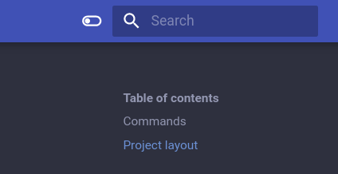
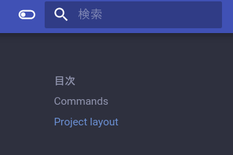
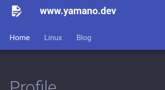
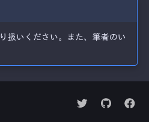
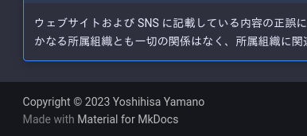

自分の軽い自己紹介と、 SNS へのリンクだけの www.yamano.dev というウェブサイトが有るのですが、 [Material for MkDocs](https://squidfunk.github.io/mkdocs-material/) で作り直してみました。
今後、個人の OS インストールメモなどをオープンにしシェアしていくため、ドキュメント向けの静的サイトジェネレータを選定しました。
細かいネタや一度きりのものは、引き続き blog.yamano.dev (Hugo) に投稿し続ける予定ですが、棲み分けは運用しながら考えたいと思っています。

ところで、個人ウェブサイトの良い呼び方が無いかと思って探したら、ポートフォリオサイトと呼ぶケースを多く見かけました。
よくデザイナーや写真家の皆さんがスキルなどを提示してオファーを貰うために運営しているウェブサイトというイメージが有ります。
当方にはそのようなスキルも無く、ただの軽い自己紹介とメモ置き場なのですが、良い呼び方無いですかね...
<!--more-->

## Material for MkDocs
[MkDocs](https://www.mkdocs.org/) は Markdown でドキュメントを記載できる静的サイトジェネレータで、 Material for MkDocs はそのテーマです。
[MkDocs のテーマカタログ](https://github.com/mkdocs/catalog#-theming)を見ると、圧倒的に人気であることが分かります。

テーマでは有るのですが、全文検索を初めとする豊富な機能が実装されており、 Material for MkDocs の公式ウェブサイトや GitHub ではフレームワークと呼称されている箇所が目立ちます。
実際に使ってみると、設定も  Material for MkDocs に対して行うことが多く、 Material for MkDocs のドキュメントやチュートリアルを参考にすることが殆んどで、テーマという意識をすることが少かったです。
フレームワークと呼称している理由っぽい記述が [Getting started の注釈](https://squidfunk.github.io/mkdocs-material/getting-started/#fn:1) に有ります。

## インストールして使ってみる
[Getting started](https://squidfunk.github.io/mkdocs-material/getting-started/) の通りです。
pip でインストールしたり、 Docker イメージを用いることができるのですが、今回はすぐに簡単に試したかったので Arch Linux AUR からインストールしています。

```
% yay -S mkdocs-material
```

mkdocs new でコンフィグと index.md が作成されます。

```
% mkdocs new .
INFO    -  Writing config file: ./mkdocs.yml
INFO    -  Writing initial docs: ./docs/index.md
% tree
.
├── docs
│   └── index.md
└── mkdocs.yml

2 directories, 2 files
% cat mkdocs.yml
site_name: My Docs
```

コンフィグファイルにテーマ指定を追記して `mkdocs serve` するとローカルでサーバが立ち上がるので、設定やポストを編集しながらドキュメントを作っていきます。

```
% cat mkdocs.yml
site_name: Yamano WebSite
theme:
  name: material
% mkdocs serve
INFO    -  Building documentation...
INFO    -  Cleaning site directory
INFO    -  Documentation built in 0.28 seconds
INFO    -  [14:21:48] Watching paths for changes: 'docs', 'mkdocs.yml'
INFO    -  [14:21:48] Serving on http://127.0.0.1:8000/
```

## 設定
どのような設定ができるかは、 [Advanced configuration](https://squidfunk.github.io/mkdocs-material/creating-your-site/#advanced-configuration) から簡単に参照でき、詳細は [Setup](https://squidfunk.github.io/mkdocs-material/setup/) にあります。
他に、 CSS などを用いた [Customization](https://squidfunk.github.io/mkdocs-material/customization/) もできますが、今回は利用しません。

### Darkmode
[ダークモードとの切り替えボタン](https://squidfunk.github.io/mkdocs-material/setup/changing-the-colors/#color-palette-toggle) を設置したうえで、ページを見た人の[システム設定に基づきデフォルトを設定](https://squidfunk.github.io/mkdocs-material/setup/changing-the-colors/#system-preference)できます。



検索バーの左横に、指定したアイコンが設置されます。

```
theme:
  palette:
    - media: "(prefers-color-scheme: light)"
      scheme: default
      toggle:
        icon: material/toggle-switch
        name: Switch to dark mode
    - media: "(prefers-color-scheme: dark)"
      scheme: slate
      toggle:
        icon: material/toggle-switch-off-outline
        name: Switch to light mode
```

### Language
[既定の言語を設定](https://squidfunk.github.io/mkdocs-material/setup/changing-the-language/)します。
試せてないもの、「言語のテンプレート変数とラベルの翻訳」が有り、言語固有のステマーが有ればサイト内検索にも影響すると記載が有ります。



分かりやすところでは、検索バーの表記や、 `Table of contents` が「目次」表記になります。

```
theme:
  language: ja
```

今回は使いませんでしたが、コンテンツが複数言語に対応している場合、 [`en/` や `ja/` などをURL に含める形で複数言語対応](https://squidfunk.github.io/mkdocs-material/setup/changing-the-language/#site-language-selector)することができます。


### Logo, Favicon
ロゴは、オリジナル画像もしくはテーマにバンドルされているアイコンを設定できます。
アイコンは大量にあり、目的のものを [検索](https://squidfunk.github.io/mkdocs-material/reference/icons-emojis/#search) できます。
ファビコンは、オリジナル画像を設定することができます。


今回は、メモを書いているようなアイコンを設定しました。

```
theme:
  icon:
    logo: material/file-document-edit
```

### Navigation Tab
Markdown の見出しレベルの1段目(\# xxxx)を、ページ上部に[タブのように表示](https://squidfunk.github.io/mkdocs-material/setup/setting-up-navigation/#navigation-tabs)できます。
通常は左サイドメニューに表示されるので、ドキュメント量が増えてくると探しにくくなります。
今回は、様々な分類に分けて記載するので、見やすいようにタブ表示を有効にします。



あわせて、 [sticky](https://squidfunk.github.io/mkdocs-material/setup/setting-up-navigation/#sticky-navigation-tabs) を有効にすると、スクロールした場合でも常に表示されるようになります。

```
theme:
  features:
    - navigation.tabs
    - navigation.tabs.sticky
```

### Social links
フッター位置の右端に、[各種 SNS へのリンクを張る](https://squidfunk.github.io/mkdocs-material/setup/setting-up-the-footer/#social-links)ことができます。
とはいえ、アイコンとURLのペアを指定するので、特定の SNS に限りません。(目的のSNSアイコンがバインドされているかは別として...)



```
extra:
  social:
    - icon: fontawesome/brands/twitter
      link: https://twitter.com/yoshihisa_ya
    - icon: fontawesome/brands/github
      link: https://github.com/yoshihisa-ya/
    - icon: fontawesome/brands/facebook
      link: https://www.facebook.com/yoshihisa.yamano
```

### Copyright
フッター位置の左端に、[コピーライト表記を追加](https://squidfunk.github.io/mkdocs-material/setup/setting-up-the-footer/#copyright-notice)することができます。
[ジェネレーター表記](https://squidfunk.github.io/mkdocs-material/setup/setting-up-the-footer/#generator-notice)の上になります。



```
copyright: Copyright &copy; 2023 Yoshihisa Yamano
```

### Navigation tree
各マークダウンファイルの見出しレベル(\#,\#\#,\#\#\#...)に従い自動的にツリーが形成されますが、マニュアル指定することもできます。
ページが増えていくと指定すうのが面倒になりますが、外部ウェブサイトなどにもリンクを貼れるので便利です。

```
nav:
  - Home: index.md
  - Linux:
    - linux/index.md
    - Arch Linux:
      - Install: linux/archlinux/install.md
  - Blog: https://blog.yamano.dev/
```

### 利用しなかったものから一部だけ紹介
#### Google Analytics およびクッキー利用同意
[Google Analytics を統合する](https://squidfunk.github.io/mkdocs-material/setup/setting-up-site-analytics/#google-analytics) ことができます。
Google Analytics に詳しくないので、今回はひとまず見送りました。
```
extra:
  analytics:
    provider: google
    property: G-XXXXXXXXXX
```

また同様に、[クッキー利用同意の機能](https://squidfunk.github.io/mkdocs-material/setup/ensuring-data-privacy/)が有りますが、こちらも見送りました。

## ページを書くうえでの便利機能
### Admonitions
https://squidfunk.github.io/mkdocs-material/reference/admonitions/

設定ファイルの markdown_extensions に下記の内容を追記すると、 note, info, warning などの注意書きを含めることができます。

```
markdown_extensions:
  - admonition
  - pymdownx.details
  - pymdownx.superfences
```

下記のように `!!!` を用いて記載することができますが、 `???` を用いると閉じた状態とすることもできます。

```
!!! note "yamano.dev および SNS について"

    ウェブサイトおよび SNS に記載している内容の正誤については一切の責任を負いません。
    情報提供のみを目的としており、情報の取り扱いについては各自の責任にて取り扱いください。
    また、筆者のいかなる所属組織とも一切の関係はなく、所属組織に関連する問い合わせも受け付けません。
```

特徴的なのが、 `inline end` や `inline` などのプロパティを指定すると、[文字に対して右や左に表示する](https://squidfunk.github.io/mkdocs-material/reference/admonitions/#inline-blocks)ことができます。

### Code blocks
https://squidfunk.github.io/mkdocs-material/reference/code-blocks/

コードブロックについても、シンタックスハイライトや行番号表示などの基本機能以外に、コピーボタンの設置や、特定行のハイライト機能などが有ります。
また、インラインコードブロックのシンタックスハイライトも可能です。

### Lists
https://squidfunk.github.io/mkdocs-material/reference/lists/

標準的なリストに加え、チェックボックス `[ ], [x]` のサポートや、リストに対し説明文を記載できる機能などが有ります。


## サイトの Generate
build サブコマンドで site ディレクトリにジェネレートされます。
```
% mkdocs build
% ls site
404.html  assets  index.html  linux  search  sitemap.xml  sitemap.xml.gz
```

もしくは、 gh-depoy サブコマンドを利用して、自動的に `gh-pages` ブランチ方式で GitHub Pages を公開できます。

また、 GitHub Actions や GitLab CI の例も記載されています。

https://squidfunk.github.io/mkdocs-material/publishing-your-site/

## blog plugin
https://squidfunk.github.io/mkdocs-material/setup/setting-up-a-blog/
https://squidfunk.github.io/mkdocs-material/blog/

気になりましたが、 Hugo を使ったブログ(このページ)が既に存在するため、ひとまず採用を見送りました。

## Insiders
サブスクリプションに登録することで、 プライベートフォークである [Insiders](https://squidfunk.github.io/mkdocs-material/insiders/) にアクセスできるようになります。
ほぼ全ての新機能は Insiders に実装され、サブスクリプションによる資金調達が(機能ごとの)目標金額に到達すると、一般公開される仕組みのようです。
とても面白い仕組みだと思いますし、業務プロダクトに利用する際などにはぜひ検討したい仕組みです。

- [スポンサー限定で利用できる機能の一覧](https://squidfunk.github.io/mkdocs-material/insiders/#whats-in-it-for-me)
- [目標金額および一般公開される機能](https://squidfunk.github.io/mkdocs-material/insiders/#funding)

## さわってみて
記載していないだけで、他にも様々な機能が含まれています。
例えば、 GitHub discussions をバックエンドにしたコメント機能([giscus](https://giscus.app/)を利用)や、 OSS のドキュメントでよく見るページごとに GitHub への編集リンクを付けることも可能です。

今まで技術ドキュメントは Sphinx を利用していたのですが、今後は Material for MkDocs も試していこうと思います。
