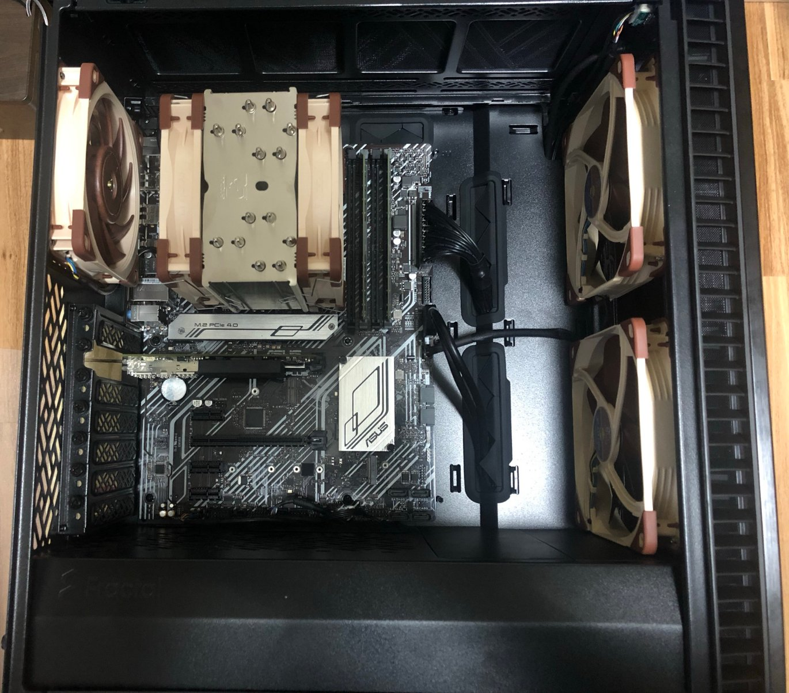

今まで Haswell (第4世代Intel Coreプロセッサ) のマシンを使っていたのですが、Rocket Lake (第11世代Intel Coreプロセッサ) のマシンに買い変えました。Arch Linux + i3-wm という軽量な環境を利用しているので、性能の観点から買い替えの必要が逼迫していたわけでは有りませんでした。ただし、大きめのコードをコンパイルする時や、NVIDIA + Nouveau の動作安定性などの観点からストレスは有ったので、性能向上とIntel iGPUへの変更を兼ねてリプレースする事としました。
<!--more-->

- 大きめのコードやqemuを扱う際の性能問題が有った(日常生活は問題無し)
- NVIDIA + Nouveau という構成を止めて、Intel iGPUとしたかった。HaswellマシンもiGPUは有ったが、出力解像度が要件を満たさなかった。

半分くらいは、買い替えたのだから、ちゃんと学習しろよ という自分への圧です。

## 旧マシン
- CPU Intel Core i7-4770
- Memory DDR3 16GB (4GB x 4)
- SSD SATA Crucial MX500 250GB 途中換装
- M/B ASRock H87 Performance
- CPU-Cooler サイズ 虎徹 初代
- Case ANTEC P100
- PSU SilverStone SST-ST75F-P 750W, フルモジュラー, 80 PLUS Silver
- GPU GeForce GTX 1060 6GB 途中換装
- InfiniBand (40GbE NIC) Mellanox ConnectX-3 VPI OEM 途中換装

あと、SATA 光学ドライブなど...

途中換装したもの以外は、当時のランキング上位に有ったものの寄せ集めです。ファン故障やメモリモジュールの差し直しで復旧した問題など、軽微なトラブルはありました。4回の引越しで影響を受けたトラブルも含まれているので、まぁ十分使えたかなぁという感想です。

ケース、電源、SSDは転用できるパーツなので流用を考えましたが、さすがに7年経過した電源を使い続けるのは嫌だったので、残りのケースとSSDを転用するよりも、1つのマシンとして残すことにしました。組んだ2014年当時は、買い替え後はサーバにするつもりで電源などを選定したマシンでした。しかし、Haswellだと最大でも32GBなので、近年のメモリ容量を考え、サーバへの転用は行わず、物理Windowsマシンとして余生を過ごしてもらうことにします。(ゲーム楽しいです)

## 新マシン
- CPU Intel Core i7-11700K
- Memory DDR4 64GB (32GB x 2)
- SSD NVMe PCIe 4.0 SAMSUNG 980 PRO 500GB
- M/B ASUS PRIME H570-PLUS
- CPU-Cooler Noctua NH-U12A
- Case Fractal Design Define 7 Compact Solid Black
- PSU FSP HGS-550M 550W, セミモジュラー, 80 PLUS Gold
- InfiniBand (40GbE NIC) Mellanox ConnectX-3 VPI OEM 宅内在庫



11世代のIntelプロセッサを採用した事は、賛否が分かれそうですね... 仕事でもIntelプロセッサを利用するので統一しておきたかったというのと、最近のAMDはiGPUを内蔵していないというのが選定理由なので、他のユーザとは少し変わった選定だとは思います。

旧マシンと比較すると、現在はi9シリーズも有るので、グレードとしては1つ下か同等という感じかと思います。11世代のCore i9は魅力を感じなかったので、i7にしました。PSUはフルモジュラーからセミモジュラーへダングレードで、容量も750W -> 550Wとダウングレードですが、80 PLUS認証はGoldになります。今回のマシンはSATAデバイスもdGPUも無いので、PSUから伸びるケーブルはATX 24pinとCPU補助電源8pinだけなのですっきりしていますし、セミモジュラーでも良かったと考えています。

## 感想
OSインストールは、[Linux workstation をセットアップした記録 Part.1]()と同等の手法で入れて使ってます。

```
]$ uname -r
5.12.15-arch1-1
```

現在の私の環境では、iGPUのDisplayPort出力のKMS回りに問題が有って、これが改善したら良いなぁと思っています。

- 起動時、DisplayPort出力のKMSで解像度を認識できずブラックアウトする。
- 起動時、HDMI出力 + DisplayPort-\>HDMI のデュアルディスプレイではストールする。

という状況なので、HDMI出力の1ディスプレイで起動した後、startxを実行する前に 2台目のディスプレイに DisplayPort-\>HDMI で接続してデュアルディスプレイにしています。

とりあえず使えているので詳しくは調べて無いのですが、DisplayPortのMSTを利用したいので、改善すれば良いなぁと思いつつ利用続けてます。Linux 5.13や5.14で改善しなければ、まともに調査しようと思っています。
