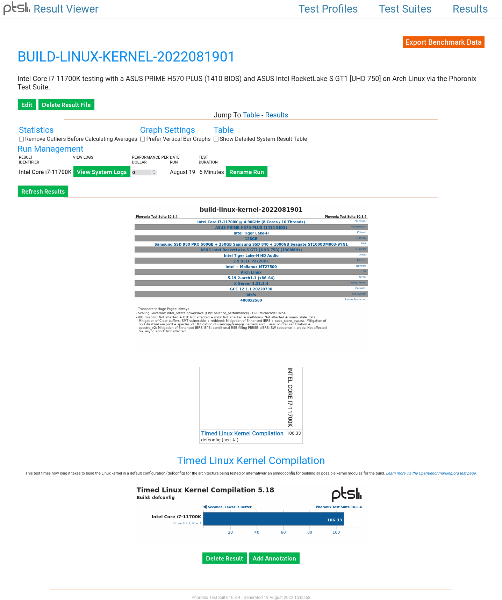
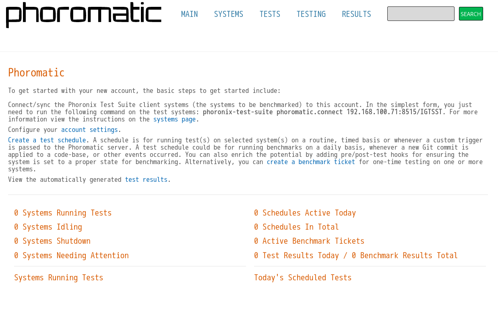
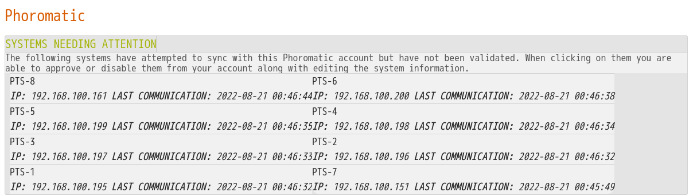
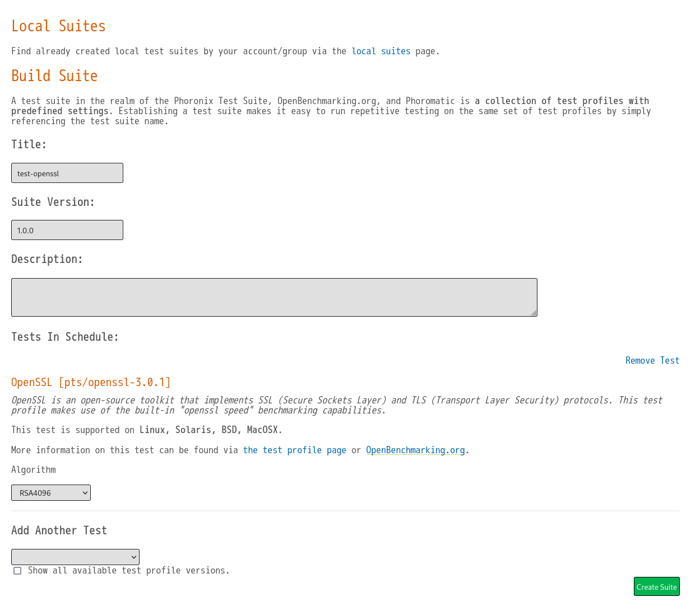
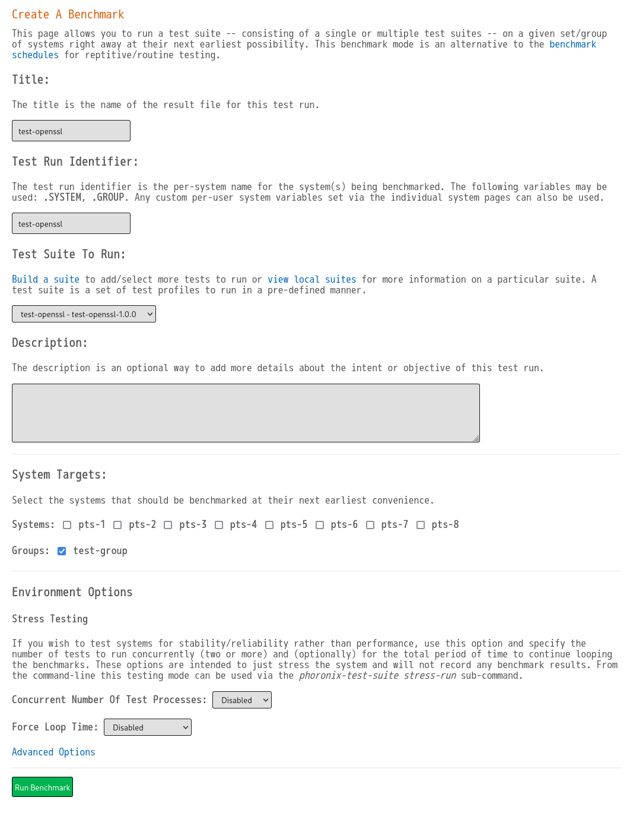
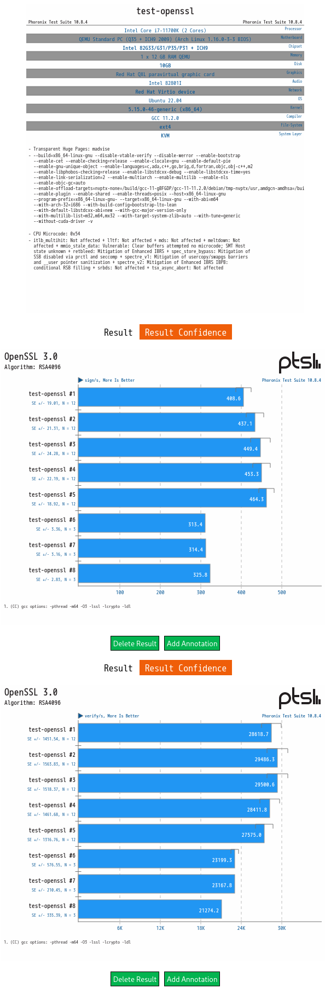

[Phoronix Test Suite (pts)](https://www.phoronix-test-suite.com/) を使って、簡単なベンチマークを実施してみることにします。

Phoronix Test Suite は、クロスプラットフォームのベンチマークプラットフォームです。
プラットフォームと記載したのは、各ベンチマークがプロファイルとして記述され、プロファイルに基づきベンチマークのインストール及び実行とレポート生成を実行するフレームワークだからです。

Phoronix Test Suite には、 OpenBenchmarking.org との連携機能や、複数マシンでのベンチマークを管理する Phoromatic も存在します。
今回は、仮想マシンを用いて Phoromatic も試してみることにします。

各ベンチマークの詳細や、プロファイルの記述については記載しません。

<!--more-->

## 初めての Phoronix Test Suite

Arch Linux では AUR からインストールできます。
RHEL系ではEPELから、Debian/Ubuntuでは[公式ウェブサイト](https://www.phoronix-test-suite.com/?k=downloads)で deb パッケージが入手できます。
.tar.gz や Windows .zip も公式ウェブサイトから入手できます。
```bash
% yay -S phoronix-test-suite
```

benchmark サブコマンドで、ポピュラーな build-linux-kernel ベンチマークを実行します。
この時、必要に応じてベンチマークのダウンロード等が実施されます。
build-linux-kernel ベンチマークは defconfig/allmodconfig を選択できるので defconfig で実行してみます。
```bash
% phoronix-test-suite benchmark build-linux-kernel
// 省略: ベンチマークのダウンロード等が実行される。

Timed Linux Kernel Compilation 5.18:
    pts/build-linux-kernel-1.14.0
    Processor Test Configuration
        1: defconfig    [Default Kernel Build]
        2: allmodconfig [This option is *much* more time consuming...]
        3: Test All Options
        ** Multiple items can be selected, delimit by a comma. **
        Build: 1 // defconfig を選択する。
```

その後、 System Information が出力された後、ベンチマーク結果を保存するか、結果ファイル名、Descriptionなどが問われるので入力すると、ベンチマークが開始されます。
```bash
// 省略: System Information が出力される。
    Would you like to save these test results (Y/n):
    Enter a name for the result file: build-linux-kernel-2022081901
    Enter a unique name to describe this test run / configuration:

If desired, enter a new description below to better describe this result set / system configuration under test.
Press ENTER to proceed without changes.

Current Description: Intel Core i7-11700K testing with a ASUS PRIME H570-PLUS (1410 BIOS) and ASUS Intel RocketLake-S GT1 [UHD 750] on Arch Linux via the Phoronix Test Suite.

New Description:
```

ベンチマークによって指定された回数が実施されますが、標準偏差(Devision)に収まらない場合は、実行回数を自動的に増やし標準偏差に収めようとします。
```
Timed Linux Kernel Compilation 5.18:
    pts/build-linux-kernel-1.14.0 [Build: defconfig]
    Test 1 of 1
    Estimated Trial Run Count:    3
    Estimated Time To Completion: 20 Minutes [23:06 JST]
        Running Pre-Test Script @ 22:47:06
        Started Run 1 @ 22:47:26
        Running Interim Test Script @ 22:49:16
        Started Run 2 @ 22:49:30
        Running Interim Test Script @ 22:51:18
        Started Run 3 @ 22:51:32
        Running Post-Test Script @ 22:53:19

    Build: defconfig:
        107.95
        105.499
        105.543

    Average: 106.331 Seconds
    Deviation: 1.32%
// 省略
```

標準偏差は Phoronix Test Suite の設定 StandardDeviationThreshold で定義されており、デフォルトは 3.50 です。
標準偏差に収まるように、自動的に15回まで実行した例では、下記のように \* マークが付きます。
```bash
Timed Linux Kernel Compilation 5.18:
    pts/build-linux-kernel-1.14.0 [Build: defconfig]
    Test 1 of 1
    Estimated Trial Run Count:    3
    Estimated Time To Completion: 6 Minutes [00:19 JST]
        Running Pre-Test Script @ 00:13:54
        Started Run 1 @ 00:14:15
        Running Interim Test Script @ 00:16:07
        Started Run 2 @ 00:16:18
        Running Interim Test Script @ 00:18:10
        Started Run 3 @ 00:18:21
        Running Interim Test Script @ 00:20:21
        Started Run 4 @ 00:20:30 *
        Running Interim Test Script @ 00:22:35
        Started Run 5 @ 00:22:46 *
        Running Interim Test Script @ 00:24:49
        Started Run 6 @ 00:25:03 *
        Running Interim Test Script @ 00:26:58
        Started Run 7 @ 00:27:12 *
        Running Interim Test Script @ 00:29:06
        Started Run 8 @ 00:29:20 *
        Running Interim Test Script @ 00:31:15
        Started Run 9 @ 00:31:29 *
        Running Interim Test Script @ 00:33:24
        Started Run 10 @ 00:33:37 *
        Running Interim Test Script @ 00:35:33
        Started Run 11 @ 00:35:47 *
        Running Interim Test Script @ 00:37:42
        Started Run 12 @ 00:37:55 *
        Running Interim Test Script @ 00:39:50
        Started Run 13 @ 00:40:03 *
        Running Interim Test Script @ 00:41:58
        Started Run 14 @ 00:42:12 *
        Running Interim Test Script @ 00:44:07
        Started Run 15 @ 00:44:21 *
        Running Post-Test Script @ 00:46:16

    Build: defconfig:
        109.504
        109.802
        117.562
        122.979
        121.147
        112.905
        112.517
        113.134
        112.577
        113.628
        113.17
        112.885
        113.219
        113.02
        113.35

    Average: 114.093 Seconds
    Deviation: 3.25%
    Samples: 15
```

最後に、結果をブラウザで表示するか、 OpenBenchmarking.org にアップロードするか問われます。
```bash
    Do you want to view the results in your web browser (Y/n): n
    Would you like to upload the results to OpenBenchmarking.org (y/n): n
```

テスト結果はウェブビューアを起動して確認することもでき、PDFやHTMLへのエクスポート(コマンドでも可)が可能です。
```bash
% phoronix-test-suite start-result-viewer

Result Viewer: http://localhost:8368
Press any key when done accessing the viewer to end the process...
```


また、単一テストの他に、複数のテストをまとめて実行する Test Suite が存在します。
例えば、[Kernel](https://openbenchmarking.org/suite/pts/kernel)を実行すると、定義されている複数のテストをダウンロードし実行します。
```bash
% phoronix-test-suite benchmark pts/kernel
```

## テストの選択
テストの一覧は list-all-tests や list-available-tests サブコマンドで出力でき、テストスイートの一覧は list-available-suites や list-available-virtual-suites サブコマンドで出力できます。
個人的に最も便利なのは、 list-recommended-tests サブコマンドで、ハードウェアサブシステムごとに推奨テストがリストされます。
マニュアルによると、テストプロファイルのダウンロード回数や、 OpenBenchmarking.org でのテスト結果数など、複数の要素によって決定されるようです。
```bash
% phoronix-test-suite list-recommended-tests


Phoronix Test Suite v10.8.4
Recommended OpenBenchmarking.org Test Profiles


System Tests

pts/apache       Apache HTTP Server
pts/pgbench      PostgreSQL pgbench
pts/nginx        nginx
pts/blender      Blender
pts/redis        Redis
pts/stress-ng    Stress-NG
system/selenium  Selenium
system/gimp      GIMP
pts/compress-rar RAR Compression
pts/java-jmh     Java JMH
Processor Tests

pts/build-linux-kernel Timed Linux Kernel Compilation
pts/x264               x264
pts/compress-7zip      7-Zip Compression
pts/openssl            OpenSSL
pts/encode-flac        FLAC Audio Encoding
pts/compress-pbzip2    Parallel BZIP2 Compression
pts/npb                NAS Parallel Benchmarks
pts/build-mplayer      Timed MPlayer Compilation
pts/gcrypt             Gcrypt Library
pts/blake2             BLAKE2
Graphics Tests

pts/xonotic       Xonotic
pts/csgo          Counter-Strike: Global Offensive
pts/glmark2       GLmark2
pts/unvanquished  Unvanquished
pts/dota2         Dota 2
pts/etlegacy      ET: Legacy
pts/paraview      ParaView
pts/metroll-redux Metro: Last Light Redux
pts/vkmark        VKMark
pts/yquake2       yquake2
Network Tests

pts/ethr          Ethr
pts/fast-cli      fast-cli
pts/speedtest-cli speedtest-cli
Disk Tests

pts/fio     Flexible IO Tester
pts/fs-mark FS-Mark
OS Tests

pts/glibc-bench Glibc Benchmarks
pts/sockperf    Sockperf
pts/perf-bench  perf-bench
Memory Tests

pts/stream Stream
```


## OpenBenchmarking.org との連携
OpenBenchmarking.org にアップロードしたくない場合、 AllowResultUploadsToOpenBenchmarking == FALSE に変更すると、問われなくなります。
```bash
% vi ~/.phoronix-test-suite/user-config.xml
      <AllowResultUploadsToOpenBenchmarking>FALSE</AllowResultUploadsToOpenBenchmarking>
```

試しに OpenBenchmarking.org のアカウントを取得し、ログインしてアップロードを試してみます。
```bash
% phoronix-test-suite openbenchmarking-login
% phoronix-test-suite upload-result build-linux-kernel-2022081901
```

先程のテスト結果をアップロードしたのが、下記のデータになります。  
https://openbenchmarking.org/result/2208191-YOSH-BUILDLI03

## Phoromatic
Phoronix Test Suite は、リモート管理ツールの Phoromatic を内包しています。
systemd もしくは start-phomatic-server サブコマンドで実行でき、ウェブブラウザからアクセスして利用できます。

今回の Arch Linux の環境では、追加でパッケージの導入と、PHP extension の有効化が必要でした。
```bash
% yay -S php-sqlite
% sudoedit /etc/php/php.ini
extension=sockets
extension=sqlite3
```

コマンドで Phoromatic をスタートしウェブブラウザからアクセスすると、ログイン画面が表示されるので、最初のユーザを登録してからログインします。
```bash
% systemctl status phoromatic-server.service
% phoronix-test-suite start-phoromatic-server

Port 8515 chosen as random port for this instance. Change the default port via the Phoronix Test Suite user configuration file.
Phoronix Test Suite v10.8.4 starting Phoromatic Server
Phoronix Test Suite User-Data Directory Path: /home/yoshihisa/.phoronix-test-suite/
Phoronix Test Suite Configuration File: /home/yoshihisa/.phoronix-test-suite/user-config.xml
Phoromatic Server Log File: /home/yoshihisa/.phoronix-test-suite/phoromatic.log

Launching with PHP built-in web server.


WebSocket Server Active: localhost:8397
The Phoromatic Web Interface Is Accessible At: http://localhost:8515
Press [ENTER] to kill server...
```

ログインすると、クライアントが Phoromatic に接続するためのコマンドラインが表示されるので、これを利用してインスタンスから接続してみることにします。
マニュアルを見ると Avahi が利用できる場合は Zeroconf を用いて構成できるようです。


インスタンスとして、 Ubuntu Jammy Jellyfish のクラウドイメージを使ってみることにします。
イメージを 10GB に拡張し、これをバッキングとする qcow2 イメージを、8インスタンスぶん作成します。
```bash
% cd /var/lib/libvirt/images
% sudo wget https://cloud-images.ubuntu.com/releases/22.04/release/ubuntu-22.04-server-cloudimg-amd64.img
% sudo qemu-img resize ubuntu-22.04-server-cloudimg-amd64.img 10G
% sudo seq 1 8 | xargs -I num sudo qemu-img create -F qcow2 -b ubuntu-22.04-server-cloudimg-amd64.img -f qcow2 pts-num.qcow2
% ls -1 pts-*
pts-1.qcow2
pts-2.qcow2
pts-3.qcow2
pts-4.qcow2
pts-5.qcow2
pts-6.qcow2
pts-7.qcow2
pts-8.qcow2
```

cloud-init の user-config も 8インスタンスぶん作成しておきます。
Phoronix Test Suite は php 製の CLI であり、 php-cli と php-xml に依存しているのでパッケージインストールします。
cloud-init で Phoromatic との接続まで実施するようにしておきます。
runcmd で記載しているのは手抜きです。
```bash
% sudoedit pts.user-config
% seq 1 8 | xargs -I num sudo cp pts.user-config pts.user-config.num
% seq 1 8 | xargs -I num sudo sed -i '2a fqdn: pts-num' pts.user-config.num
% cat pts.user-config.1
#cloud-config

fqdn: pts-1
timezone: "Asia/Tokyo"
user:
  name: yoshihisa
ssh_import_id:
  - gh:yoshihisa-ya
packages:
  - php-cli
  - php-xml
runcmd:
 - [ wget, https://phoronix-test-suite.com/releases/repo/pts.debian/files/phoronix-test-suite_10.8.4_all.deb ]
 - [ dpkg, -i, phoronix-test-suite_10.8.4_all.deb ]
 - [ sh, -c, phoronix-test-suite phoromatic.connect 192.168.100.71:8515/IGTSST ]
```

作成した qcow2 イメージと user-config を指定し8インスタンスを起動させます。
```bash
% seq 1 8 | xargs -I num sudo virt-install --name pts.num --hvm \
                 --virt-type kvm \
                 --memory 12288 \
                 --vcpus 2 \
                 --cpu host-passthrough \
                 --disk pts-num.qcow2,format=qcow2 \
                 --os-variant=ubuntujammy \
                 --cloud-init root-password-generate=off,user-data=pts.user-config.num \
                 --noautoconsole
```

しばらくすると Phoromatic に登録待ちとして表示されるので、それぞれ Enabled に変更し有効化します。
テストを実行するときに8インスタンス選択するのが面倒なので、今回は合わせて System Group を作成しまとめておきます。


Phoromatic ではスケジュールの作成と、1回のベンチマーク実行ができますが、今回は1回のベンチマーク実行をしてみます。
スケジュールでは、対応している場合は WoL や実行後シャットダウンができるようですが、今回は試しません。

まず、ベンチマークを実行するために、テストスイートを作成する必要が有ります。
今回は、 OpenSSL のみを含むテストスイートを test-openssl として作成しました。


続いて、作成したテストスイートとシステムグループを指定し、ベンチマークを実行します。
Advanced Option から、センサ値の取得や Perf カウンタの取得を指定することも可能です。


実行した結果を表示したのが下記です。

