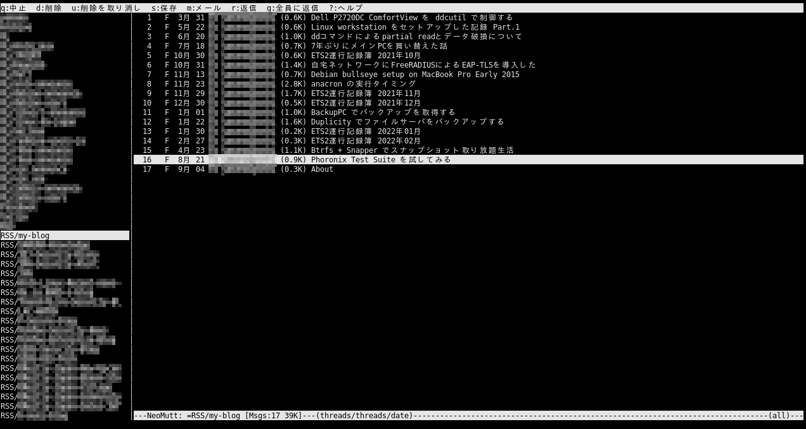
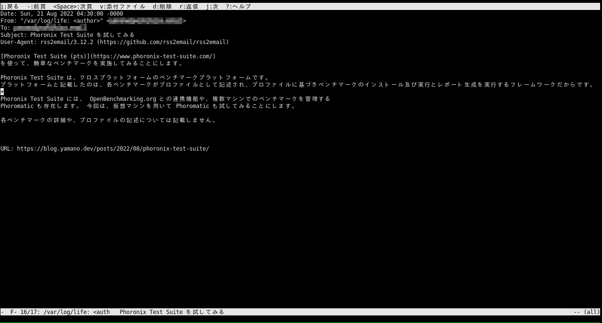

[rss2email](https://github.com/rss2email/rss2email) を利用して、 RSS を電子メールとして送信することができます。

RSSアグリゲーターとして [Newsboat](https://newsboat.org/) を利用しており、 Linux CLI ユーザとしては、 TUI で操作でき便利に利用していました。
しかし、同期やスマートフォンなどからの利用を考えると不便だったので、 rss2email を試してみることにします。

## なぜ rss2email か

「大量のメールを効率的に捌く手法を構築しており、今後もメールは捨てる見込みが無いから」という理由につきます。
多くの OSS コミュニティはメールベースのコミュニケーション手法を確立しており、当方も procmail レシピによるメッセージデリバリーや、ターミナルベース MUA の NeoMutt などを利用しており、この仕組みに載せてしまえば良いと考えた為です。
同期やスマートフォンなどからの利用としては、 IMAP でカバーする事とします。

<!--more-->

## Install and settings

Debian bullseye では パッケージが用意されています。その他のディストリビューションも、[README.rst](https://github.com/rss2email/rss2email/blob/master/README.rst) に記載が有ります。

https://packages.debian.org/bullseye/rss2email

```bash
gsv1:~$ apt install rss2email
```

設定については、 [ArchWiki](https://wiki.archlinux.org/title/Rss2email) などが参考になりますが、設定ファイルが一部変更になっているようなので、プロジェクトの README を読むのが良いです。

まず、送信先のメールアドレスを設定します。
```bash
gsv1:~$ r2e new reciever@example.com
```

後は、必要な RSS フィードを登録します。
ヘルプに記載が有る通り、送信先メールアドレスを指定することもできます。
重要な事として、 rss2email での name (下記でのmy-blog) は、送信するメールでの List-ID ヘッダに用いられるので、空白無しのアルファベットのみとすべきでしょう。
今回は、 procmail での振り分けルールにも用います。
```bash
gsv1:~$ r2e add my-blog https://blog.yamano.dev/index.xml
gsv1:~$ r2e add -h
usage: rss2email add [-h] name url [email]

positional arguments:
  name        name of the new feed
  url         location of the new feed
  email       target email for the new feed

optional arguments:
  -h, --help  show this help message and exit
```

list サブコマンドで確認ができ、削除や一時停止の為の各種サブコマンドが用意されています。
```bash
gsv1:~$ r2e list
0: [*] my-blog (https://blog.yamano.dev/index.xml -> reciever@example.com)
gsv1:~$ r2e delete -h
usage: rss2email delete [-h] index [index ...]

positional arguments:
  index       feeds to delete

optional arguments:
  -h, --help  show this help message and exit
gsv1:~$ r2e pause -h
usage: rss2email pause [-h] [index ...]

positional arguments:
  index       feeds to pause (defaults to pausing all feeds)

optional arguments:
  -h, --help  show this help message and exit
```

OPML によるエクスポート/インポート機能が有るので、今回は Newsboat からインポートしてみる事にします。
Newsboat と rss2email で一部の要素名が異なり、正常にフィードタイトルが入ってくれないので、そこだけ修正して渡します。
```bash
local% newsboat --export-to-opml | sed "s/title=/text=/" | ssh gsv1 r2e opmlimport
```

次に、送信元アドレスや、送信方法の設定を実施します。
デフォルトでは、RSSフィードから送信元メールアドレスを生成しますので、昨今の状況では、外部MTAに送る場合は変更が必要でしょう。
また、今回は sendmail コマンドでは無く、レンタルサーバ(not root)の MTA に SMTP を使って送信します。

送信元アドレスを指定し、その送信元アドレスを利用する。
```bash
gsv1:~$ vi ~/.config/rss2email.cfg
from = sender@example.com
force-from = True
```

SMTP の設定及び、デフォルトの sendmail から SMTP に変更する。
今回はレンタルサーバによって提供されている SMTPS を利用します。
```bash
gsv1:~$ vi ~/.config/rss2email.cfg
email-protocol = smtp
smtp-auth = True
smtp-username = username
smtp-password = password
smtp-server = smtp.example.net
smtp-ssl = True
```

他に、メール送信日時を、RSSフィードによって得た時刻に変更する事ができます。
これは、利用する MUA によって挙動が異なることが有ります。
```bash
gsv1:~$ vi ~/.config/rss2email.cfg
date-header = True
```

今回は設定していませんが、 HTML メールとする html-mail や、postが変更された場合に再送する trust-guid などが有り、詳細は [config.py](https://github.com/rss2email/rss2email/blob/master/rss2email/config.py) で確認できます。

後は、 run サブコマンドで実行されるので、これを cron に登録しておく事で利用できます。
--no-send オプションで実施すると、メールが送信されないので、初回はお勧めです。
また、インポートしたフィードの中に取得できないものが存在するとエラー出力されるので、この段階で確認し、必要に応じ delete しておくのが良いです。
```bash
gsv1:~$ r2e run --no-send
gsv1:~$ crontab -e
gsv1:~$ crontab -l | grep r2e
*/30 * * * * r2e run
```

## procmailrc

前述の add サブコマンドでの name (OPMLのtext=) に、日本語や . を用いていなければ、次の procmail レシピで振り分けすることができます。
```
:0
* ^User-Agent: rss2email.*
* ^List-Id: .*<\/[^.]*
RSS/$MATCH/
```

NeoMutt でメール一覧を確認した状態

NeoMutt でメールを確認した状態


## 苦労した点と今後
### 日本語ブログの扱い
前述の通り登録名(name)は、メールの List-Id を生成する為に使われるので、マルチバイト文字や空白などを避けることとしました。
しかしそれは同時に、日本語タイトルのウェブサイトにおいて、適当な代替名で登録する必要が生じました。
企業のエンジニアブログであれば、企業名の英語表記を元に代替を考えつくのが容易でした。
個人ブログはそうもいかず、 Twitter アカウントの ID 等を用いて、 xxxxx-blog のような代替名で登録しました。
筆者の方が Twitter アカウントなどをお持ちではなく、かつ、英単語に変換しにくいブログタイトルだと、代替名を考えるのが非常に難しいです。

実際、今回の rss2email の設定作業においても、時間の殆どを、登録名の設定作業に使いました。

### フォルダ分けについて
今回、 procmail を用いてフォルダ分けを実施しましたが、購読フィードの53個ぶんのフォルダ(メールボックス)が作成されました。
これは少し細かすぎるので、振り分けを辞めて1つにするか、notmuch と組み合わせて NeoMutt の virtual-mailbox 機能を利用する、新規メールの無いメールボックスをサイドバーから非表示にするなど、将来的には検討していきたいです。

### URL Open について
X-RSS-URL ヘッダーに post の URL が付いてくるので、 NeoMutt (などのMUA)でこれをブラウザで開くようにキーバインドなどを設定すると、利用しやすくなります。
現状、当方の環境では、NeoMutt のビューワーで Ctrl-B を用いて本文が urlview に渡され、(存在する場合は複数の) URL から対象を選択しているので、 Newsboat に比べてアクションが増えてしまっています。
GUI の MUA であれば、メール本文に添付されている URL をクリックすれば良いのですが...

## RSSリーダーを撰択するにあたって
ちなみに、Web型のRSS リーダーも検討しました。
Google リーダーの終了などが有り、セルフホスティングが盛り上がっており、いくつかセルフホストの選択肢が有ります。
最も有名なのは [Tiny Tiny RSS](https://tt-rss.org/) だと思いますし、一時期は昔ながらのレンタルサーバ(not root)での実行が盛り上がりました。
しかし現在、公式に推奨されているのは Docker での実行となります。
今回は、レンタルサーバ(not root)か、VPS(コンテナ未構築)を考えていた為、残念ながら除外となりました。(そして当方のレンタルサーバ環境ではエラーで動作しませんでした。)
昔は 自宅 Kubernates や docker-compose ホストも構築してましたが取り壊し済みで、RSSリーダーの為に再構築および管理というのは避けた為です。
しかし、 Tiny Tiny RSS のようにコンテナでの実行が推奨というのも増えているので、コンテナサービスも含めて、どこかで作り直しても良いかもしれません...

同様のWeb型RSSリーダーとして、[FreshRSS](https://freshrss.org/) も検討しました。
レンタルサーバ(not root) でも快適に動作しましたが、スマートフォンでネイティブアプリが存在しない(有償や連携を除く)事や、ユーザインタフェースが当方と合わない部分有ったのでこちらも見送りとなりました。
