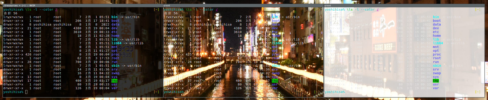
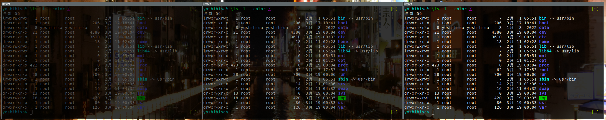
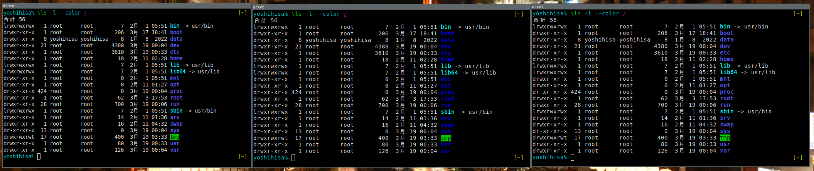
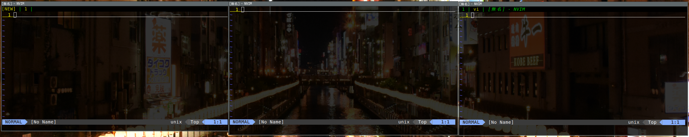

[xterm](https://invisible-island.net/xterm/) から [urxvt(rxvt-unicode)](http://software.schmorp.de/pkg/rxvt-unicode.html) に乗り換えたので、設定をまとめておきます。

urxvt のフォーク元である rxvt は、 xterm のあまり使われていない機能を省き代替品として開発されたものですから、似た部分もあります。
xterm と比べると、非常に高速に動作し、 Perl 拡張をサポートするなど、多機能なターミナルとしても利用できる側面もあります。

urxvt 以外にも [st](http://st.suckless.org/) や GPU アクセラレーション を利用できる [Alacritty](https://github.com/alacritty/alacritty), [WezTerm](https://wezfurlong.org/wezterm/) も人気が有るようなので気になってますが、 xterm で大きな不便を感じなかったので似た代替品を使おうと思い urxvt を試しに使ってみることにしました。

この記事を記載するにあたり、 [Arch Wiki](https://wiki.archlinux.org/title/Rxvt-unicode) および [Manual Page](http://pod.tst.eu/http://cvs.schmorp.de/rxvt-unicode/doc/rxvt.1.pod) を参考にしました。

<!--more-->

## 個人的に移行した理由と変わったこと

### 疑似透過
urxvt はコンポジットマネージャを必要としない疑似透過をサポートしているので、実際の透過を必要とせず、 X Window のルートに設定した壁紙が透けて見えれば十分な私には良い選択でした。
urxvt の高速な動作もあり、 xterm のころより高速に動作している体感は有ります。

### URL マッチ及びオープン機能(Perl拡張)
matcher 拡張機能を用いることで、ターミナルに表示された URL を識別し、マウスクリックやキー操作で xdg-open や wsl-open に渡すことで、ブラウザでオープンすることができます。
TUI MUA や RSS リーダ にはブラウザオープンする為のキーバインドが標準で存在することが多いですが、それぞれのキー操作を覚える必要が無くなるのがとても便利です。
もちろん、 cat や less で表示された URL もオープンすることができます。

### デーモン動作
urxvt はデーモンとして動作する urxvtd が存在し、クライアントである urxvtc を複数繋げて利用できるモードが存在します。
しかし実は、 tmux を利用し分割などを行っており、あまり多くのターミナルを起動することが無いので、活用はできていません。

### タブ機能(Perl拡張)
urxvt には、シンプルなタブ機能である tabbed が Perl 拡張として提供されています。
更に高度なタブ拡張である [tabbedex](https://github.com/mina86/urxvt-tabbedex) (Arch Linux では AUR urxvt-tabbedex) を利用することもできます。
ローカルの tmux にアタッチしたターミナルと、リモートの tmux にアタッチしたターミナルそれぞれを開くためにタブ機能を利用しています。
タイル型ウィンドウマネージャ(i3-wm)を用いているので本来は不要なのですが、 Microsoft Windows を使わなければならない環境があり、そこでは大変役立っています。

### urxvt がサポートしない機能
xterm がサポートしており、逆に urxvt がサポートしない機能も目立ちます。
大きなものは、 True Color をサポートしないことで、 urxvt は 256 色までのサポートです。
Vim のカラースキームなどでも、 True Color を前提としたものが有るので、これらは乗り換えが必要かと思います。
もしくは、 Arch Linux AUR には、 True Color パッチを有てたものも見受けられるので、これらを利用することになります。

他にも、私が気になった範囲として、オンラインでのフォントリサイズと、OSC52 があります。
画面共有する際にフォントリサイズしたい時や、リモートのクリップボードと連携したい時に OSC52 を使う時が有りました。
前者は Perl 拡張機能が Arch Linux AUR では [urxvt-resize-font-git](https://aur.archlinux.org/packages/urxvt-resize-font-git) として提供されています。
後者は Arch Linux AUR には無さそうですが、 Perl 拡張機能のコードはインターネット上に見られるので、それらを用いれば良いかと思います。

ただこれらも、私自身のターミナル利用法が変わってきたこともあり、最近はあまり利用していません。

## 設定
設定は xterm と同様に ~/.Xresources を用いており、現状で私が設定しているものを記載します。

https://github.com/yoshihisa-ya/dotfiles/blob/8e3baf0f91fb6d84c079249d38285fdcdfa9c228/dot_Xresources.tmpl#L14-L65

### Buffer
```
URxvt.saveLines: 10000
```
tmux を用いるので 0 でも良いのですが、 一時的なターミナルウィンドウなどで tmux を用いないことが有るので、少し大きめに設定しています。

### Bell
```
URxvt.visualBell: true
```
ビジュアルベルを設定しています。

### Color, Transparent
```
URxvt.foreground: gray90
URxvt.background: black
URxvt.inheritPixmap: true
URxvt.transparent: true
URxvt.shading: 20
URxvt.fading: 60
URxvt.color12: rgb:5c/5c/ff
```
色と疑似透過の設定です。

shading は疑似透過の透過率で、 100 が透過の状態から、 0 に近づくにつれて darkens に、 200 に近づくにつれて lightens になります。

上の画像は、左が 20 中央が 100 右が 180 です。
私の設定はフォアグランドが gray90 なので、透過は darkens に倒して 20 としています。

また、他に fading があり、ウィンドウのフォーカスが外れた時にテキストをフェードすることができます。
100 を指定すると、テキストがフェードカラーに置き換えられるのですが、未指定の場合のデフォルトは黒です。

上の画像は、左が 60 中央が 30 右が未指定 で、全てフォーカスを外した状態です。
未指定の右はが通常の状態ですが、ウィンドウへのフォーカスが外れると、中央や左のようにフェードさせることができます。

urxvt の文字カラーは、 xterm と同じものを利用しますが、1つだけ異なります。
これを揃えるには、 [Arch Wiki](https://wiki.archlinux.org/title/Rxvt-unicode#Colors) に記載の通り、 color12 を設定します。

上の画像は、左が xterm 中央が urxvt 右が color12 を設定して揃えた urxvt です。
分かりやすいように疑似透過を無効にしています。

### Pointer, Cursor
```
URxvt.cursorBlink: false
URxvt.cursorUnderline: false
URxvt.pointerBlank: true
```
カーソルとポインタの設定です。

cursorBlink はカーソルを点滅させ、 cursorUnderline はアンダーラインカーソルに変更します。
私の環境では、どちらも false にしています。

pointerBlank は、文字入力を実施した時か、指定した秒数(デフォルトは2秒)の非アクティブが継続すると、マウスポインタを消滅させます。
ターミナル作業するときに邪魔なマウスポインタを消せるので便利です。
残念ながら、私が Microsoft Windows 10 の WSLg 環境で試した時は、マウスポインタがアクティブの場合でも消滅させてしまったので、 WSLg 環境では false にしています。

### Font
```
URxvt.font: xft:DejaVuSansMono Nerd Font Mono:size=10.5,\
            xft:IPAGothic:size=10.5
URxvt.letterSpace: -1
```
Nerd Font として DejaVeSansMono を、日本語フォントとして IPAGothic を設定しています。
デフォルト設定だと文字間のスペースが空きすぎているので、少し詰めています。

### ScrollBar
```
URxvt.scrollBar: false
```
ほとんど tmux を使っているので、スクロールバーは無効化しています。

### PrintScreen
```
URxvt.print-pipe: "cat > /dev/null"
```
[Arch Wiki](https://wiki.archlinux.org/title/Rxvt-unicode#Printing) や urxvt(1) によれば、 PrintScreen キーによって lpr へ出力すると有ります。
不要なので上記の Arch Wiki を参考にしていますが、 urxvt(1) には、ファイルにダンプする例の記載が有ります。

### InputMethod
```
URxvt.perl-ext-common: xim-onthespot
URxvt.inputMethod: ibus
URxvt.preeditType: OnTheSpot
```
入力メソッドの入力方法を指定します。
OverTheSpot, OffTheSpot, Root, OnTheSpot が指定できますが、 OnTheSpot は xim-onthespot 拡張が必要なので、拡張を読んでいます。

### URL Open
```
URxvt.perl-ext-common: default,matcher
URxvt.url-launcher: /usr/bin/xdg-open
URxvt.matcher.button: 1
URxvt.keysym.C-Delete: perl:matcher:last
URxvt.keysym.M-Delete: perl:matcher:list
URxvt.matcher.rend.0: Uline Bold fg5
```
matcher 拡張を利用して URL 文字列を左クリックできるようにしています。
合わせて、 Ctrl-Delete で直近の URL を、 Alt-Delete で URL 一覧選択を開くようにしています。
WSLg 環境では、 [4U6U57/wsl-open](https://github.com/4U6U57/wsl-open) を使うことで、 Microsoft Windows 上のウェブブラウザをオープンするようにしています。

### Tab
```
URxvt.perl-ext-common: tabbedex
URxvt.tabbedex.autohide: true
URxvt.tabbedex.tabbar-fg: 2
URxvt.tabbedex.tabbar-bg: 0
URxvt.tabbedex.tab-fg: 3
URxvt.tabbedex.tab-bg: 0
URxvt.tabbedex.new-button: false
```
urxvt パッケージに含まれるシンプルなタグ拡張ではなく、更に高度なタブ拡張である [tabbedex](https://github.com/mina86/urxvt-tabbedex) (Arch Linux では AUR urxvt-tabbedex) を利用しています。
大きな違いは、タブが1つのみである時に自動的に隠す(autohide)ことができるのと、NEWボタンを消せる(new-button)こと、タブに名称を付けれることです。
私はタブ機能をあまり多様しないので、通常は隠しておけるのは便利です。

上の画像は、左が通常のタグ拡張である tabbed 、中央が tabbedex で自動的に隠れている状態、右が tabbedex で NEW ボタンが非表示でタブ名称を付けた状態です。
また、右の画像を見ると、起動している nvim によってタブバーにタイトルが表示されていることが分かります。

### ISO 14755
urxvt では Ctrl + Shift で ISO 14755 モードという入力モードになってしまい、他のキーバインドとよく衝突するので、無効化しています。

### selection-to-clipboard
```
URxvt.perl-ext-common: resize-font
```
Arch Linux では AUR urxvt-resize-font-git で提供されている拡張機能で、フォントサイズの変更をサポートします。

### selection-to-clipboard
```
URxvt.perl-ext-common: selection-to-clipboard
```
urxvt は、他の一般的なアプリケーションと同様に、デフォルトでは PRIMARY セクションを用いるので、 CLIPBOARD セクションを利用するための拡張機能です。
urxvt のセレクトおよびペーストは [Manual Page](http://pod.tst.eu/http://cvs.schmorp.de/rxvt-unicode/doc/rxvt.1.pod#THE_SELECTION_SELECTING_AND_PASTING_) が役立ちます。

## 今後
xterm から難無く移行はでき、便利に利用しているので、メインターミナルとして使い続ける予定です。
しかし私の環境では少し不安定な挙動が見られ、おそらく疑似透過周りが原因と考えられるので、今後は疑似透過を無効にして利用するかもです。

実は、年始頃から、デスクトップ環境の見直しを実施していたのですが、今回でおおよそ整いました。
i3 + polybar が基本的なデスクトップ環境なのですが、他に polybar の設定を見直したり、 chezmoi を導入したり、 Btrfs subvolume のレイアウト見直しなどをしていました。
一段落したので、このブログも、もう少しテクニカルな内容を増やせればと思っています。


このブログ記事を買いているときのデスクトップ。
なお、壁紙は、昔とある場所を撮影した写真を一時的に設定しただけで、普段から利用しているのものでは無い。
