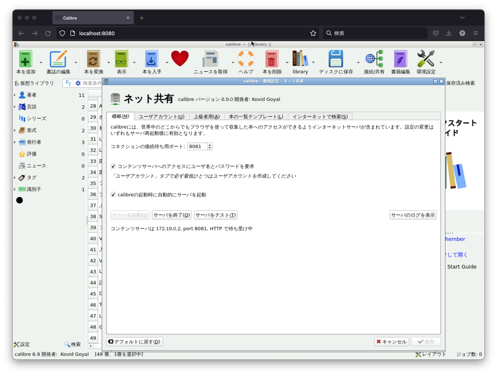

ただの日記である。技術的要素は少い。

いくつか複雑な経緯があり、新たに VM インスタンスを契約したので、 Calibre を移行した。
[Calibre](https://calibre-ebook.com/) は有名な電子書籍管理ソフトウェアで、フォーマット変換や、電子ブックリーダーとの同期などもできるが、オンラインでのビューワーとしてのみ利用している。
今回は、 deb パッケージから Docker Compose に移行し、 [LinuxServer.io](https://www.linuxserver.io/) によりメンテナンスされている Docker イメージを用いた。

<!--more-->

## Calibre
Calibre はデスクトップアプリケーションだが、コンテンツサーバ機能があるので、他のコンピュータからもブラウザ経由で電子書籍を読むことができる。
これまで私は、 VM インスタンス (Debian bullseye) に [calibre パッケージ](https://packages.debian.org/ja/bullseye/calibre) を導入していた。
ローカルマシンから SSH X Forwarding を用いて接続し、詳細な設定やフォーマット変換などを実施できる。
普段はコンテンツサーバのみを systemd で起動させ、モバイルデバイスを含めた様々なデバイスからウェブブラウザを用いて読めるようにしていた。
例えば、 macOS Monterey + Xquartz を用いて SSH X Forwarding で VM インスタンスに接続し、デスクトップアプリケーションを実行すると下記のようになる。


GUI アプリケーションからコンテンツサーバを起動しても良いが、コンテンツサーバのみを起動させることができる。
[公式ドキュメントにも記載があるが](https://manual.calibre-ebook.com/ja/server.html)、例えば下記のようにすると、認証機能を有効にしたうえで 8765/TCP を用いてコンテンツサーバを起動できる。
```bash
$ systemctl --no-pager cat calibre-server.service
# /etc/systemd/system/calibre-server.service
[Unit]
Description=calibre Content server
After=network.target

[Service]
Type=simple
User=yoshihisa
Group=yoshihisa
ExecStart=calibre-server --userdb /home/yoshihisa/calibre/users.sqlite --enable-auth --port 8765 /home/yoshihisa/calibre/books

[Install]
WantedBy=multi-user.target
```

あとは、好きなデバイスからウェブブラウザでアクセスすれば、どこでも電子書籍が読めるので便利である。
読みたい書籍のデータは1冊全てをダウンロードする必要が有るのでダウンロード時間がかかるが、ブラウザのオフラインキャッシュとなるので初回のみだし、オフライン環境でも読むことができる。

もし読んでる書籍がバレたくない紳士は、 HTTPS の設定をしたり、 Nginx リバースプロキシで HTTPS 終端しても良いだろう。
その場合、ダイジェスト認証の代わりにベーシック認証も選択肢となるだろう。

## LinuxServer.io が提供する Calibre
[LinuxServer.io](https://www.linuxserver.io/) が提供する Calibre 関連の Docker image は、 [calibre](https://hub.docker.com/r/linuxserver/calibre) と [calibre-web](https://hub.docker.com/r/linuxserver/calibre-web) が有る。
少し名前が分かりずらいが、 [calibre-web](https://github.com/janeczku/calibre-web) は Calibre と異なる1つのソフトウェアで、 Calibre のライブラリを読みリッチなウェブインタフェースを提供する。
個人的にはリッチなウェブインタフェースは不要だったので、 Calibre のみを動作させることとした。

[Docker hub linuxserver/calibre](https://hub.docker.com/r/linuxserver/calibre) に docker-compose.yml の例があるので、少し変更して `docker-compose up -d` するだけである。
今回は、下記のようにした。

```bash
$ cat docker-compose.yml
version: "2.1"
services:
  calibre:
    image: linuxserver/calibre:latest
    container_name: calibre
    security_opt:
      - seccomp:unconfined #optional
    environment:
      - PUID=1000
      - PGID=1000
      - TZ=Asia/Tokyo
    volumes:
      - /data/calibre:/config
    ports:
      - 127.0.0.1:8080:8080
      - 127.0.0.1:8081:8081
    restart: unless-stopped
```

linuxserver/calibre は、デスクトップアプリケーションとしての Calibre を実行するが、 [Apache Guacamole](https://guacamole.apache.org/) を用いておりウェブブラウザから利用できる状態となっている。
PASSWORD environment を設定すれば、アクセスの為のパスワードを設定することも可能だ。
手元のコンピュータに X11 サーバをセットアップしていない場合でも利用できるので便利である。
今回は、上記の通り、 Docker ホストの 127.0.0.1:8080 にマップしているので、 SSH ポートフォワーディングでアクセスするようにした。
例えば、 macOS Monterey + Firefox + ssh を用いて `ssh -L 8080:localhost:8080 docker-host` とすると、下記のように利用できる。


GUI でセットアップウィザードを完了させたり、旧サーバからライブラリを rsync などしたら、 Calibre の設定からコンテンツサーバを起動させる。



GUI(Apache Guacamole) と同様に Docker ホストの 127.0.0.1:8081 にマップしているので、これを HTTPS 終端した Nginx でリバースプロキシして公開することにした。

## コンテンツサーバで PDF を開くと calibre ビューワーでは無くブラウザの PDF ビューワーで開く
[6.2.1 で変更されたようだ。](https://github.com/kovidgoyal/calibre/blob/v6.9.0/Changelog.txt#L326)
この変更により、 PDF で管理している電子書籍をコンテンツサーバ経由で読む場合、単純な PDF ダウンロードのような動作になった。
つまり、読むときは毎度ダウンロードが発生するし、既読位置も管理されない。
ただし、 Calibre で他の形式に変換しておけば良いという解決策が有る。
