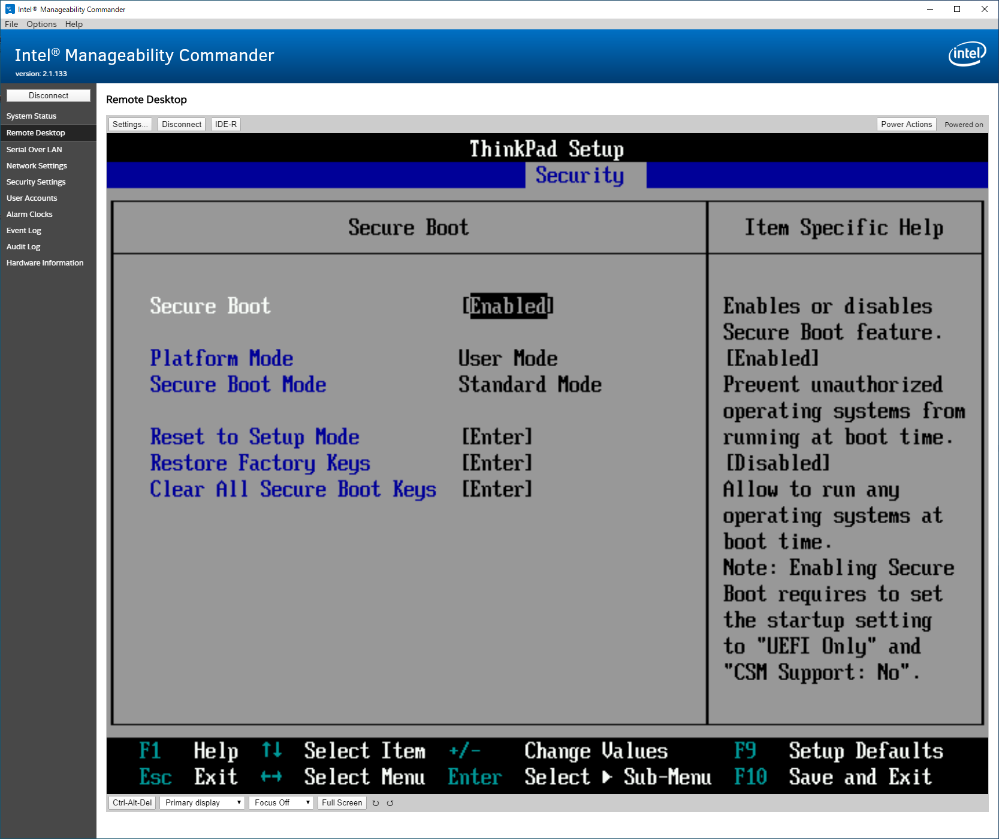

久し振りにLinux workstationとしてArch Linuxをセットアップしたので記録を残しておきます。
Part.1 として、OSのインストールまでを実施します。

以前から引き継ぐポイントや重要視した事
- UEFI GPT boot とする。
- UEFI GPT boot に必要な ESP (EFIシステムパーティション) 以外は、/boot も含めて LUKS にて暗号化を実施する。
- ESP に設置するファイルに関しては、UEFI Secure Boot を用いる事で改竄検知の対策とする。

<!--more-->

ハードウェア
- ThinkPad X1 Carbon 3rd
- Intel Core i5 5300U (4thered/2core)
- 8GB RAM
- SATA SSD 256GB

以前に中古で入手し Microsoft Windows を中心に動作させていた物です。Broadwell世代のモバイル向けプロセッサで有り、既に性能不足は否めません。このマシンは Intel vPro に対応しており、 Intel AMT を利用する事ができます。Intel AMT は IPMI(BMC) に近い操作が可能な為、誤ったり、デフォルト運用のままだとセキュリティリスクになります。

Linux workstationのセキュリティについては、下記のチェックリストが参考になります。  
[Linux workstation security checklist](https://github.com/lfit/itpol/blob/master/linux-workstation-security.md)

## 事前準備
1. BIOS/UEFI をファクトリーリセットし、また、利用予定のデバイスが無効化されてないか確認します。
1. Microsoft Windows を導入し、全てのファームウェアのアップデートを行います。Lenovo Vantage等のソフトウェアが利用できます。
1. UEFI boot only, Secure boot disable とします。これは昨今のArch LinuxイメージがSecure Bootに対応してない為です。もしくはイメージをリマスタリングする必要が有ります。一時期は対応していたので、対応しているという古い情報も見られます。
1. 必要なUEFIの設定を実施します。例えば次のような物です。
    1. 不必要なインタフェースを無効化します。特に、メモリに直接アクセスできるインタフェースはDMA攻撃を受ける可能性が有ります。
    1. UEFI の設定を変更されないよう、パスワードを設定します。気が付かない内にSecure Bootを無効化されるのを避ける為です。
    1. F1-F12 がメディアキーがデフォルトとなっており、F1等のキー操作にFnキーを併用する物が有ります。必要に応じて F1-F12 の操作をデフォルトとします。今回のマシンでは、 `F1-F12 as Primary Function` という項目です。
    1. Intel AMTを無効化します。
    1. Intel VTが有効になっているか、その他、全体的に設定項目を確認します。

Intel AMT が有効になっている場合、ネットワーク経由で基本的な電源操作やリモートコンソール、SoL(Serial Over LAN)等が利用できます。当方は興味が有ったので、デフォルトパスワードから変更し設定を行い試用してみましたが、モバイルし管理外ネットワークへ接続する事と脆弱性リスクを考慮し、UEFIより無効化する事としました。Intel AMTが有効な場合はBIOSやハードウェアRAID等と同様に、ブート中にCtrl-Pで設定画面に入る事ができる為、UEFI/BIOSの保護とは別に、デフォルトパスワードからの変更もしくは無効化を実施する必要が有ります。

しかし、リモートワークが求められる昨今では、事務所に設置しているコンピュータに対する操作手段としては有りだと思います。OSがクラッシュした場合等、出社しているメンバーに負担をかけなくて済みます。LUKSパスフレーズ方式を用いている場合も同様に活用できます。(但しLUKSパスフレーズに対しては[別の解決策](https://wiki.archlinux.org/title/Dm-crypt/Specialties)が有ります)


Intel Manageability Commanderを用いて、異なるWindowsコンピュータから、今回のマシンのUEFIセットアップ画面を操作している様子。


## Arch Linuxインストール
1. Arch Linuxイメージから起動したら、ストレージをshredします。これは、過去の暗号化されていないデータが存在した場合の対策、これからのセットアップが完了した後の難読化の為です。ストレージを廃棄もしくは譲渡する際の処理としては不十分ですので注意する必要が有ります。(代替セクタやオーバープロビジョニング等に対して不十分です。)
    ```
    ]# shred -n 1 -v /dev/sda
    ```
1. 今回は 512MiB の ESP + 残り全てのパーティション(LVM on LUKS) として作成します。
    ```
    Number  Start (sector)    End (sector)  Size       Code  Name
       1            2048         1050623   512.0 MiB   EF00  EFI system partition
       2         1050624       500118158   238.0 GiB   8308  Linux dm-crypt
    ```
    sda1 は FAT32 として、sda2はLUKSを組みその上にLVMを構成した後、LVMから swap と / を切り出します。
    ```
    ]# mkfs.fat -F32 /dev/sda1
    ```
    ```
    ]# cryptsetup -v -s 512 luksFormat /dev/sda2
    ]# cryptsetup luksOpen /dev/sda2 cryptlvm
    ]# pvcreate /dev/mapper/cryptlvm
    ]# vgcreate vg0 /dev/mapper/cryptlvm
    ]# lvcreate -L 16g vg0 -n swap
    ]# mkswap /dev/vg0/swap
    ]# swapon /dev/vg0/swap
    ]# lvcreate -l 100%FREE vg0 -n root
    ]# mkfs.ext4 /dev/mapper/vg0-root
    ```
    作成した / を /mnt に、 ESPは /boot/esp に配置する事としマウントしておきます。
    ```
    ]# mount /dev/mapper/vg0-root /mnt
    ]# mkdir -p /mnt/boot/esp
    ]# mount /dev/sda1 /mnt/boot/esp
    ```
1. 通常通り必要なパッケージのインストールや設定を行います。例えば次のような内容です。
    1. 基本的なパッケージ導入
        ```
        ]# pacstrap /mnt base base-devel linux [netctl or networkmanager] vi lvm2 cryptsetup device-mapper e2fsprogs inetutils linux-firmware logrotate
        ```
    1. ホスト名やfstabの用意
        ```
        ]# vi /mnt/etc/hostname
        ]# vi /mnt/etc/hosts
        ]# genfstab -U /mnt >> /mnt/etc/fstab
        ```
    1. ロケール等の設定
        ```
        ]# arch-chroot /mnt
        (chroot)]# ln -sf /usr/share/zoneinfo/Asia/Tokyo /etc/localtime
        (chroot)]# hwclock --systohc --utc
        (chroot)]# sed -i -e 's/#ja_JP.UTF-8/ja_JP.UTF-8/' /etc/locale.gen
        (chroot)]# sed -i -e 's/#en_US.UTF-8/en_US.UTF-8/' /etc/locale.gen
        (chroot)]# echo LANG=ja_JP.UTF-8 > /etc/locale.conf
        (chroot)]# locale-gen
        ```
    1. 初期RAMイメージのLUKS対応
        ```
        (chroot)]# vi /etc/mkinitcpio.conf
        // HOOKSの変更例
        # HOOKS=(base udev autodetect modconf block filesystems keyboard fsck)
        HOOKS=(base udev autodetect modconf keyboard keymap block encrypt lvm2 filesystems fsck)
        (chroot)]# mkinitcpio -p linux
        ```
## Secure Boot に対応したカーネルイメージの作成
BIOS-MBR構成では一部を除いて、/boot を暗号化する事ができず、所有者の手を離れている間に、他者により初期RAMイメージ等が改竄される可能性が有ります。今回は UEFI-GPT 構成で /boot(を含む/パーティション) は暗号化の対象ですが、暗号化されてないESPに配置したカーネルからブートする構成ですので、同様に改竄されるリスクが有ります。持ち出さないマシンでも、データセンター等のセキュリティが確保された場所に設置していない限り、就寝中に改竄される可能性が有るため対応が必要です。当然ながらカーネルに限らずブートローダーも同様です。

Secure Boot に関しては、下記の記事が詳しいです。  
[Managing EFI Boot Loaders for Linux: Dealing with Secure Boot](http://www.rodsbooks.com/efi-bootloaders/secureboot.html)

詳細は記載しませんが大きく分けて2つの対応策が有り、今回は後者を用います。
1. Microsoft の鍵で署名されたブートローダを用いる方法。
    Microsoft は自社製品を署名する為の鍵と、それ以外に署名する為の鍵を持っており、後者も殆どのマシンに入っています。その為、Microsoftの鍵で署名されたブートローダを利用する事で起動でき、多くのディストリビューションがこの方式を採用しています。但し、あらゆるバイナリをロードするブートローダにMicrosoftは署名しない為、通常、これらのブートローダはホワイトリスト方式で起動するバイナリを制限しており、Arch Linuxではこの作成や管理の必要が有ります。また、署名済みブートローダは公式に提供されずAURから利用する事となります。
1. UEFIに登録されているSecure Bootの鍵を置き換える。
    Secure Bootに必要な鍵は多段構造となっておりますが、一部のマシンを除き、これらの鍵を変更する事ができます。自身で作成した鍵ペアでブートローダやカーネルを署名し、またUEFIに鍵を登録しておく事で、Secure Bootに対応します。

なお後者の方式を用いた場合、UEFI -> ブートローダ -> カーネルイメージ と読み込まれるうち署名の検証は行われますが、初期RAMイメージの検証は行われません。これではinitramfsが保護できないので、initramfsやカーネルイメージ等を含めたunified kernel imageを作成して署名を行い、これからブートする構成にします。

前述のArch Linuxインストールの続きとして、引き続きUSBメモリ等から立ち上げた状態のまま、次の通り署名済みのイメージを作成します。

1. ブートローダ systemd-boot を導入します。
    systemd-boot は、特定ディレクトリに存在するイメージから自動的にエントリを作成する事ができ、今回はその機能を利用する為、最小限の設定のみ行います。
    悪意の有るカーネルパラメータ等が混入され無いよう、editor noとしておきます。
    ```
    (chroot)]# bootctl --path=/boot/esp install
    (chroot)]# vi /boot/esp/loader/loader.conf
    timeout  4
    editor   no
    ```
1. 必要な鍵ペアを作成します。
    例えば、/etc/secureboot/に鍵ペアを作成し保存します。
    ```
    (chroot)]# pacman -S efitools sbsigntools
    (chroot)]# mkdir /etc/secureboot
    (chroot)]# cd !$

    (chroot)]# uuidgen --random > GUID.txt

    (chroot)]# openssl req -newkey rsa:4096 -nodes -keyout PK.key -new -x509 -sha256 -days 3650 -subj "/CN=my Platform Key/" -out PK.crt
    (chroot)]# openssl x509 -outform DER -in PK.crt -out PK.cer
    (chroot)]# cert-to-efi-sig-list -g "$(< GUID.txt)" PK.crt PK.esl
    (chroot)]# sign-efi-sig-list -g "$(< GUID.txt)" -k PK.key -c PK.crt PK PK.esl PK.auth

    (chroot)]# sign-efi-sig-list -g "$(< GUID.txt)" -c PK.crt -k PK.key PK /dev/null rm_PK.auth

    (chroot)]# openssl req -newkey rsa:4096 -nodes -keyout KEK.key -new -x509 -sha256 -days 3650 -subj "/CN=my Key Exchange Key/" -out KEK.crt
    (chroot)]# openssl x509 -outform DER -in KEK.crt -out KEK.cer
    (chroot)]# cert-to-efi-sig-list -g "$(< GUID.txt)" KEK.crt KEK.esl
    (chroot)]# sign-efi-sig-list -g "$(< GUID.txt)" -k PK.key -c PK.crt KEK KEK.esl KEK.auth

    (chroot)]# openssl req -newkey rsa:4096 -nodes -keyout db.key -new -x509 -sha256 -days 3650 -subj "/CN=my Signature Database key/" -out db.crt
    (chroot)]# openssl x509 -outform DER -in db.crt -out db.cer
    (chroot)]# cert-to-efi-sig-list -g "$(< GUID.txt)" db.crt db.esl
    (chroot)]# sign-efi-sig-list -g "$(< GUID.txt)" -k KEK.key -c KEK.crt db db.esl db.auth
    ```
1. unified kernel imageを作成します。
    - /usr/lib/os-release
    - kernel parameter
    - スプラッシュイメージ
    - vmlinuz
    - initramfs

    を含めます。

    また、Intel microcodeも含めるようにするので、これは事前にinitramfsと統合しておきます。
    ```
    (chroot)]# pacman -S intel-ucode
    (chroot)]# cat /boot/intel-ucode.img /boot/initramfs-linux.img > /boot/ucode-initramfs-linux.img
    ```

    kernel parameter はファイルとして作成しておきます。
    また、今回はAppArmorを導入しコマンドラインに含めるので、この時点でインストールしておきます。
    ```
    (chroot)]# pacman -S apparmor
    (chroot)]# systemctl enable apparmor
    (chroot)]# vi /etc/cmdline
    cryptdevice=UUID=xxxxxxxx-xxxx-xxxx-xxxx-xxxxxxxxxxxx:cryptlvm root=/dev/mapper/vg0-root rw quiet sysrq_always_enabled=1 apparmor=1 security=apparmor
    ```

    次のようにスタブイメージと共に unified kernel image を作成します。
    ```
    (chroot)]# objcopy --add-section .osrel="/usr/lib/os-release" \
      --change-section-vma .osrel=0x20000 --add-section .cmdline="/etc/cmdline" \
      --change-section-vma .cmdline=0x30000 --add-section .splash="/usr/share/systemd/bootctl/splash-arch.bmp" \
      --change-section-vma .splash=0x40000 --add-section .linux="/boot/vmlinuz-linux" \
      --change-section-vma .linux=0x2000000 --add-section .initrd="/boot/ucode-initramfs-linux.img" \
      --change-section-vma .initrd=0x3000000 "/usr/lib/systemd/boot/efi/linuxx64.efi.stub" "/boot/esp/EFI/Linux/linux.efi"
    ```

1. ブートローダ及びunified kernel imageを署名します。

    署名する必要の有るもの。
    ```
    (chroot)]# find /boot/esp -type f \( -name 'linux.efi' -o -name 'systemd*' -o -name 'BOOTX64.EFI' \)
    /boot/esp/EFI/systemd/systemd-bootx64.efi
    /boot/esp/EFI/BOOT/BOOTX64.EFI
    /boot/esp/EFI/Linux/linux.efi
    ```

    署名
    ```
    (chroot)]# sbsign --key /etc/secureboot/db.key --cert /etc/secureboot/db.crt --output /boot/esp/EFI/systemd/systemd-bootx64.efi /boot/esp/EFI/systemd/systemd-bootx64.efi
    (chroot)]# sbsign --key /etc/secureboot/db.key --cert /etc/secureboot/db.crt --output /boot/esp/EFI/BOOT/BOOTX64.EFI /boot/esp/EFI/BOOT/BOOTX64.EFI
    (chroot)]# sbsign --key /etc/secureboot/db.key --cert /etc/secureboot/db.crt --output /boot/esp/EFI/Linux/linux.efi /boot/esp/EFI/Linux/linux.efi
    ```

## ファームウェアに鍵の登録
unified kernel imageに署名を行い、Secure Bootで起動できるようにしたので、ファームウェアに鍵を登録しSecure Bootを有効にします。
1. 鍵及び登録ユーティリティを用意する。
    鍵を登録する為のユーティリティとして、KeyToolというEFIアプリケーションに署名し、ブートローダのエントリに追加しておきます。
    また、登録する鍵/証明書をESPもしくはUSBメモリ等、LUKS領域外のFAT32ファイルシステムの下に複製しておきます。(秘密鍵を複製してはなりません。)
    ```
    (chroot)]# sbsign --key /etc/secureboot/db.key --cert /etc/secureboot/db.crt --output /boot/esp/KeyTool-signed.efi /usr/share/efitools/efi/KeyTool.efi
    (chroot)]# vi /boot/esp/loader/entries/keytool.conf
    title KeyTool
    efi   /KeyTool-signed.efi
    (chroot)]#
    (chroot)]# mkdir /boot/esp/tmp
    (chroot)]# cp /etc/secureboot/{*.cer,*.esl,*.auth} /boot/esp/tmp/
    ```
    なお、鍵を登録した段階、もしくは登録後にSecure Bootを有効化する為、KeyToolは署名しなくても構いません。当然ですが、署名しない場合、Secure Bootを有効にした後は無効化しない限り、KeyToolを起動できません。

1. Rebootし鍵を登録する。
    chrootを抜け全てアンマウントし、インストールメディアから脱出し、インストールしたストレージから通常通り起動できる事を確認します。Secure Boot以外の問題が有る場合は、この時点で起動できないはずです。
    ```
    (chroot)]# exit
    ]# umount -R /mnt
    ]# swapoff /dev/vg0/swap
    ]# vgchange -a n vg0
    ]# cryptsetup luksClose cryptlvm
    ]# reboot
    ```
    通常通り起動できたら、UEFIメニュー等から既存の全てのキーを削除しておきます。その後、ブートローダのエントリ一覧からKeyToolを立ち上げ鍵を登録した後、UEFIメニューからSecure Bootが有効になっている事、もしくは有効で無ければ有効化します。
    最終的に、Secure Bootが有効となっているかは次のコマンドで確認できます。
    ```
    ]# bootctl --esp-path=/boot/esp status
    System:
         Firmware: UEFI X.XX (Lenovo X.XXXX)
      Secure Boot: enabled
       Setup Mode: user
     TPM2 Support: no
     Boot into FW: supported

    Current Boot Loader:
          Product: systemd-boot 248-5-arch
    ```
    必要に応じてKeyToolと鍵をESPから削除しておきます。
    ```
    ]# rm /boot/esp/KeyTool-signed.efi
    ]# rm /boot/esp/loader/entries/keytool.conf
    ]# rm -rf /boot/esp/tmp
    ```

## パッケージマネージャフック
パッケージマネージャによりカーネルやブートマネージャ、マイクロコードが更新された際、unified kernel imageを作成し署名及び/boot/espに配置するようにフックを作成します。

systemd-bootのアップデートフック
```
]# cat 96-systemd-boot.hook
[Trigger]
Type = Package
Operation = Upgrade
Target = systemd

[Action]
Description = Updating systemd-boot
When = PostTransaction
Exec = /usr/bin/bootctl --path=/boot/esp update
```

Intel Microcodeを含むinitramfsを作成するフック
```
]# cat 97-intel-ucode.hook
[Trigger]
Operation = Install
Operation = Upgrade
Type = Package
Target = intel-ucode
Target = linux
Target = systemd

[Action]
Description = Create microcode include initramfs
When = PostTransaction
Exec = /usr/bin/sh -c "/usr/bin/cat /boot/intel-ucode.img /boot/initramfs-linux.img > /boot/ucode-initramfs-linux.img"
Depends = coreutils
```

unified kernel imageを作成するフック
```
]# cat 98-unified-kernel-image.hook
[Trigger]
Operation = Install
Operation = Upgrade
Type = Package
Target = intel-ucode
Target = linux
Target = systemd

[Action]
Description = Create unified kernel image
When = PostTransaction
Exec = /usr/bin/objcopy --add-section .osrel="/usr/lib/os-release" --change-section-vma .osrel=0x20000 --add-section .cmdline="/etc/cmdline" --change-section-vma .cmdline=0x30000 --add-section .splash="/usr/share/systemd/bootctl/splash-arch.bmp" --change-section-vma .splash=0x40000 --add-section .linux="/boot/vmlinuz-linux" --change-section-vma .linux=0x2000000 --add-section .initrd="/boot/ucode-initramfs-linux.img" --change-section-vma .initrd=0x3000000 "/usr/lib/systemd/boot/efi/linuxx64.efi.stub" "/boot/esp/EFI/Linux/linux.efi"
Depends = binutils
```

unified kernel image及びブートローダに署名するフック
```
]# cat 99-secureboot.hook
[Trigger]
Operation = Install
Operation = Upgrade
Type = Package
Target = intel-ucode
Target = linux
Target = systemd

[Action]
Description = Signing Kernel for Secure Boot
When = PostTransaction
Exec = /usr/bin/sh -c "/usr/bin/find /boot/esp -type f \( -name 'linux.efi' -o -name 'systemd*' -o -name 'BOOTX64.EFI' \) -exec /usr/bin/sh -c 'if ! /usr/bin/sbverify --list {} 2>/dev/null | /usr/bin/grep -q \"signature certificates\"; then /usr/bin/sbsign --key /etc/secureboot/db.key --cert /etc/secureboot/db.crt --output {} {}; fi' \;"
Depends = sbsigntools
Depends = findutils
Depends = grep
```

## 参考資料
Linux workstationの基本的なセキュリティ要件について  
[Linux workstation security checklist](https://github.com/lfit/itpol/blob/master/linux-workstation-security.md)

Linux のためのSecure Boot対応について  
[Managing EFI Boot Loaders for Linux: Dealing with Secure Boot](http://www.rodsbooks.com/efi-bootloaders/secureboot.html)

Secure BootについてのArchWiki  
[Unified Extensible Firmware Interface/Secure Boot - ArchWiki](https://wiki.archlinux.org/title/Unified_Extensible_Firmware_Interface/Secure_Boot)
