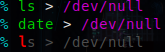

「おすすめの」と記載するのが多いケースだと思いますが、用途や趣味思考によって大きく変わるであろう内容なので、共有したいとしました。

最近、約 6 年ぶりに bash から zsh に戻り、 [とても酷い間違いだらけの ~/.zshrc](https://github.com/yoshihisa-ya/dotfiles/blob/main/dot_zshrc) を見直しています。
「工夫している点や便利な設定を教えて」と聞かれすぐに思い出せないことが有るので、自分の備忘録と脳内整理も兼ねて、いくつか記載します。

記載しているコードやアイディアは、多くが私のオリジナルでは有りません。
dotfiles あるあるなのですが、インターネット上で共有していただいたものや、[zshの本](https://gihyo.jp/book/2009/978-4-7741-3864-0)に記載の内容です。
zshの本 は2009年に発売された書籍ですが、zshについてとても詳しく書かれた良書です。
[電子版](https://gihyo.jp/dp/ebook/2022/978-4-297-12730-5) も新に発売されています。

<!--more-->

## 一部コマンドをヒストリリストに登録しない
```
setopt hist_ignore_space
alias rm=" rm -iv"
alias mv=" mv -iv"
```
HIST\_IGNORE\_SPACE を設定すると、スペースで始まるコマンドラインをヒストリリストに登録しません。
ヒストリに残したくない情報を含むコマンドラインを実行するときに便利です。

この機能とエイリアスを組み合わせることで、特定のコマンドをヒストリリストに残さないようにすることが可能です。
上記の例では、 rm と mv を設定していて、ヒストリから漁って実行してしまう事故を防ぐためのものです。
合わせて、 -i オプションを用いて、削除や上書きが発生する場合に、確認プロンプトを出すようにしています。
本当に確認が不要な場合は、 -f オプションを使えば -i より優先されます。

ちなみに、 HIST\_IGNORE\_SPACE で実際にヒストリリストから消去されるのは、対象コマンドラインの次にコマンドラインを実施した時点です。
つまり、スペースで始まるコマンドラインを実行した直後は、 Ctrl-P を用いることで、改めて編集し再実行することができます。

```
% touch {a,b,c}.txt
% rm a.txt   # エイリアスに登録した " rm -iv" が実行される。
rm: 通常の空ファイル 'a.txt' を削除しますか? y
'a.txt' を削除しました
% rm a.txt   # Ctrl-P でヒストリから再選択できる。
rm: 'a.txt' を削除できません: そのようなファイルやディレクトリはありません
% ls
b.txt  c.txt
% history    # ヒストリに残らない。
    1  touch {a,b,c}.txt
    2  ls
```

Bash では、 HISTCONTROL や HISTIGNORE が利用できそうです。

## 一部コマンドでメニュー補完を無効にする
```
zstyle ':completion:*:(rm|rmdir):*' menu false
```
メニュー補完では、複数の候補が有る場合、 Tab キーを複数回押して目的の候補を選択することができます。
一方で、誤った候補を選択してしまう可能性も有るので、上記の例では rm と rmdir でメニュー補完を無効にしています。
i [TAB] として、複数の i から始まるファイルが存在した場合に、誤ったファイルを選択してしまわないようにする為です。
ただし設定によりますが、1つに候補が絞られる場合や、途中まで同一である場合は補完されます。

```
% touch {1000,2222,2223}
% rm -f 1[TAB]
% rm -f 1000      # 1つに候補が絞られるので補完される。
'1000' を削除しました
% rm -f 2[TAB]    # 222 までは同一なので補完される。
% rm -f 222[TAB]  # 候補表示されるが、 TAB を何度押してもメニュー補完にはならない。
Completing file
2222  2223
% rm -f 222
```

ちなみに、この例ではコンテキストを詳細に指定していないので
```
% rm -[TAB]
```
とした場合でも、オプションがメニュー補完されません。
ファイル指定に限定したい場合、次のようにコンテキストを詳細に指定するのが良いと思います。
```
zstyle ':completion:*:rm:argument-rest:globbed-files' menu false
```
以降も、コンテキストを詳細に指定しておりません。

## 同一引数を補完しない
```
zstyle ':completion:*:(less|rm|rmdir|cp|mv|vi|vim|nvim):*' ignore-line true
```
rm や vi で、複数のファイル(やオプション)を指定するとき、既に指定したものを補完候補から除外できます。
似たファイル名を複数指定したい場合や、 mv で移動する場合に便利です。
ただし、 grep -e ABC -e DEF のように同じオプション(-e)を繰り返し取るコマンドでは、不便になる可能性が有るのでコマンドは限定するのが良いと思います。

```
% ls
1000  2222  2223  2224
% rm 2222 222[TAB]  # 2222 を除く 2223 と 2224 が候補となる。
Completing file
2223  2224
% vi 2222 2223 2[TAB]
% vi 2222 2223 2224 # 2222, 2223 以外に 2 で始まるのが1つなので補完される。
```

## 補完でのワイルドカードを充実させる
```
setopt complete_in_word
zstyle ':completion:*' matcher-list 'r:|[._-]=*'
```
COMPLETE\_IN\_WORD は、カーソル位置に \* を置いた補完を行います。
通常、TABキーを押した補完は、カーソルが末尾に移動してから行われます。

```
% ls
abcd
% ls a[TAB]d   # aとdの間にカーソルを置き TAB しても補完されない。
% setopt complete_in_word
% ls a[TAB]d   # a*d として補完される。
% ls abcd |    # | は、補完された後のカーソルの位置。
% # ただしこの例では _approximate コンプリータが有効な場合、 setopt せずとも補完される。
```

続いて matcher-list ですが、
```
zstyle ':completion:*' matcher-list 'r:|[._-]=*'
```
は、 \.\_\- の手前に * が有るものとして補完します。
拡張子のみが異なるファイルが存在する場合や、ファイル名が \_ や \- で区切られている場合に便利です。
```
% ls
go.mod  go.sum  hoge-fuga  hoge_fuga
% ls g.m[TAB]
% ls go.mod    # 一致する go.mod に補完される
% ls h_f[TAB]
% ls hoge_fuga
% ls h-f[TAB]
% ls hoge-fuga
```

ただし、一致するファイルが存在する場合でも補完されます。
```
% ls
g.sum  go.mod  go.sum  hoge-fuga  hoge_fuga
% touch g.sum
% ls g.s[TAB]
Completing file
g.sum   go.sum
```

これを回避したい場合は、代わりに
```
zstyle ':completion:*' matcher-list '' 'r:|[._-]=*'
```
とすると、一致するケースが優先されます。
```
% ls
g.sum  go.mod  go.sum  hoge-fuga  hoge_fuga
% ls g.s[TAB]
% ls g.sum
```

## 拡張ヒストリファイルを用いて、実行開始時刻と実行時間を記録する
```
setopt extended_history
```

拡張フォーマットでヒストリを保存すると、コマンドの実行開始時刻と、実行時間(秒)が保存されます。
history の -d で実行開始時刻、 -D で実行時間(秒)、 -f で実行開始時刻(日時込み) を確認できます。
```
% sleep 5
% history -dD
    1  23:53  0:05  sleep 5
% history -f
    1  4/22/2023 23:53  sleep 5
```

例えば、過去に実施したワンライナーを再び使いたい場合、実施した日付が分かっていれば、ヒストリを遡るのが容易になります。

また、秒オーダーであるものの、実行時間を確認することができます。
time コマンドで再び実行すれば問題無いものですが、再び実行することができないケースや、再びの実行で実行時間が変わってしまうケースで利用できます。

## zdharma-continuum/fast-syntax-highlighting プラグイン
[zdharma-continuum/fast-syntax-highlighting](https://github.com/zdharma-continuum/fast-syntax-highlighting) はシンタックスハイライトしてくれます。
同様のプラグインで人気が有るのは [zsh-users/zsh-syntax-highlighting](https://github.com/zsh-users/zsh-syntax-highlighting) です。
比較して、お好きなものを入れておくと便利かと思います。

## zsh-users/zsh-autosuggestions プラグイン
[zsh-users/zsh-autosuggestions](https://github.com/zsh-users/zsh-autosuggestions) は fish で提供されているような自動サジェストを提供してくれます。

入力した内容に応じて、最も近い history の候補をグレーでサジェストしてくれます。


通常(カーソルが入力の末尾)であればそのまま、Ctrl-F (forward-char (Emacsキーバインドの場合))でサジェストを確定することができます。
Alt-F で単語を進むことで、部分的にサジェストを受け入れることも可能です。

## yuki-yano/zeno.zsh プラグイン
[yuki-yano/zeno.zsh](https://github.com/yuki-yano/zeno.zsh) はスニペット補完してくれるプラグインです。

```
  - name: git switch
    keyword: gsw
    snippet: git switch

  - name: awk ave
    keyword: "awkave"
    snippet: "awk '{sum+=$NF{{field}}} END {print sum/NR}'"
    context:
      lbuffer: '.+\s'
```
上記のコンフィグを用意した状態とすると、 gsw と入力することで git switch に展開されます。
```
% gsw[space]   # gsw と入力しスペースキーを投下する。
% git switch | # git switch に展開され、カーソルは | の位置に移動する
```
通常は、先頭から入力した文字列がスニペットに展開されますが、既に何か入力している場合に、展開することも可能です。
```
% cat test.txt
1
2
3
4
5
6
7
8
9
10
% cat test.txt | awkave[space]
% cat test.txt | awk '{sum+=$NF} END {print sum/NR}'
# カーソルは {sum+=$NF|} の | の位置となるので、フィールドパラメータをすぐに変更することができる。
5.5
```
エイリアスや、グローバルエイリアスを利用することで目的は果たせますが、 history にも展開後の内容で残ることが大きな利点です。
他にも、コマンド実行結果に展開したり、fzfと連携してプロセス一覧などを展開する機能も有ります。
